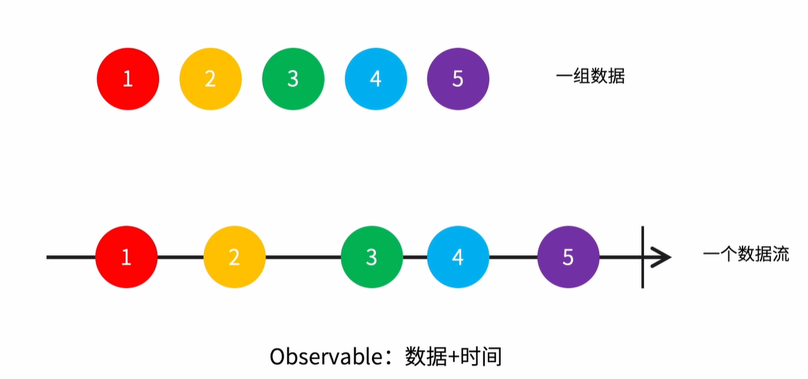
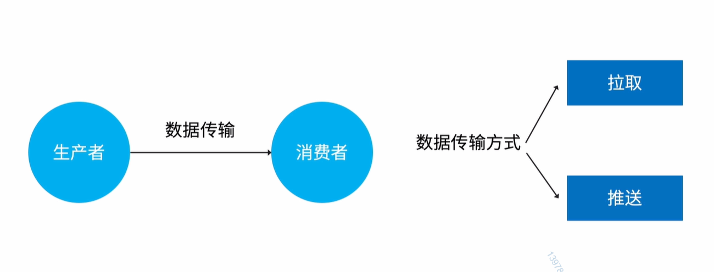
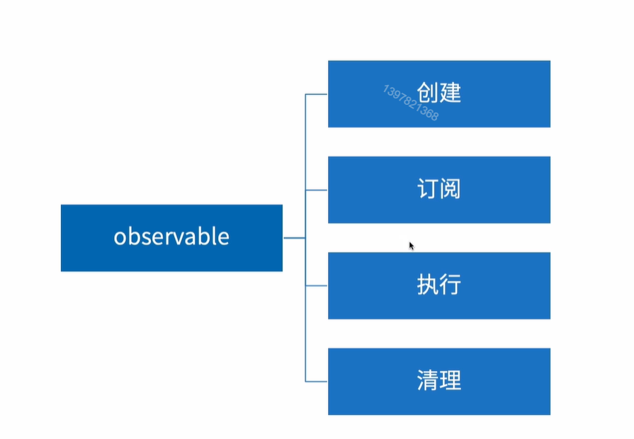
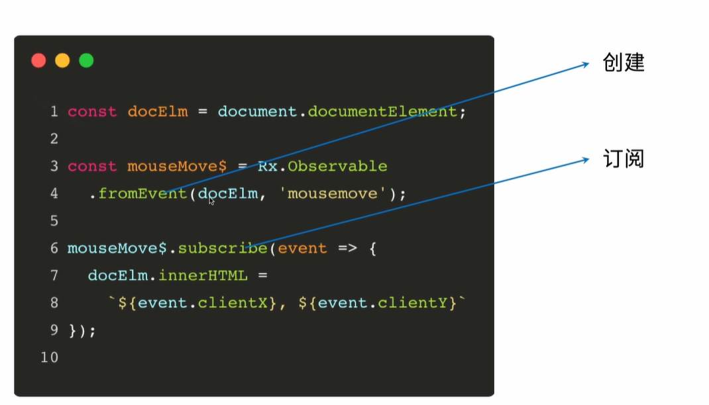
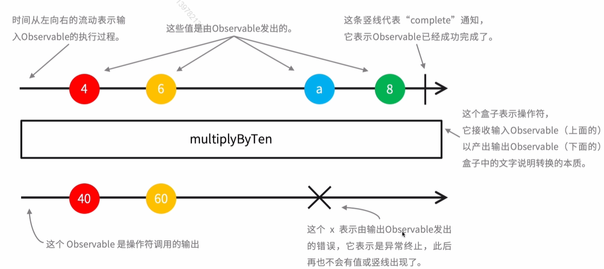
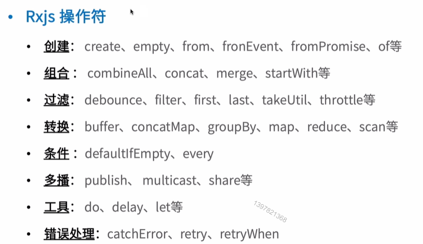

# 处理异步的框架 - Rxjs


### Main Target

+ ReactiveX 介绍
+ Rxjs 用法
+ 使用场景


## 01. ReactiveX 介绍

#### ReactiveX 

+ Reactive Extensions 的缩写，响应式编程，一种编程模型
+ Rxjs 是 JavaScript 的语言实现
+ 使用可观察的序列 （Observable）来编写异步和基于事件的程序


#### ReactiveX介绍





| 函数式风格   | 简化代码     |
| ------------ | ------------ |
| 异步错误处理 | 轻松使用并发 |


## 02. Rxjs用法

#### Rxjs

+ Rxjs是ReactiveX 编程模型的JavaScript 语言实现
+ 使用可观察的序列（Observable）来编写异步和基于事件的程序

##### 引入方式

+ npm

  + npm install rxjs
  + import * as rxjs from 'rxjs'

+ cdn

  

#### Rxjs用法






#### Rxjs用法 -  操作符

Rxjs操作符是纯函数，作用是基于当前的 Observable 创建一个新的 observable




```js
const docElm = document.documentElement

const mouseMove$ = Rx.Observable
.fromEvent(docElm, 'mousemove')
.map(event => ({ x: event.clientX, y: event.clientY }) )

mousemove$.subscribe(pos => {
    docElm.innnerHTML = `${pos.x}, ${pos.y}`
})
```




#### Rxjs 用法 -  名词

+ 基础名词
  + Observable(可观察对象)
  + Observer(观察者)
  + Subscription（订阅）
  + Operators(操作符)
  + Subject（主体）
  + Schedulers (调度器)


## 03. 使用场景

#### Rxjs vs promise

Rxjs 特点

+ 可以取消
+ 可以发送多个值
+ 有工具函数对结果处理
+ 学习曲线陡峭


#### 什么时候需要使用Rxjs

没有标准的答案


#### 学习Rxjs 的意义？

+ 解决问题的思路
+ Observables成为 ECMAScript 的 提案


#### 某场景下是否要选择Rxjs实现？

+ 了解 Rxjs 的思想，了解数据流的操作，Rxjs是否能更简单更优雅的实现


### 最后小结

+ ReactiveX 
+ Rxjs


