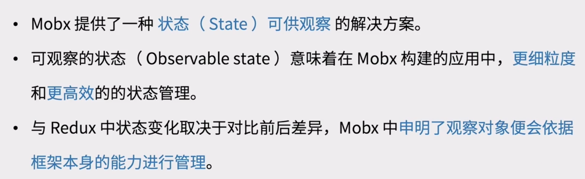
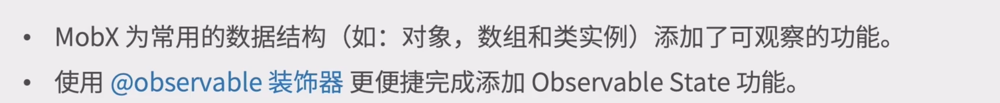
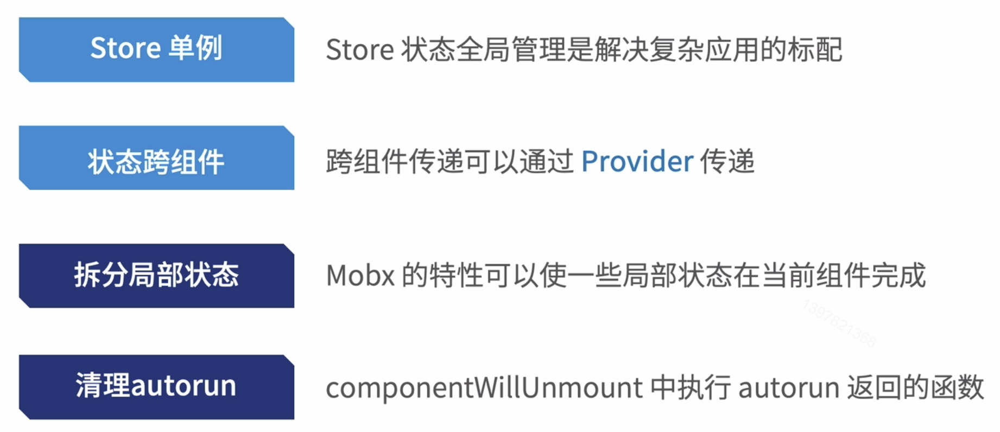
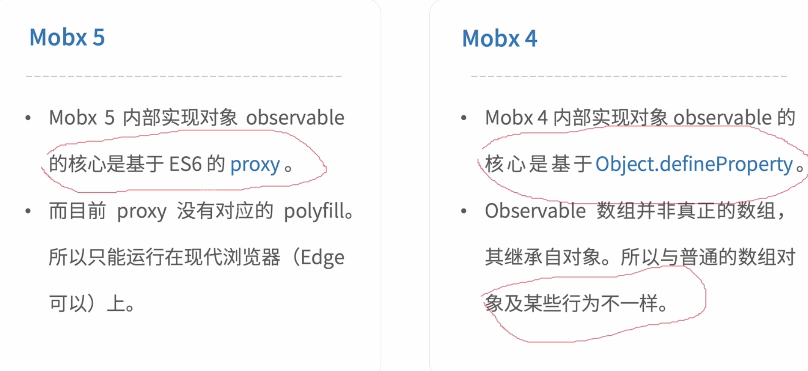

# Mobx入门

**响应式状态管理工具**

### Main Target

+ Mobx 核心概念
+ Mobx 实战

## 01. Mobx 核心概念

#### Mobx 核心概念

### Redux 流程 vs Mobx 流程

#### Redux 应用流转图

#### Mobx 应用流转图

#### Mobx 核心概念

+ Observable State

+ Derivations（衍生）

## 02. Mobx 实战

**Mobx 复杂应用**

**Mobx 5 Or Mobx 4**

#### Mobx VS Redux

#### 小结

+ Mobx 核心概念
+ Mobx 实战

