# Context API 前世今生

**New Context API的实践**

### Main Target

+ Context api before React v16.3
+ New context api

## 01. Context api before React v16.3

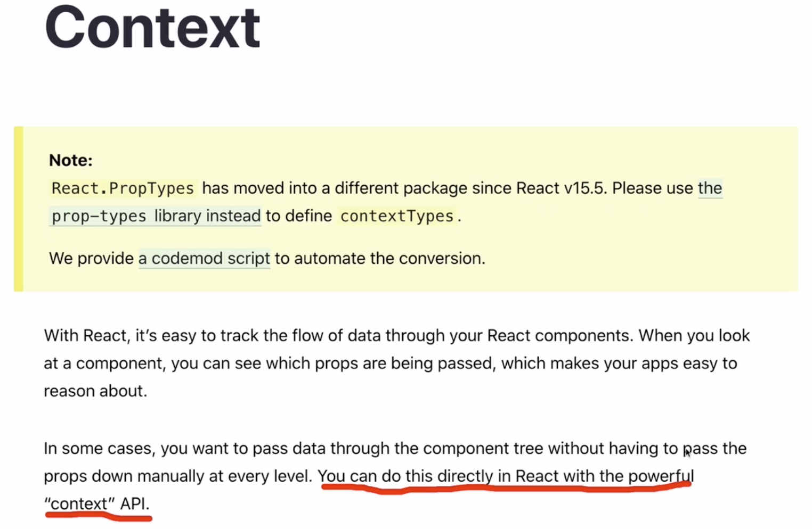

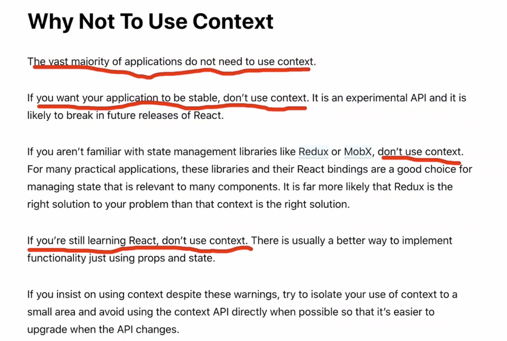

#### Context

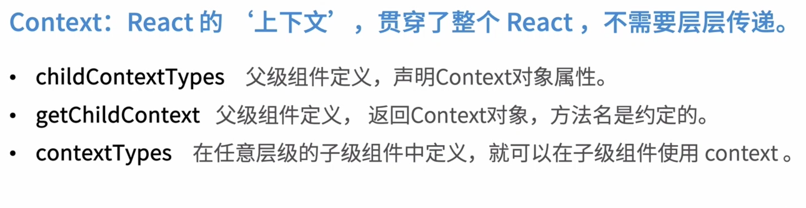

#### 实战使用 - Context

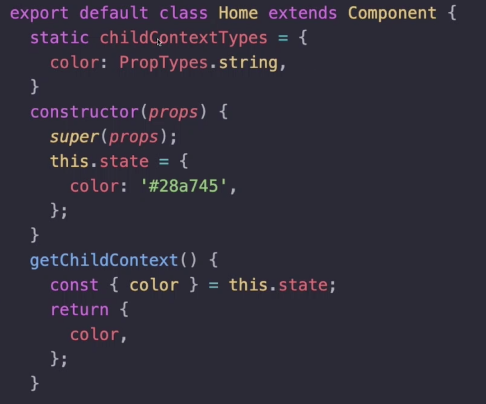

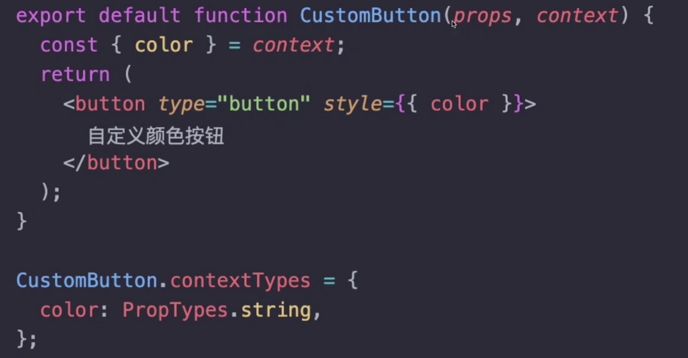

#### Context vs Props

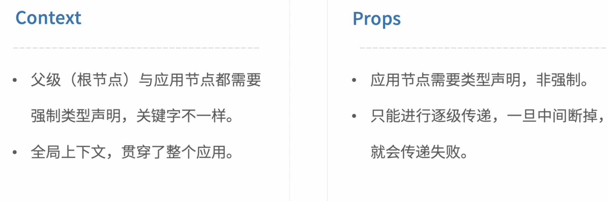

#### Context 的缺陷

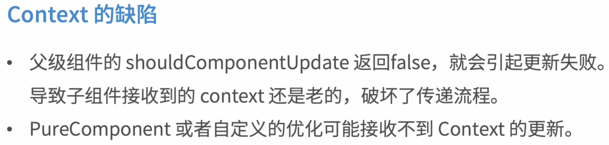

## 02. New context api

#### New context api

**Provider**  (生产者)

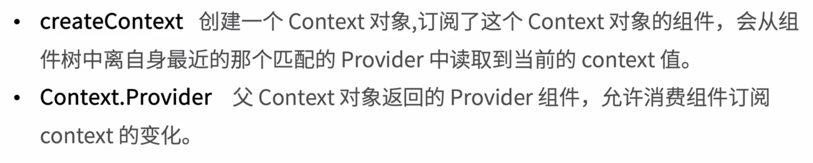

**Consumer**（消费者）

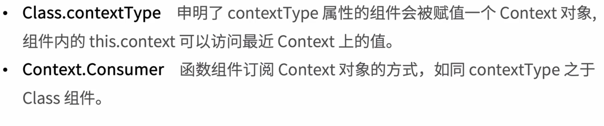

+ 生产者

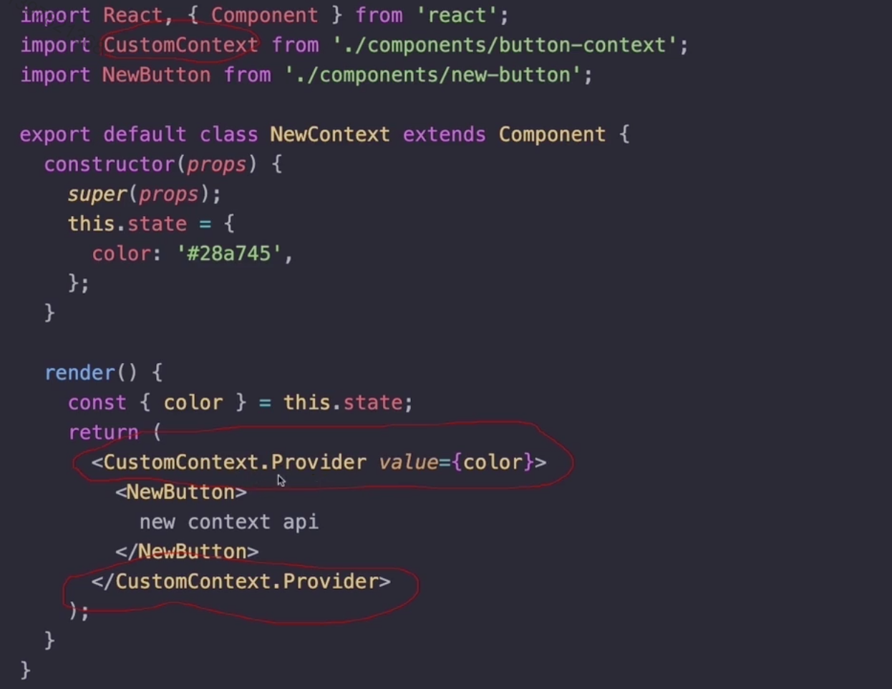

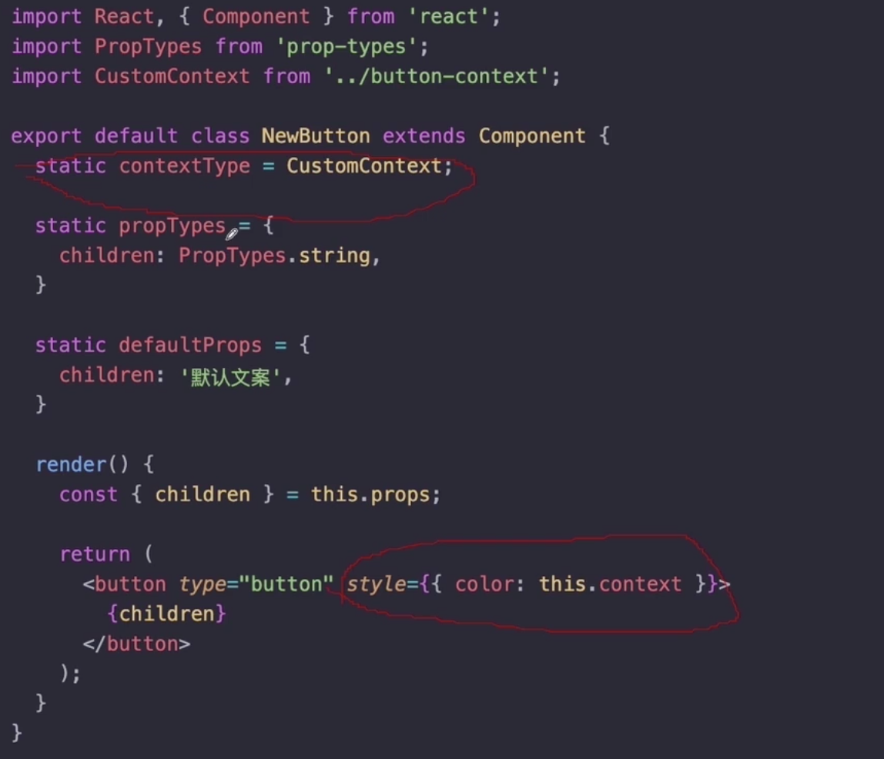

context 对象

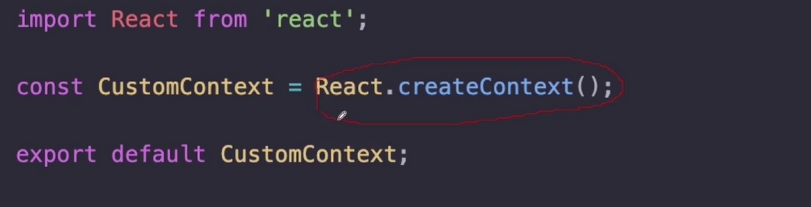

#### Context VS Redux

#### 小结

+ Context api -前世
+ Context api - 今生