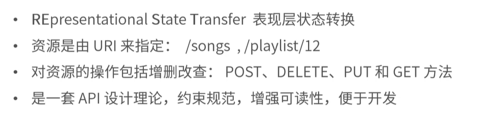
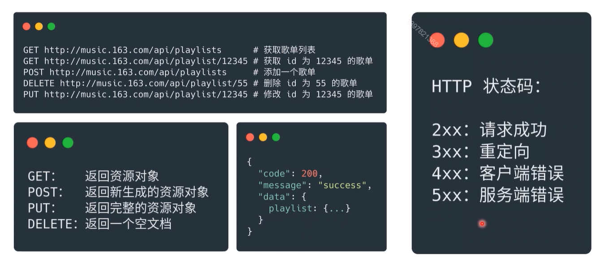
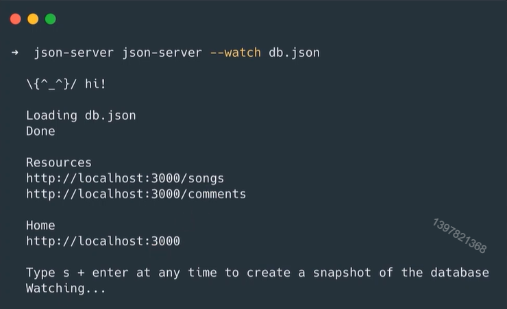
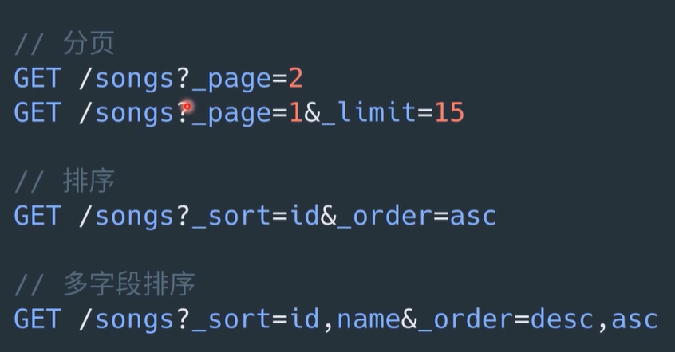
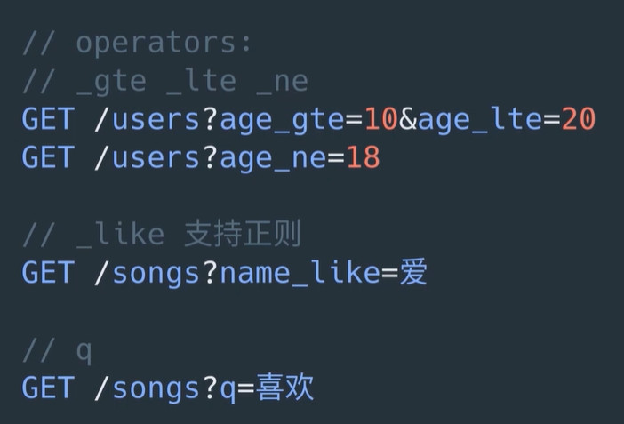
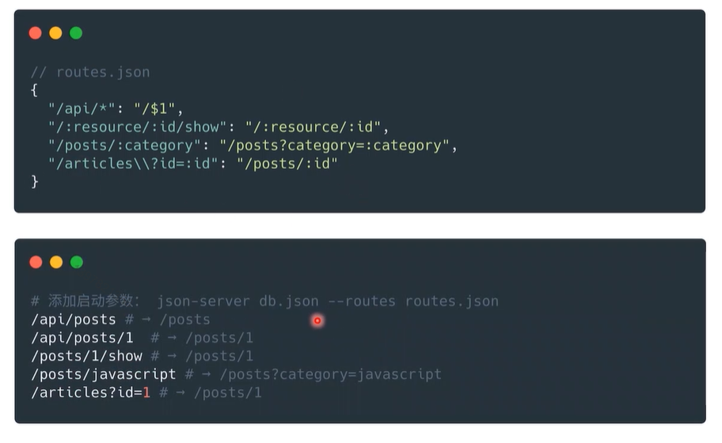
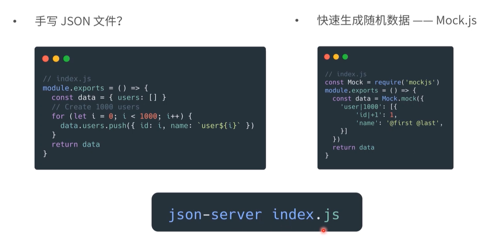

### 回顾

+ Mock.js生成不同类型的接口数据
+ 纯页面展示，不修改数据
+ CURD请求？
+ 怎么把同类请求关联起来


### Main Target

+ 复杂的接口 Mock 场景
+ JSON Server 的安装和使用
+ 生成随机数据


## 01. 复杂的接口 Mock 场景


#### Restful API




#### Restful API 规范




#### 复杂的接口mock场景

+ 如何 mock 对同一个资源的增删改查
+ 在前端运行、可以存储数据的 server
+ JSON-Server：零开发，快速模拟Restful API


## 02. JSON Server 的安装和使用

#### 安装和基本用法

```shell
# 安装 install
$ npm install -g json-server
```

```json
// db.json
{
    "songs": [
        {id: 1, name: 'Baby'}
    ]，
    "comments": [
        {
            id: 1, content: 'nice'
        }
    ]
}
```

```shell
// start server
$ json-server --watch db.json
```



+ GET  http://localhost:3000/songs/1

  {id: 1, name: 'Baby'}

+ post，PUT，PATCH，DELETE 操作会改变 db.json文件的内容


#### Routes规则 - 过滤


#### Routes 规则 - 翻页与排序




#### Routes 规则 - 查询




#### 自定义 routes

+ 更贴近后端接口

  


#### 添加 middleware

+ 统一定制个性化请求

  ```js
  // my-middleware.js
  module.exports = (req, res, next) => {
      res.header('X-Music', '163')
      next()
  }
  ```

  ```shell
  $ json-server db.json --middleware ./my-middleware.js
  ```

  

## 03. 生成随机数据

生成随机数据




#### JSON-Server 的基本使用

+ 演示：搭配 Mock.js 生成随机数据接口

```js
// index.js
const Mock = require('mockjs')

module.exports = () => {
    const data = Mock.mock({
        'playlists|100': [{
            'id|+1': 1,
            'name': '@title',
            'cover': '@image'
        }]
    })
    return data
}

// middleware.js
module.exports = (req, res, next) => {
    res.header({
        'X-MUSIC': '163'
    })
    next()
}

```

```json
// routes.json
{
    "/api/music/*": "/$1",
    "/playlists\\?limit=:limit&offset=:offset": "/playlists?_start=:offset&_limit=:limit"
}
```


### 小结

+ Restful API 概念
+ JSON-Server 的安装和使用
+ 自定义routes、middleware
+ 搭配 Mock.js 生成随机数据


