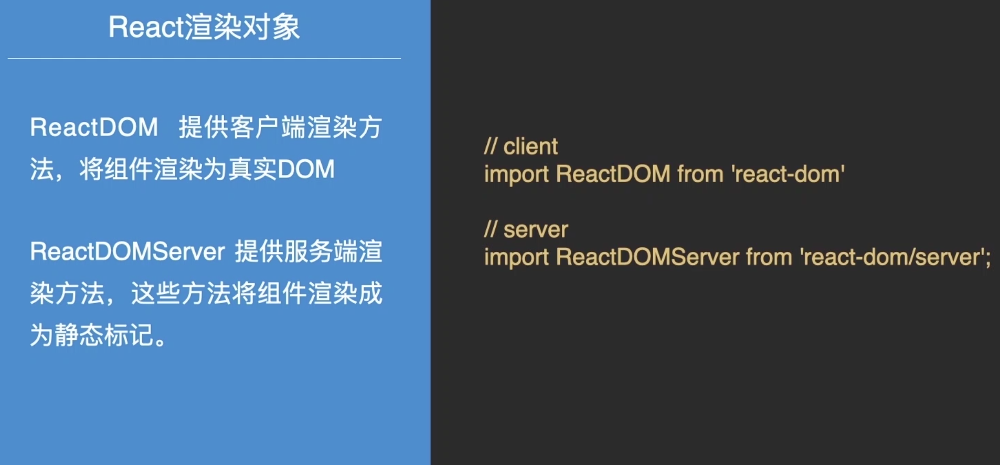
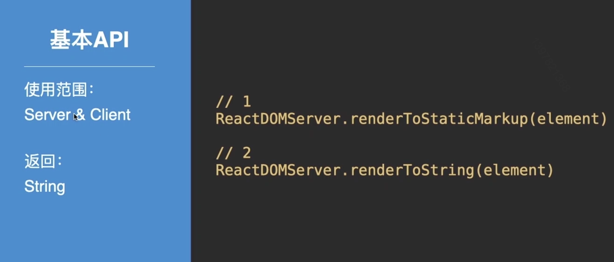
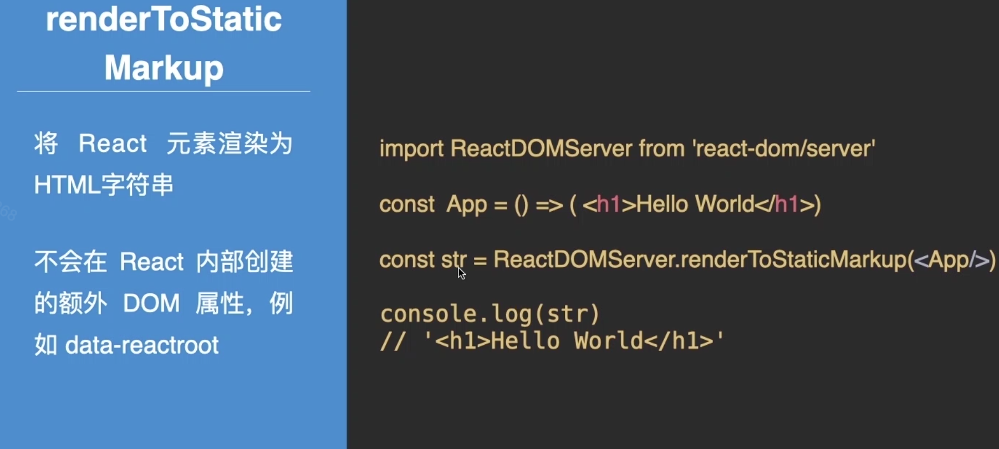
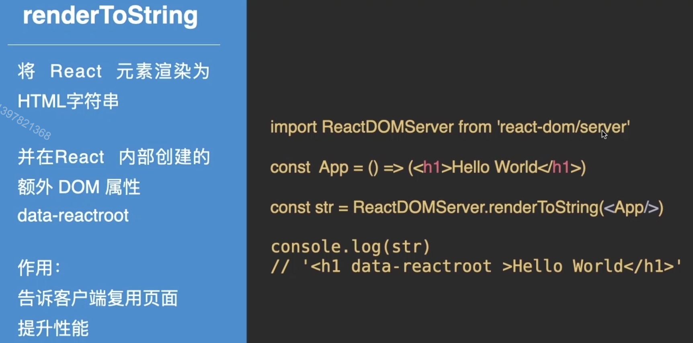
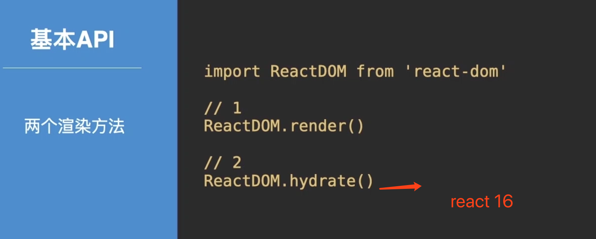
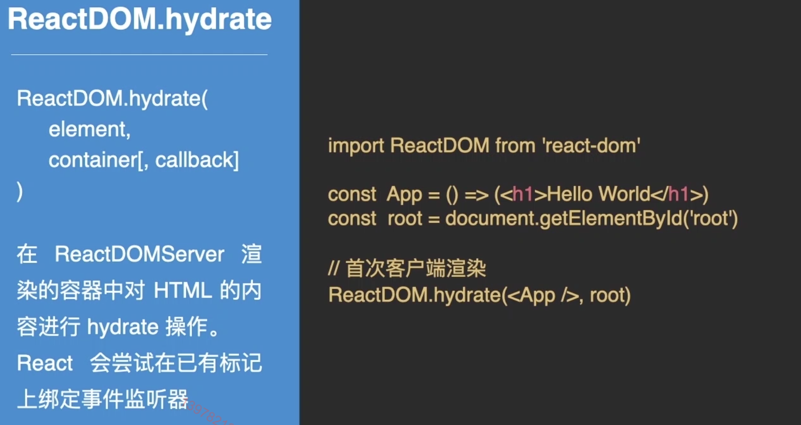
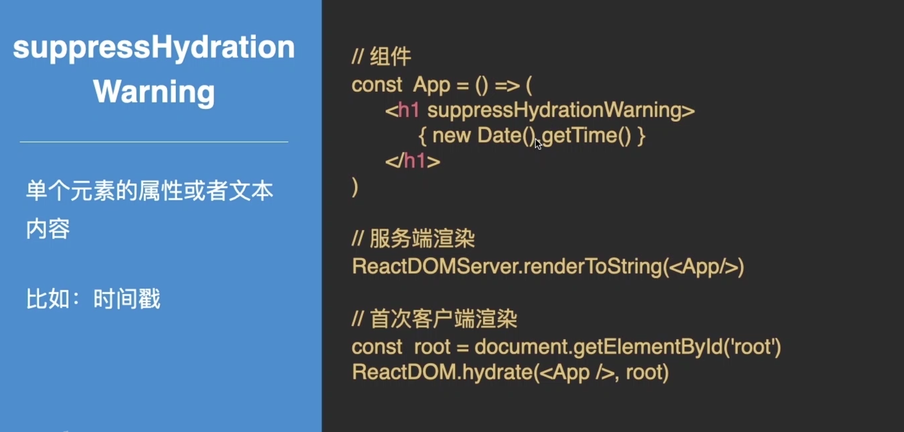
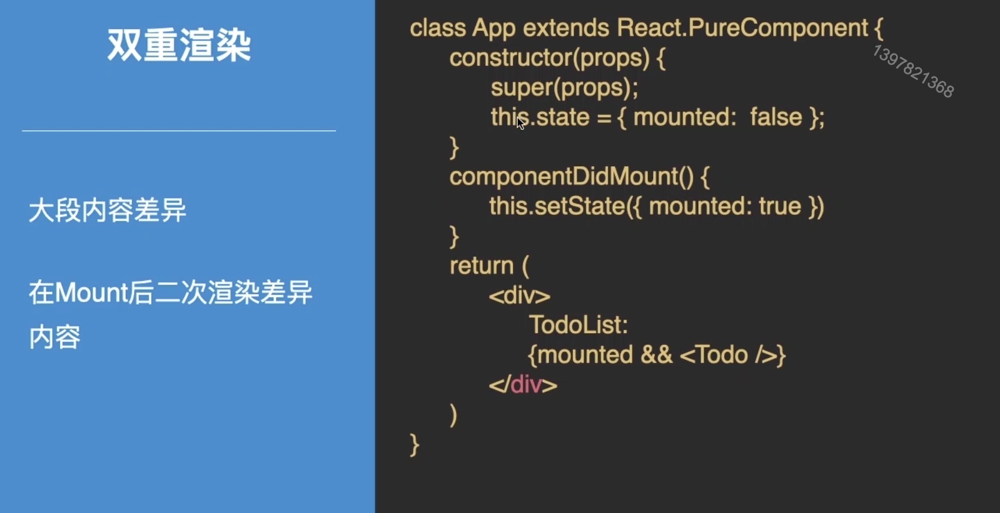

# React 同构

### Content

+ React 服务端渲染方法
+ React 客户端渲染方法
+ React 前后端渲染同构

### Main target

+ 掌握React 服务端渲染API
+ 如何选择服务端渲染方法
+ 理解 React SSR 的整个过程
+ 理解 Hydrate

#### 两端渲染方法概述

## 01. React 服务端渲染方法

#### renderToStaticMarkup

#### renderToString

#### 如何选择React服务端渲染方法？

+ 纯静态页面：renderToStaticMarkup
+ 可交互页面（js事件）：renderToString

## 02. React 客户端渲染方法

#### ReactDOM.render

#### ReactDOM.hydrate

#### React 两端渲染差异

时间戳

双重渲染

#### 如何选择React客户端渲染方法？

+ 服务端渲染后的首次客户端渲染：hydrate
+ 其他;render

## 03.React 前后端渲染同构

#### 最后小结

+ 何时使用 RenderToString?

+ 何时使用RenderToStaticMarkup

+ hydrate是什么

+ React同构渲染使用了哪些方法？

  