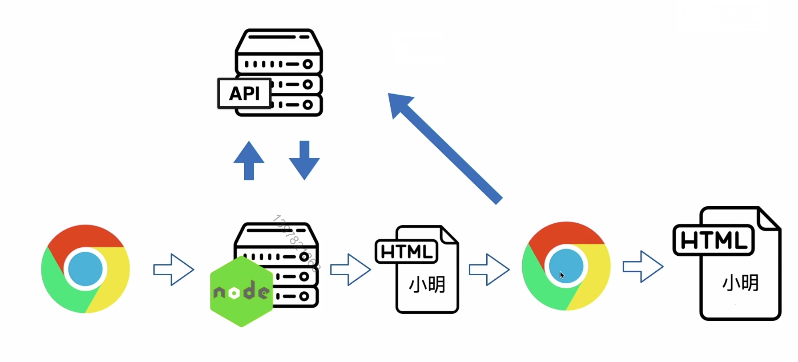
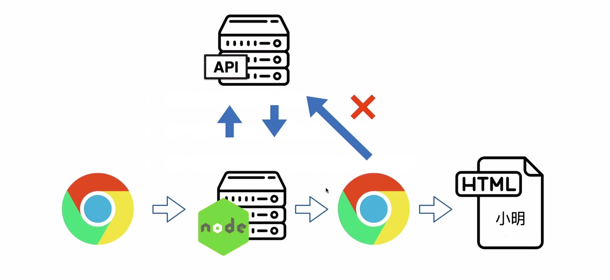
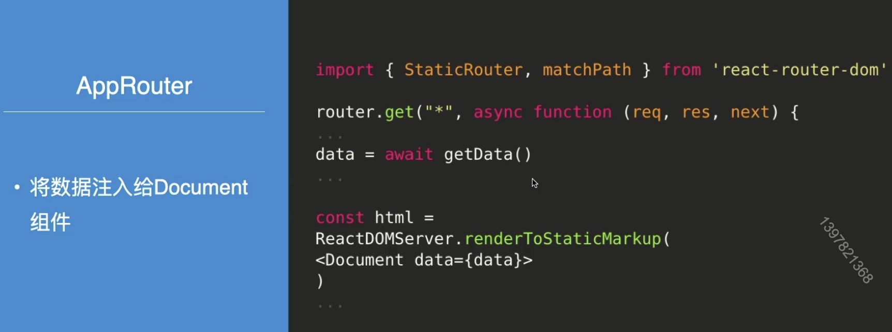
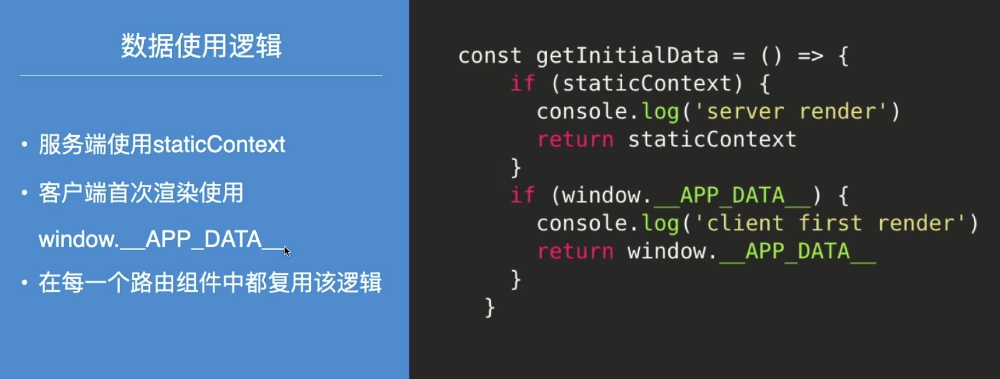
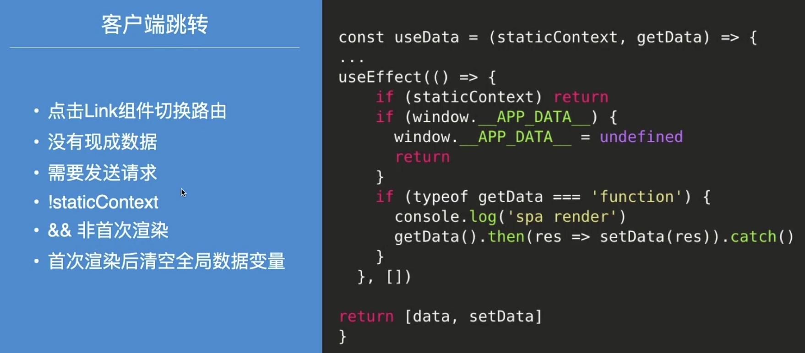

# 服务端请求数据复用

### Content

+ 把数据渲染到页面上
+ 客户端首屏复用服务端请求数据

## 01.把数据渲染到页面上

 

#### 同构渲染首屏数据请求

#### 客户端首屏渲染

#### 客户端首次渲染获取数据

+ 服务端已经发送过请求
+ 客户端再次发送请求会造成浪费
+ 客户端能不能复用服务端请求到的数据？

#### 同构渲染首屏数据请求

## 02. 客户端首屏复用服务端请求数据

#### 如何从服务端向客户端传递数据？

**方法**：

+ 通过window全局变量传递

**思考**：

+ 为什么是window全局变量，可以直接保存在普通变量里吗？

#### 利用window全局变量传递数据

 

数据使用逻辑

优化逻辑相同的代码

 

#### 客户端路由跳转数据获取

#### Redux下的数据同步

+ 原理是一样的，利用window全局变量
+ 服务端store和客户端store同构全局变量共享数据

 

#### 最后小结

+  客户端首次渲染同构window全局变量复用服务端数据
+ 为什么使用window全局变量

#### 作业

实现Redux下得服务端和客户端数据同步

