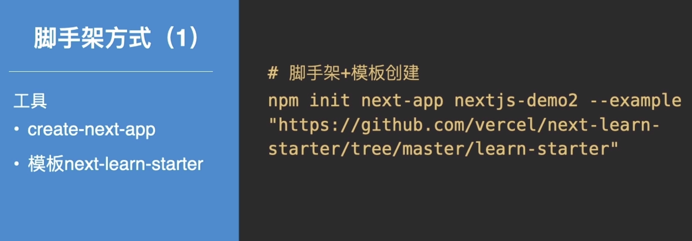
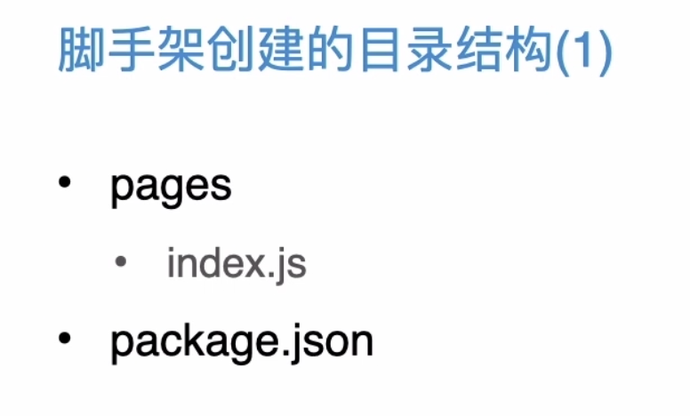
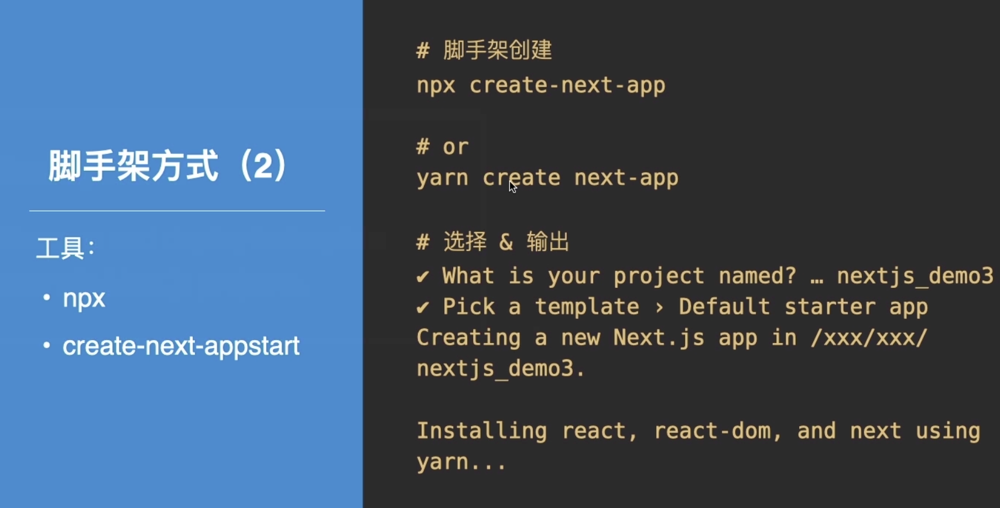

# Next.js项目搭建


### Content

+ 如何初始化Next.js 项目
+ Next.js 香满园结构剖析


### target

+ 熟悉Next.js 项目搭建方式
+ 了解Nextjs 搭建的项目结构


## 01. 如何初始化Next.js项目

常用的两种方式

+ 手动：从零开始引入依赖进行构建
+ 脚手架：使用create-next-app （甚至可以借助模板）


#### 手动方式


  


**手动方式**

至此，一个最精简的next.js项目创建完成

包含：package.json  + 依赖 + pages


#### 脚手架方式

**create-next-app**

> https://nextjs.org/learn/basics/create-nextjs-app/setup



 ```shell
npx create-next-app nextjs-blog --use-npm --example "https://github.com/vercel/next-learn-starter/tree/master/learn-starter"
 ```



 



```shell
npx create-next-app
# 自动选择相关配置
```


## 02. Next.js 项目结构剖析


#### 项目结构

+ package.json - 命令、依赖....
+ pages - 页面、API....
+ public - 静态文件
+ next.config.js - 自定义配置


#### pages

+ api - 接口数据
  + hello.js
+ Index.js - 路由匹配页面


#### public

+ 图片
+ 文本
+ 音频、视频

**注意事项**

1. public 目录命名是固定的，名称不能更改，并且是用于提供静态资产的唯一目录
2. 确保没有与 pages 目录中的文件同名的静态文件，否则将导致错误


### 最后小结

1. next.js 项目的创建方法

+ 手动
+ 脚手架

2. next.js 项目结构


