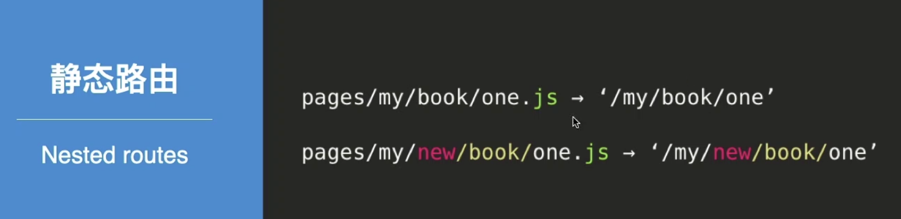
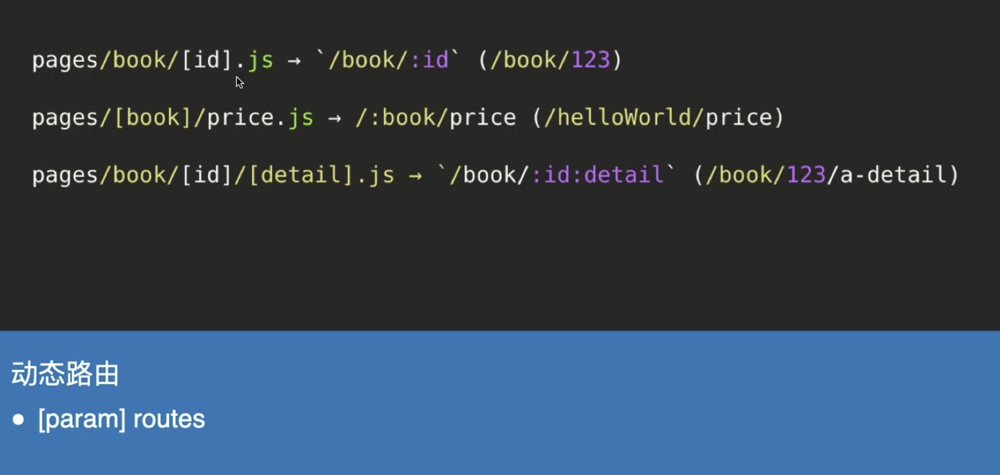
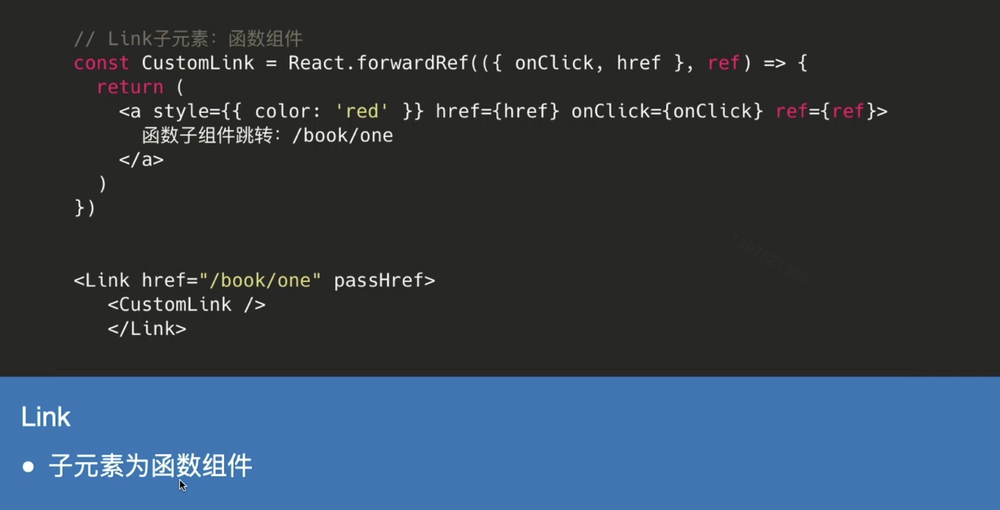

# Next.js 路由

### Target

+ 了解Next.js 提供的两种预渲染形式
+ 掌握基于文件系统的静态/动态路由
+ 掌握next/link和next/router的使用
+ 掌握Shallow Routing

## 01. 预渲染

#### 思考：什么是预渲染？

#### Nextjs提供

**静态生成 & 服务端渲染**

##### 静态生成（static Generation）

+ 页面生成时机：构建时（build time）

+ 优势：CDN缓存

+ 数据

  + 不包含数据
  + 包含数据（数据固定不变）（getStaticPaths + getStaticProps）

+ 场景：

  + 营销页面
  + 博客文章
  + 帮助和文档

  

##### 服务端渲染（Server-side Rendering）

+ 页面生成时机：请求时（request time）
+ 优势：保持数据更新（每次访问都是最新的数据）
+ 数据：getServerSideProps
+ 场景：因请求不同而数据不同的页面

## 02. 静态路由和动态路由

> Nextjs 路由体系：基于文件系统（pages）

###  静态路由

简单一点的静态路由

复杂一点的静态路由

思考：无法预先明确定义的路由怎么办？

#### 动态路由

 全匹配路由

**思考：路由匹配优先级？**

#### 路由匹配优先级

#### 路由跳转

