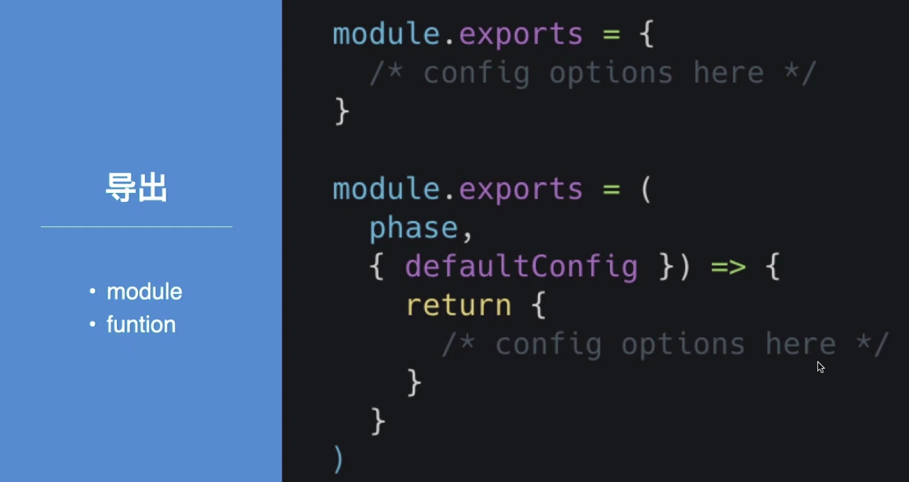
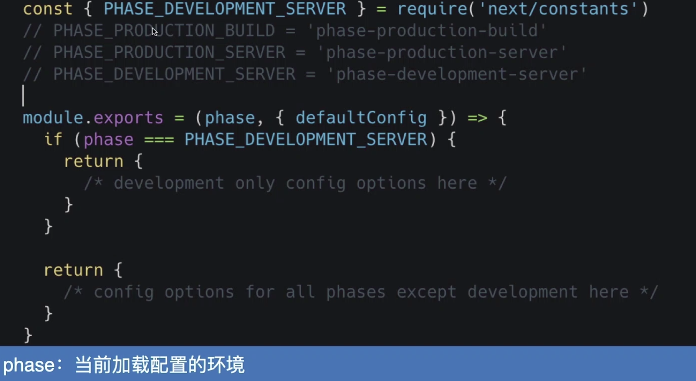
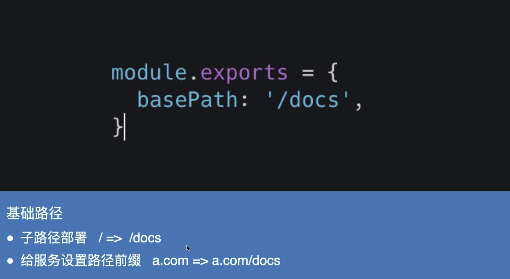
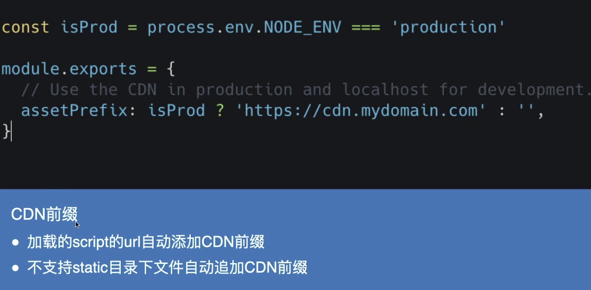
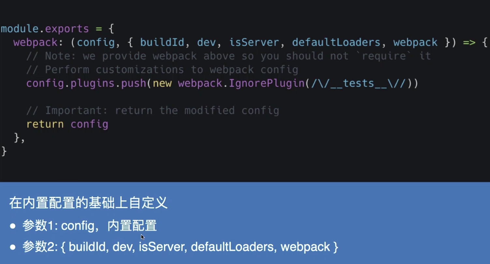
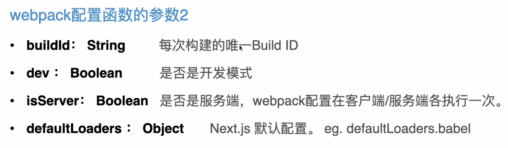
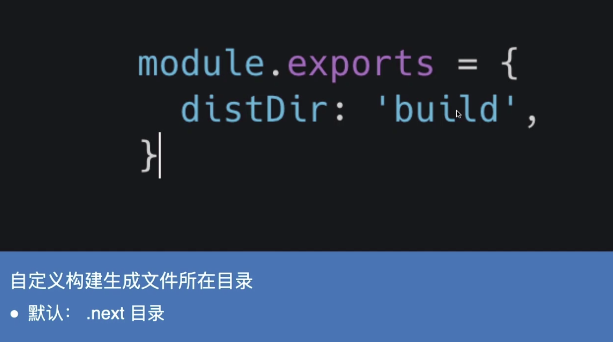
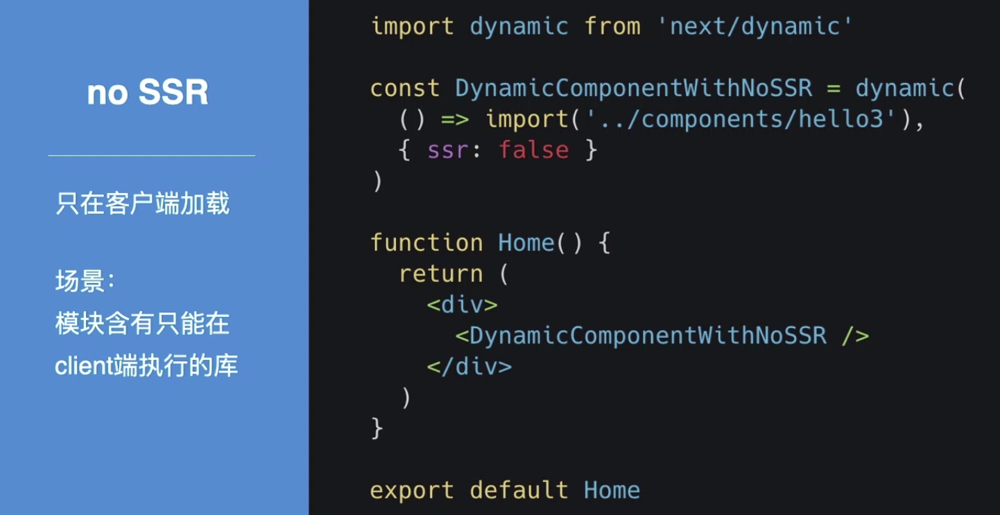
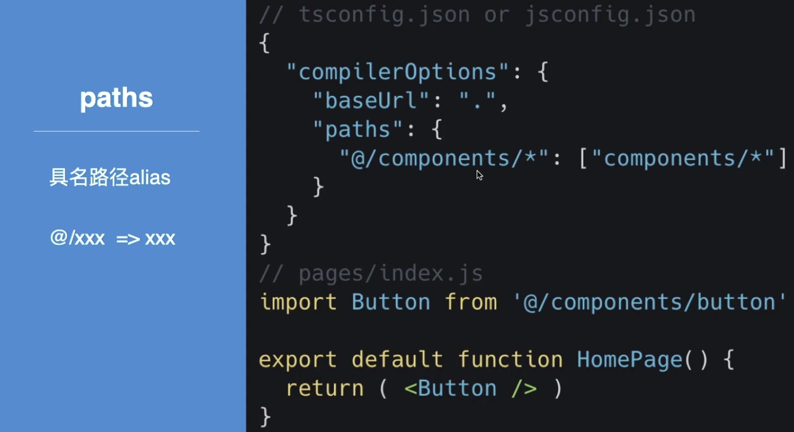
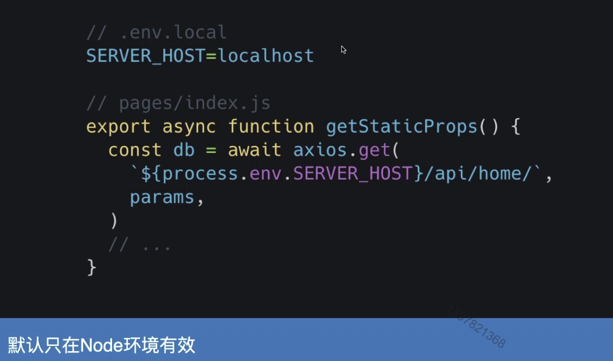

# Next.js 配置

****

### content

+ next.config.js
+ Next.js 框架内置功能
+ 其他自定义配置

## 01. next.config.js

#### 自定义配置文件

+ 位置 - 根路径 `./next.config.js`,(package.json旁边)
+ 不编译 - 不会被webpack,babel or typescript 编译
+ js文件 - 不支持json,只能使用你的Node 版本支持的js特性
+ 使用阶段 - next Server 端， build 构建过程中，不会再Client 端被使用

#### next.config.js

### 常用常见配置

#### 环境变量

#### Base path

#### assetPrefix

#### 自定义 Webpack Config

#### distDir

## 02. Next.js框架内置功能

#### 动态import

#### 浏览器支持

+ `>=ie11`
+ 现代浏览器（edge、Firefox、Chrome、Safari、Opera...）

#### JavaScript语言支持

+ async/await(ES2017)
+ Object Rest/Spread Properties(ES2018) 解构
+ Dynamic import() (ES2020)
+ Optional Chaining (ES2020) 可选链      a?.b
+ Nullish Coalescing (ES2020)  空值合并  null ?? 'foo'

#### Polyfills

+ IE11  兼容
+ fetch  node & client
+ URL   仅Node
+ Object.assign()

#### postcss

+ IE11
+ Autoprefixer
+ Flex

## 03. 其他自定义配置

#### 路径别名

#### 环境变量

#### 其他配置

+ .babelrc.js
+ Postcss.config.js
+ browserlist
+ eslintrc.js
+ ……

#### 最后小结

+ next.config.js常用配置
+ next.js内置功能和支持
+ 其他配置

