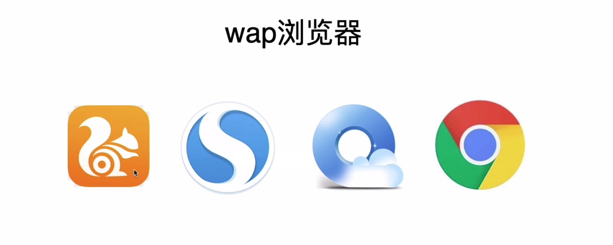
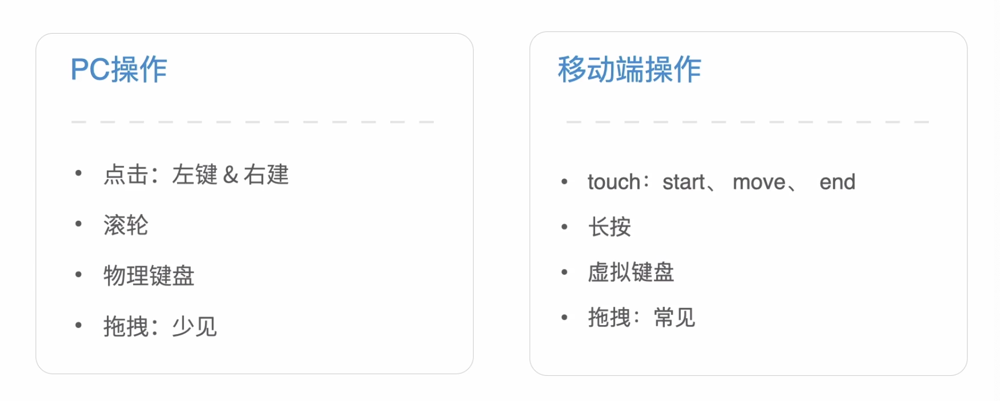
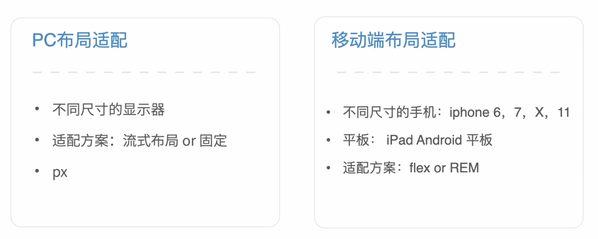

# 移动端页面介绍

### Content

+ 多环境
+ 兼容性
+ 操作差异
+ 布局适配
+ 如何增加移动端开发经验

### Main Target

+ 了解移动端和PC端的差异
+ 了解移动端开发环境
+ 学会如何增加移动端开发经验

## 01. 多环境

#### PC页面环境

> 桌面浏览器

#### 移动页面环境

+ 不同品牌手机自带浏览器
+ wap浏览器
+ 不同APP内环境

##### wap浏览器

##### 不同APP内环境

+ 自己家APP
+ 微信
+ 微博、QQ等其他第三方APP

##  02.兼容性

#### 系统兼容性

#### 手机兼容性

## 03. 操作差异

## 04. 布局适配

#### 如何增加移动端开发经验

### 最后小结

+ 环境差异
+ 兼容差异
+ 操作差异
+ 布局适配差异

