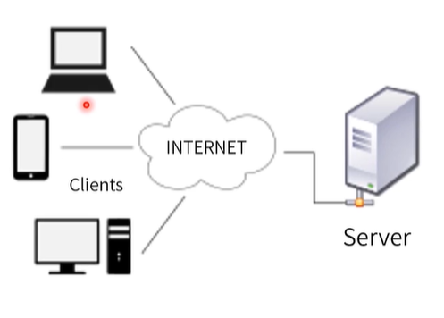
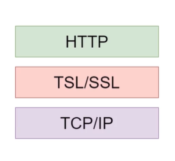
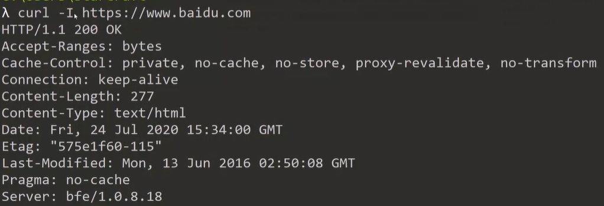

### 课程目标

+ 前端重点
+ 面试重点
+ 工作日常


### 课程内容

+ HTTP协议介绍
+ Node.js实战Http请求
+ chrome/curl/postman/whistle 工具初探


## 01. Http协议介绍

蒂姆·伯纳斯-李（英国计算机科学家）1955-

+ 万维网（1990HTTP协议）
+ 创办MIT人工智能实验室


#### HTTP协议

+ 超文本传输协议（Hyper Text Transfer Protocol）
+ 处理客户端和服务端之间的通信
+ http请求/http返回
+ 网页/json/xml/提交表单.......




#### 纯文本 + 无状态（stateless）

+ 应用层协议（下面可以是TCP/IP）
+ 信息纯文本传输
+ 无状态
  + 每次请求独立
  + 请求间互不影响
+ 浏览器提供了手段维护状态（Cookie，Session，*Storage等）


#### HTTP历史

+ 1991 HTTP 0.9
+ 1996 HTTP 1.0
+ 1999 HTTP 1.1
+ 2015 HTTP 2.0


#### 设计的基础因素

+ 带宽
  + 基础网络（线路、设备等）
+ 延迟
  + 浏览器
  + DNS查询
  + 建立连接（TCP三次握手）


#### 设计考虑因素 --  缓存与带宽优化

+ 缓存
  + http1.0  提供缓存机制如 IF - Modified -Since 等基础缓存控制策略
  + http1.1 提供E-tag等高级缓存策略
+ 带宽优化
  + http1.1  利用range头获取文件的某个部分
  + http1.1  利用长连接让多个请求在一个TCP连接上排队
  + http2.0  利用多路复用技术同事传输多个请求


#### 设计考虑因素 --  压缩/安全性

+ 压缩
  + 主流web度武器如 nginx/express 等都提供 gzip压缩功能
  + http2.0 采用二进制传输，头部使用 HPACK算法压缩
+ HTTPS
  + 在HTTP和TCP/IP之间增加 TSL/SSL层
  + 数据传输加密（非对称 + 对称加密）


#### HTTPS 



+ 安全超文本传输协议（Hyper Text Transfer Protocol Secure）

+ 数据加密传输

  + 防止各种共计手段（信息泄露、篡改等）

+ SSL/TSL（Secure Socket Layer/ Transport Layer Secure）

  + SSL - 安全套接层
  + TSL - 传输层安全性协议
  + 需要在客户端安装证书

  

## 02. Node.js实战Http请求

#### Header和Body(实战)

+ http协议是一个文本传输协议，传输内容是人类可读的文本，答题分成两部分
  + 请求头（Header）/ 返回头
  + 消息体（Body）
+ 观察node实现http的基础协议

```js
const net = require('net')

const response = 
`HTTP/1.1 200 OK
Data: Tue, 30 Jun 2020 01:00:00 GMT
Content-Type: text/plain
Connection: Closed

Hello World
`

const server = net.createServer(socket => {
    socket.end(response)
})
server.listen(80, () => {
    
})
```


#### Chrome

Goolgle开发的免费浏览器

Chrome开发者工具拥有强大的调试能力


#### cURL

+ 传输一个URL (和服务器交互的工具)
  + url：网址（Uniform Resource Locator）

```shell
$ curl -I https://www.baidu.com
```



+ 支持多种协议（HTTP/HTTPS/FTP/FTPS/SCP/SFTP/DICT/TELNET...）


#### fetch

+ 在网络上获取数据的标准接口
  + 提供对请求/返回对象（标准Promise接口）
  + 提供自定义Header能力
  + 提供跨域能力


#### postman 

+ 协作的API开发工具


#### Whistle

+ 跨平台网络调试工具
  + 需要SwitchOmega插件
  + node.js开发
  + 支持抓包、重放、替换、修改等

```shell
# 安装 whistle
$ npm i -g whistle
# 启动 whistle
$ whistle start
```

启动之后访问： http://127.0.0.1:8899/


### 最后小结

+ 简单比效率更重要（Java/HTTP等）
+ 跟上时代，掌握更多的工具