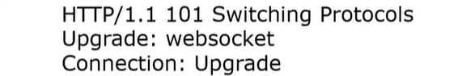
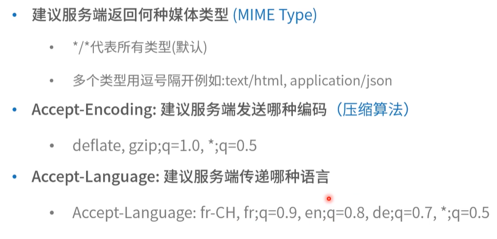

### 课程目标

+ 前端重点
+ 面试重点
+ 工作日常

### 课程内容

+ HTTP协议内容和方法
+ 常见HTTP状态码
+ 常见HTTP头

## 01. HTTP协议内容和方法

#### HTTP请求常见请求头

+ Method
+ Path
+ 协议版本
+ Content-Length
+ User-Agent
+ Content-Type
+ Accept
+ Origin
+ Referer
+ Accept-Encoding
+ Accept-Language
+ Connection

#### HTTP常见返回头

+ 协议版本
+ 状态码
+ X-Powered-By
+ 日期
+ Connection
+ Content-Length

#### 基本方法

+ GET
  + 从服务器上获取资源
+ POST
  + 在服务器创建资源
+ PUT
  + 在服务器修改资源（幂等性）
+ DELETE
  + 在服务器删除资源

#### 其他方法

+ OPTION
  + 跨域部分讲解
+ TRACE 用于显示调试信息
  + 多数网站不支持
+ CONNECT
  + 代理部分讲解
+ PATCH
  + 对资源进行部分更新（极少用）

## 02. 状态码

+ 1xx: 提供信息

  + 100 continue

  + 101 切换协议（switch protocol）

    

+ 2xx: 成功
+ 3xx: 重定向
+ 4xx: 客户端错误
+ 5xx:  服务端错误

#### 2xx状态码

+ 200 - OK
+ 201 - Created 已创建
+ 202 - Accepted 已接收
+ 203 - Non-Authoritative  Information 非权威内容
+ 204 - No Content 没有内容
+ 205 - Reset Content 重置内容
+ 206 - Partial Content 服务器下发了部分内容（range header）

**注意：多数服务端开发已经不遵循状态码，我们在后面restful部分讨论**

#### 3xx 状态码

+ 300 - Multiple Choice 用户请求了多个选项的资源（返回选项列表）
+ 301 - Moved Permanently 永久转移
+ 302 - Found 资源被找到（以前是临时转移）
+ 303 - See Other 可以使用GET方法在另一个URL找到资源
+ 304 - Not Modified 没有修改（缓存部分特别说明）
+ 305 - Use Proxy 需要代理
+ 307 - Temporary Redirect  临时重定向
+ 308 - Permanent Redirect  永久重定向

#### 面试疑惑：301 vs 308

+ 共同点
  + 资源被永久移动到新的地址
+ 差异
  + 客户端收到308请求后，之前是什么 method , 那么之后也会延用这个 method(get、post)到新的地址
  + 客户端收到301请求后，通常用户会向新地址发起GET请求

#### 面试疑惑：302/303/307

+ 共同点
  + 资源临时放到新地址（请不要缓存）
+ 差异
  + 302是http1.0 提出的，最早叫做 Moved Temporarily；很多浏览器实现的时候没有遵循标准，把所有请求都重定向为GET
  + 1999年标准委员会增加了 303 和 307，并将302 重新定义为Found
  + 303告诉客户端使用 GET 方法重定向资源
  + 307 告诉客户端使用原请求的 method 重定向资源

#### 4xx 状态码

+ 400 -  Bad Request 请求格式错误
+ 401 - Unanthorized 没有授权
+ 402 -  Payment Required 请先付费
+ 403 -  Forbidden  禁止访问
+ 404 - Not Found 没有找到
+ 405 - Method Not Allowed 方法不被允许
+ 406 -  Not Acceptable 服务端可以提供的内容和客户端期待的不一样

**注意：多数服务端开发已经不遵循状态码，我们在后面restful部分讨论**

#### 5xx 状态码

+ 500 -  Internal Server Error(内部服务器错误)
+ 501 - Not Implemented (没有实现)
+ 502 -  Bad Gateway(网关错误)
+ 503 - Service Unavailable (服务不可用)
+ 504 - Gateway Timeout (网关超时)
+ 505 - HTTP Version Not Supported(版本不支持)

**注意：多数服务端开发已经不遵循状态码，我们在后面restful部分讨论**

## 03. 常见HTTP头

#### Content-Length

发送给接收者的Body内容长度（字节）

+ 一个byte是 8 bit
+ UTF-8 编码 的字符1-4个字节

#### User-Agent

帮助区分客户端特性的字符串

+ 操作系统
+ 浏览器
+ 制造商（手机类型等）
+ 内核类型
+ 版本号...

#### Content -Type

帮助区分资源的媒体类型（Media Type/ MIME Type）

+ text/html
+ text/css
+ application/json
+ image/jpeg
+ ...

#### Origin

描述请求来源地址

+ scheme://host:port
+ 不含路径
+ 可以是 null

#### Accept

#### Referer

告诉服务端打开当前页面的上一张页面的URL；如果是ajax请求那么久告诉服务端请求的URL是什么

+ 非浏览器环境有时候不发送Regerer (或者虚拟 Referer，通常是爬虫)
+ 用户行为分析

#### Connection

决定连接是否在当前事务完成后关闭

+ HTTP1.0 默认是 close
+ HTTP1.1 后默认是 keep-alive

### 最后小结

+ 思考平时工作中前端和服务端有没有遵循HTTP协议规范？
+ HTTP协议相关代理/安全、缓存、跨域等重点内容见后续章节

