### 课程目标

+ 面试重点
+ 前端重点
+ 架构思想

### 课程内容

+ 对称加密和非对称加密
+ 解决信任问题
+ 场景算法介绍
+ HTTPS工作原理

## 01. 对称加密和非对称加密

#### 明文传输

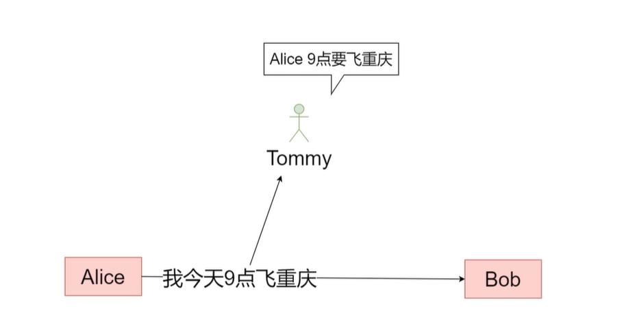

#### 加密

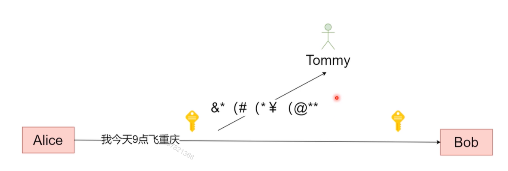

### 什么是加密

将明文信息变成不可读的密文内容，只有拥有解密方法的对象才能够将密文还原成加密前的内容

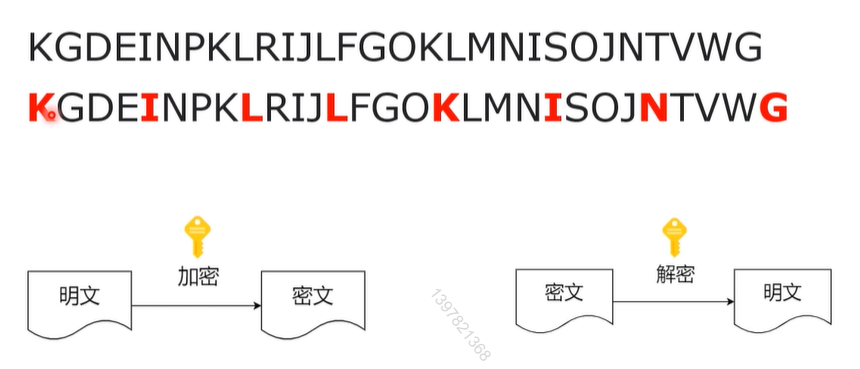

#### 加密方法 / 解密方法

+ 计算机中，加密方法和解密方法，可以描述为一段程序，我们称作加密 / 解密算法
+ 加密有时候会对暗号，比如上个栗子中每次跳过3个字符， **3**  就是一个暗号，这个我们称作 **秘钥**

#### 对称加密 / 非对称加密

+ 加密和解密的暗号（秘钥）相同，我们称为对称加密

  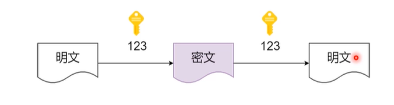

+ 加密和解密的暗号（秘钥）**不同**，我们称为非对称加密

  

#### 非对称加密（秘钥对）

+ 创建者创建一个秘钥对（分成公钥和私钥）
+ 公钥加密必须私钥解密
+ 私钥加密必须公钥解密
+ 创建者保留个私钥，公钥向外界公开

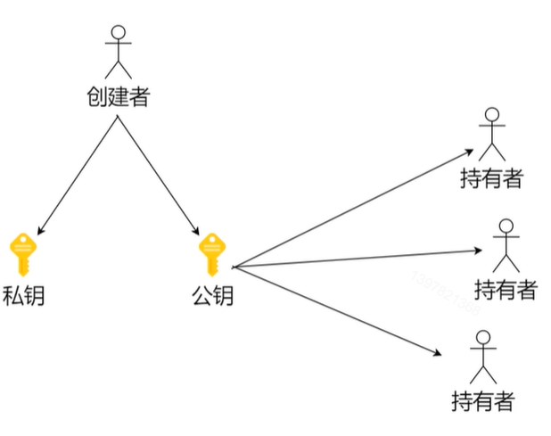

**思考**

为什么加密解密可以不用一把钥匙？

什么场景需要非对称加密？

+ 不放心对方保管密钥的情况

## 02. 解决信任问题

#### 证书体系

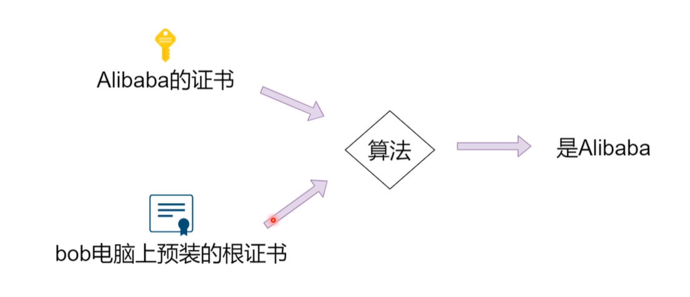

#### 算法如何验证证书就是Alibaba

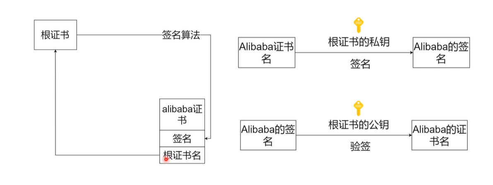

#### 实际的证书体系

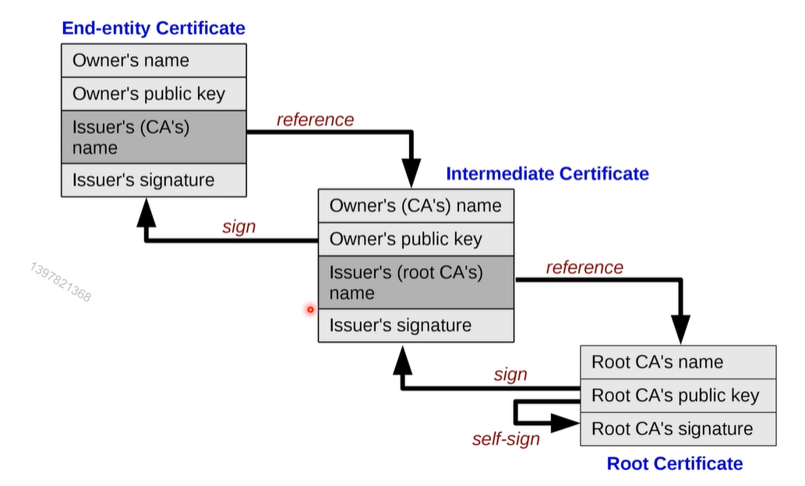

## 03. 算法种类介绍

#### DES（Data  Encryption Standard）

+ 1970 IMB 提出的对称加密算法
+ 可暴力破解

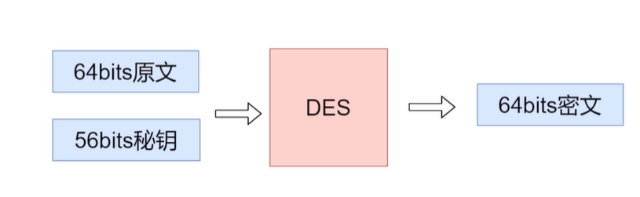

#### AES（Advanced Encryption Standard）

+ 2001年美国国家标准与技术研究院发布的对称加密算法（两位密码学家共同设计）
+ 可旁道攻击

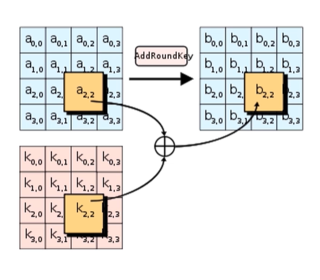

#### RSA（Rivest-Shamir-Adleman）

Ron Rivest, Adi SHamir, and LeonardAdman 1977 年发布的**非对称加密算法**

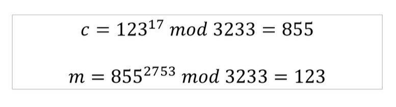

#### 对称 vs 非对称

+ 非对称加密安全性更好
+ 对称加密计算速度更快
+ 通常混合使用（利用非对称加密协商秘钥，然后进行对称加密）

## 04. HTTPs  工作原理

#### HTTPs 建立连接到工作的过程

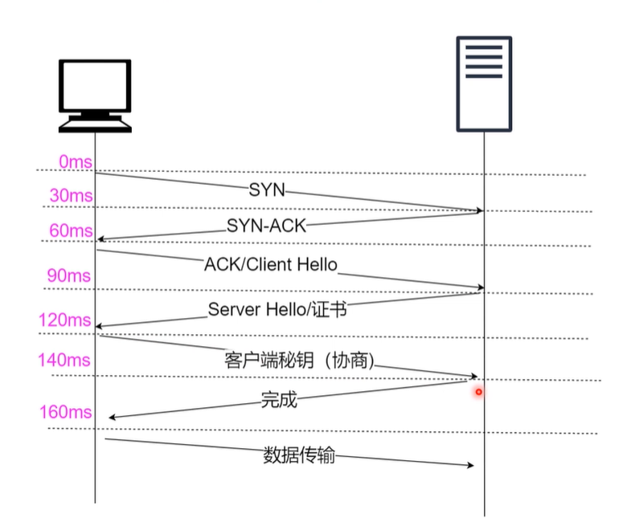

#### 最后小结

加密 / 解密核心是要解决诚信问题

（凡是能解决诚信问题的方法都可以替代现在的体系）