### 课程目标

+ 面试重点
+ 前端重点
+ 架构思想

### 课程内容

+ TCP vs UDP
+ HTTP2.0
+ HTTP3.0

## 01. TCP vs UDP

#### Internet协议群（TCP/IP协议群）

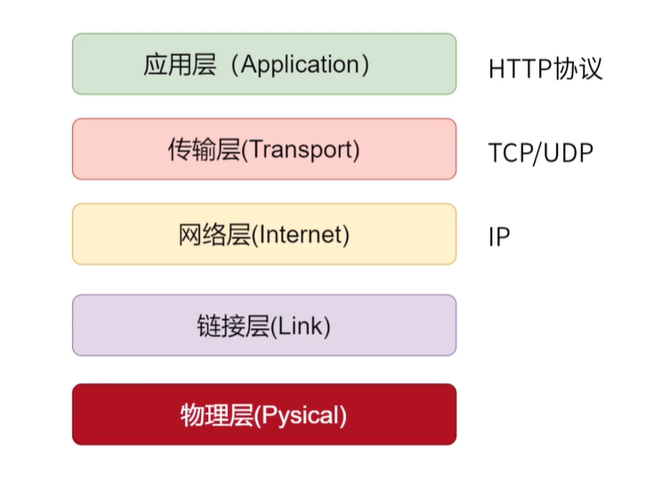

#### 传输层和网络层

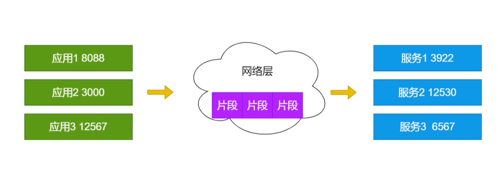

### UDP（User Data Diagram）

+ 比TCP节省网络资源和迅速
  + 不需要建立连接（延迟更低）
  + 封包体积更小（传输速度快）
  + 不关心数据顺序（不需要序号和ACK，传输快速）
  + 不保证数据不丢失

#### 连接

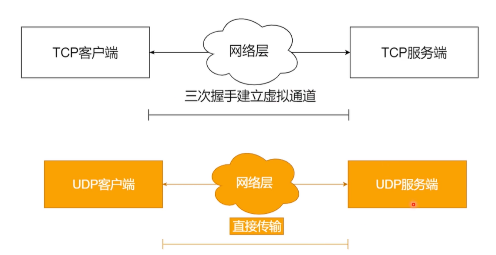

#### 重发（校验）

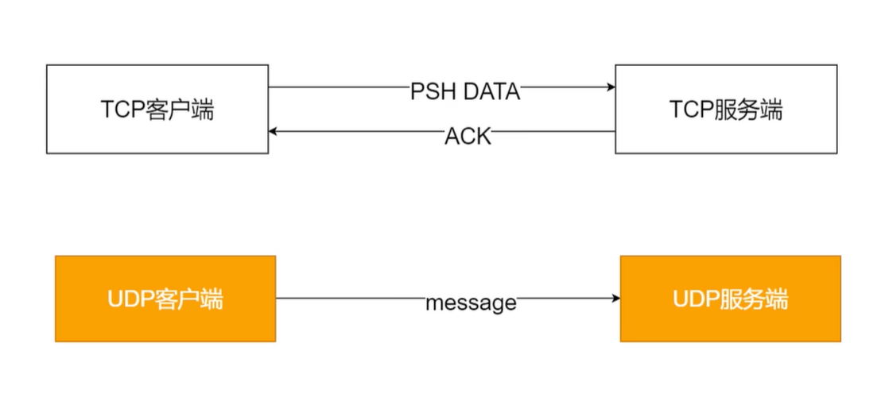

#### UDP 不保证顺序

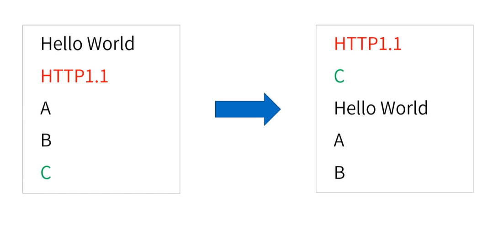

会乱序。

**思考**

+ 没有虚拟连接、不校验数据、不保证顺序、没有收到不重发 -- 是不是意味着不安全、不可靠？
+ UDP自由度更高...
  + 需要用户程序在应用层定义类似的机制
  + TCP面向流（API接收流）、UDP面向消息（API接收数据包）
+ 场景不同
  + 模糊： 文件 & 文本、多媒体
  + TCP：远程控制
  + UDP：DNS查询

## 02. HTTP2.0

#### HTTP2.0 目标

+ 多个请求多路复用
+ 防止对头阻塞
+ 压缩HTTP头部
+ 服务端推送

#### HTTP1.1 排队问题

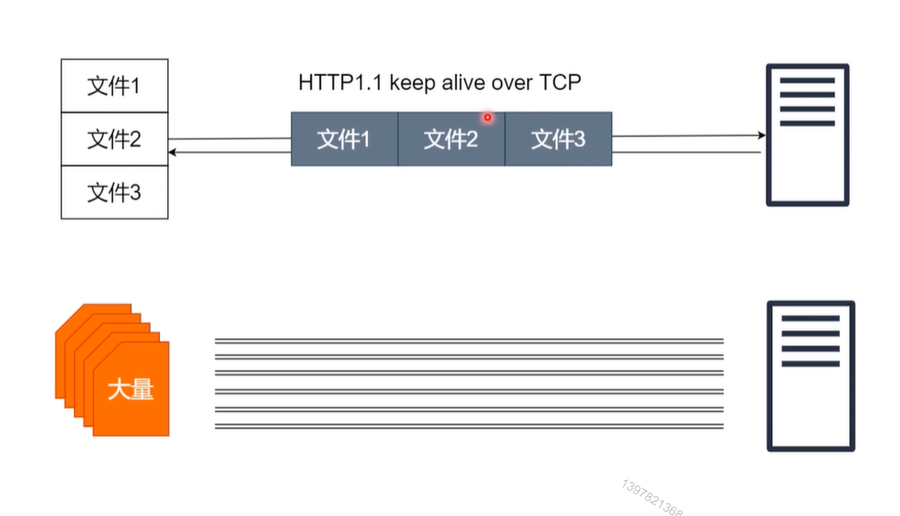

#### HTTP2.0多路复用

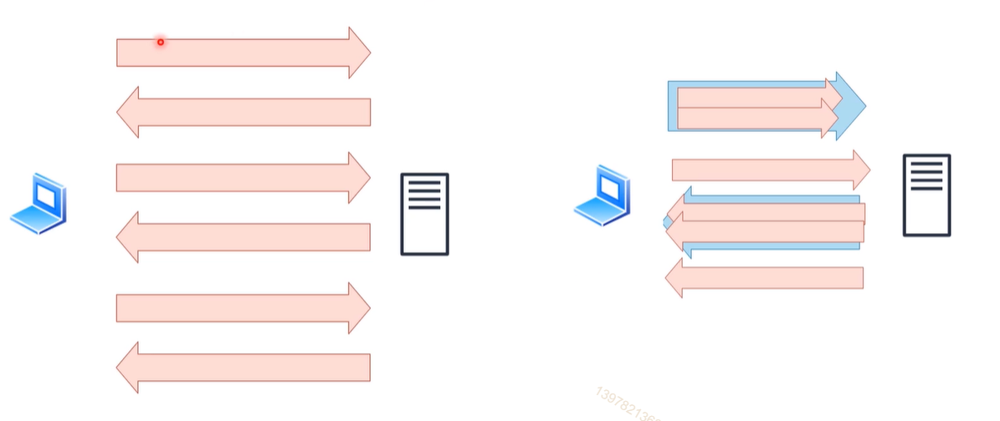

**思考**

哪里变快了？没有变快啊！还是需要传送这么多的数据！

#### HTTP1.1对头阻塞

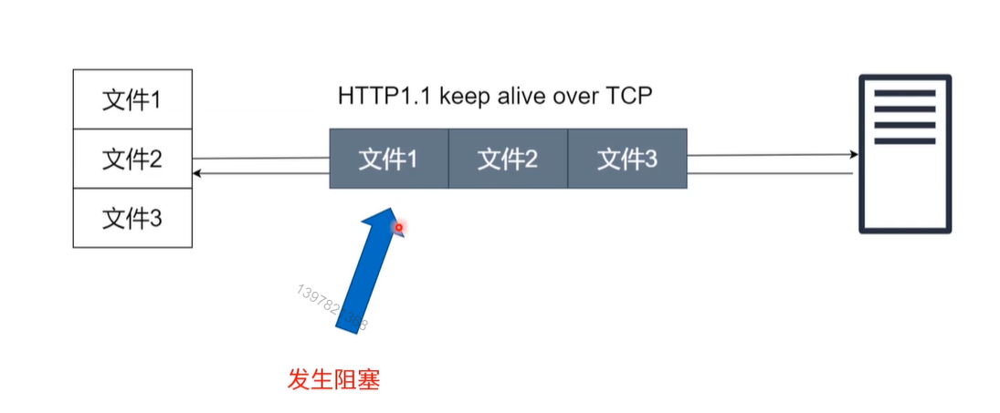

#### HTTP2.0解决

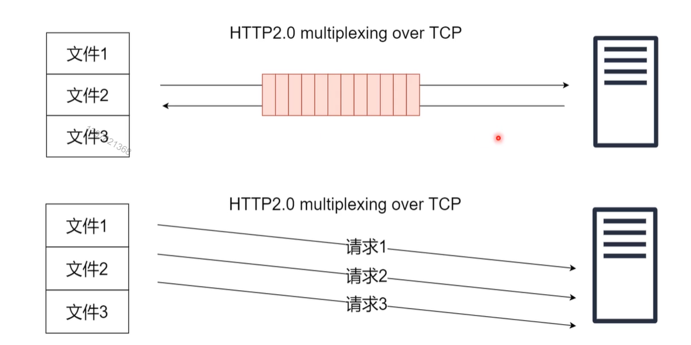

### 压缩头部

+ HPACK技术

  + 压缩（2  代表 METHOD GET）

  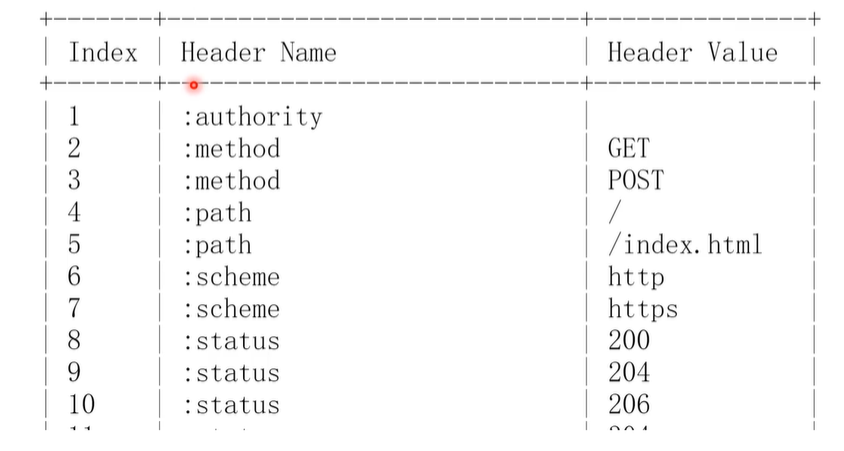

#### 服务端推送

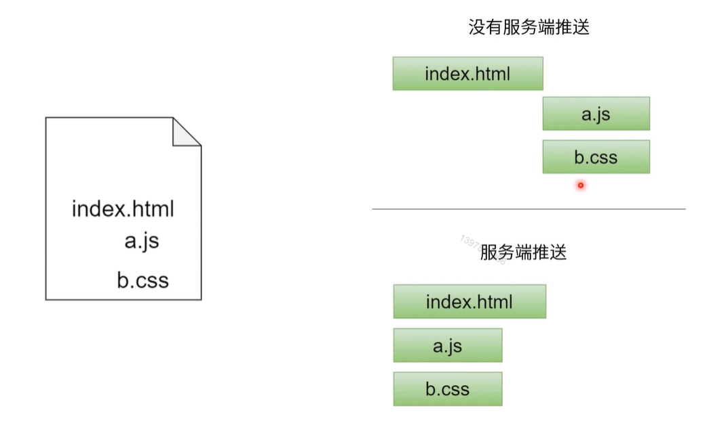

#### 服务端推送（悖论）

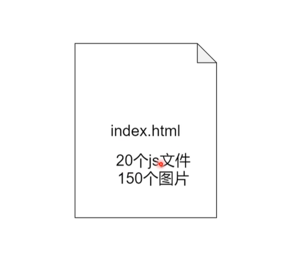

#### 思考

+ 雪碧图还要不要
+ 前端资源还需不需要GZIP
+ JS/css文件合并还需不需要？JS 压缩还需要么？
+ 首屏优化还需 不需要？

## 03. HTTP3.0

HTTP3.0 是什么？

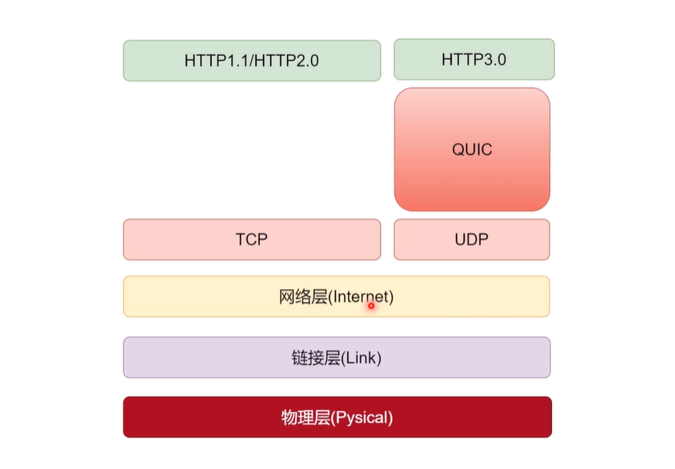

#### 最后小结

+ UDP把自由度给了用户，使用的人少；TCP自由度低，用的人多（思考）
+ HTTP2.0/ HTTP3.0都兼容了HTTP1.1(思考)
+ **问题**：谁在推动协议发展？