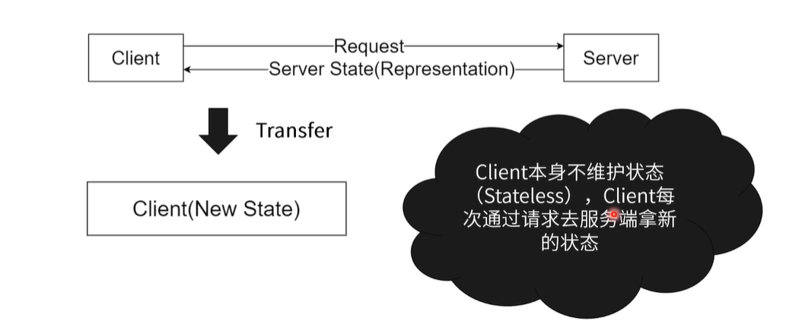

### 课程目标

+ 工作日常
+ 面试重点
+ 大厂生态

### 课程内容

+ Restful
+ postman

## 01. RESTFUL

> 表现层状态转化（Representational state transfer）

#### 资源、表示和转换

+ 资源（Resource）
  + 服务端的一个资源
  + 拥有URL
+ 表示（Representation）
  + 服务端资源在客户端的表示
  + 客户端拥有操作服务端资源的方法
+ 转换（Transfer）
  + 客户端收到新的表示，从而向用户展示新的内容

#### 约定

+ 资源命名
  + 名词性词组
  + 下单：/makeOrder -->  POST  /order
  + 用户登录：/user/login --> /token
+ 状态
  + 客户端无状态（资源表示 -> 展示）
  + 产品列表：GET /products -> 产品列表组件
+ 统一
  + 资源ID /product/123
  + 描述性强：HTTP状态码、规范的协议

#### CURD（约定）

+ GET /product?{query}
+ GET  /product/123
+ POST /product <body>
+ PUT/product <body>
+ DELETE  /product <body>

#### RESTFUL优点

+ 客户端无状态（简化开发）

+ 资源独立、接口间独立（缓存好设计）
+ 对协议依赖不严重（可迁移）

#### 问题

+ 服务端建设不够领域化（导致：相同资源不同字段）
  + /GET /product/123?includes=id,name,data,desc
  + /GET /product/123?includes=id,name,desc,color

## 02. postman

#### postman使用方法

+ 接口清单（文档）
+ 接口开发（测试）
+ 分享（协作）
+ Mock数据

### 最后小结

+ 从RESTFUL角度：前端不是无状态，而是无业务状态
+ Mock数据和接口测试的其他方法
  + Mock.js
  + Mocha、jest

