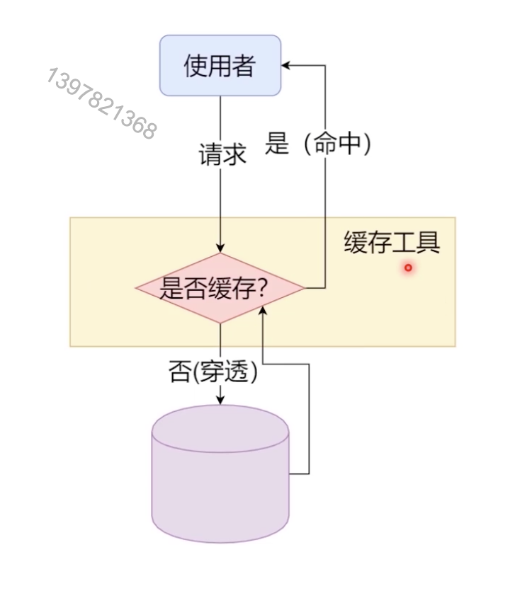
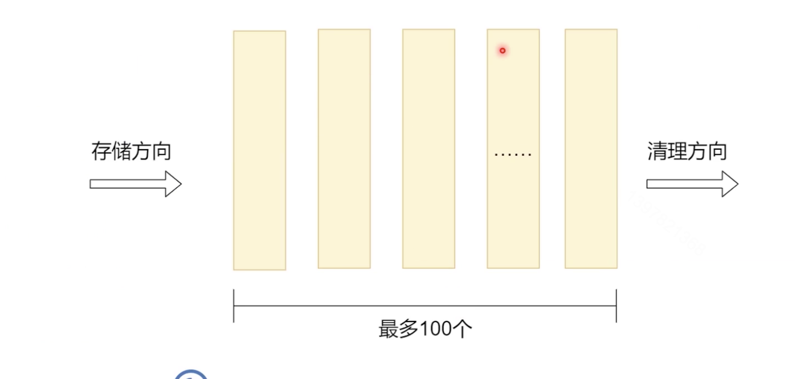
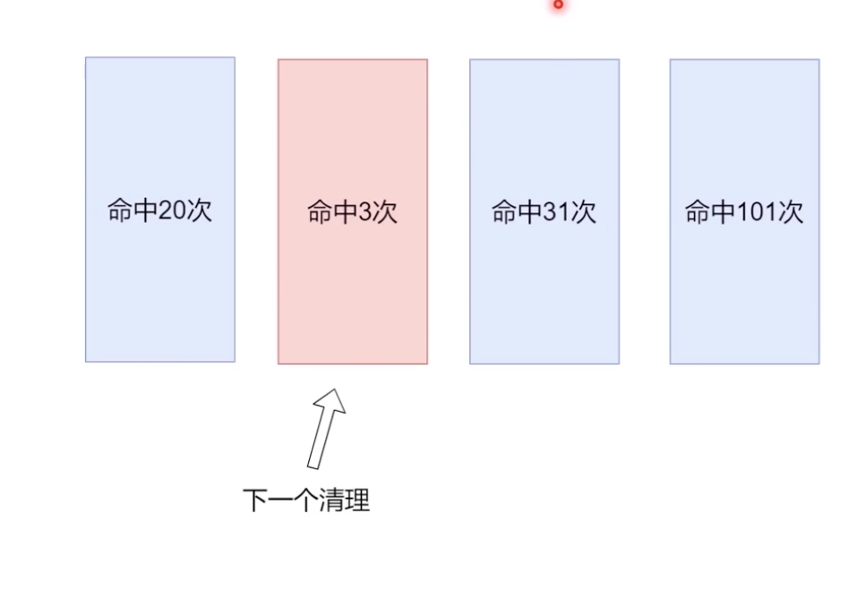
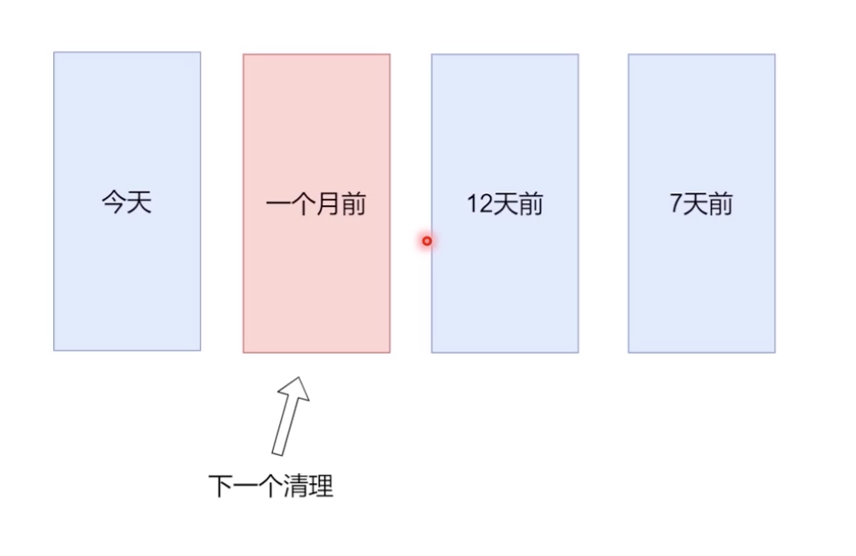
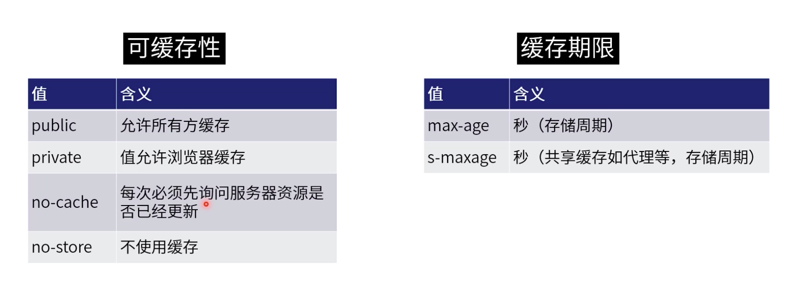
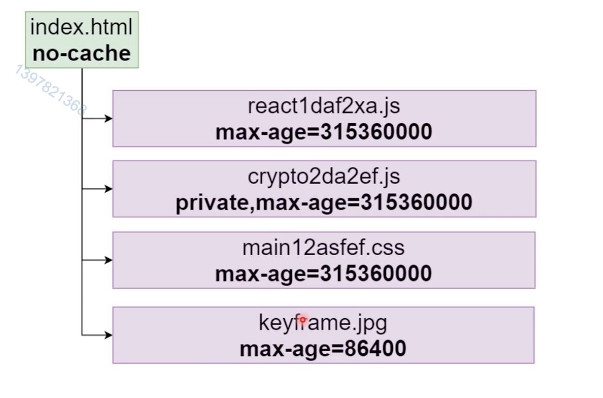
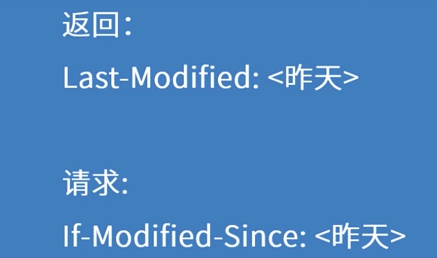
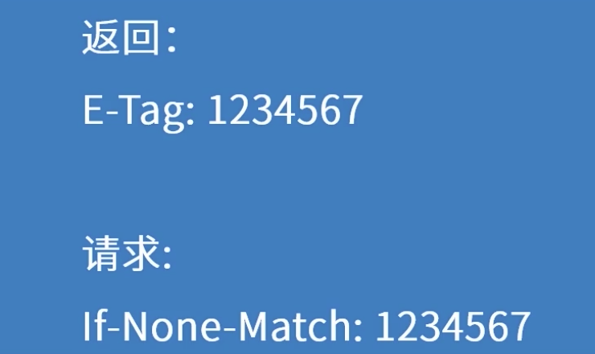

### 课程目标

+ 工作日常
+ 面试重点
+ 架构思想


### 课程内容

+ 缓存介绍
+ 实战：fifo的memory函数
+ 实战：LRU算法
+ HTTP缓存


## 01. 缓存介绍


#### 缓存

+ 存储将被用到的数据，让数据访问更快
  + 命中：让缓存中找到了请求的数据
  + 不命中/穿透：缓存中没有需要的数据
  + 命中率：命中次数/总次数
  + 缓存大小：缓存中一共可以存多少数据
  + 如果缓存空间不够数据如何被替换




#### 清空策略（FIFO）



**思考**：如果是JavaScript缓存，是Map还是Array


#### LFU-Least Frequently used



**思考**：内部实现用数组还是优先级队列？


#### LRU-Least recently used



**思考**：内部实现用数组还是优先级队列？


## 02. 实战：fifo的memory函数

```js
// 1 1 2 3 5 8
function fib(n) {
    if (n == 1 || n == 2) {
        return n
    }
    return fib(n-1) + fib(n-2)
}
console.log(fib(43))
```


### Cache-Control

定义所有缓存都要遵守的行为




#### Cache-Control常见用法




### 强制缓存

强制使用缓存，不去服务器对比；（缓存生效不再发送请求）


###  协商缓存

协商使用缓存，每次需要向服务器请求对比，缓存生效不传回 body



Etag  也是一种协商缓存


#### 协商缓存-2

用的最多的协商缓存，这个不用自己配，服务端自动生成一个



 

最后小结

+ 发布新的静态资源的时候，如何更新缓存？
  + 每次发布的静态文件名都不同（大厂现在用的最多的策略）
+ HTTP缓存有大小限制么？FIFO还是lRU
  + 有大小限制，需要和服务端同学商量去定多大


