# 计算机网络总结-串讲

#### 前端工程师-职级体系

第一个阶段：基础

+ 新人（需要指导） P4-5
+ 中间状态（多个职级）
+ 熟练（独立承担需求）P6

第二个阶段：服务端技能、算法+数据结构、源码、操作系统

+ 腿部力量、部分创造型节点（独立设计+落地有价值的局部方案）
+ 腰部力量、中间状态（多个职级）
+ 转型期：完全创造型节点（整体方案推动和落地）

第三个阶段：公司高层

+ 策略型节点

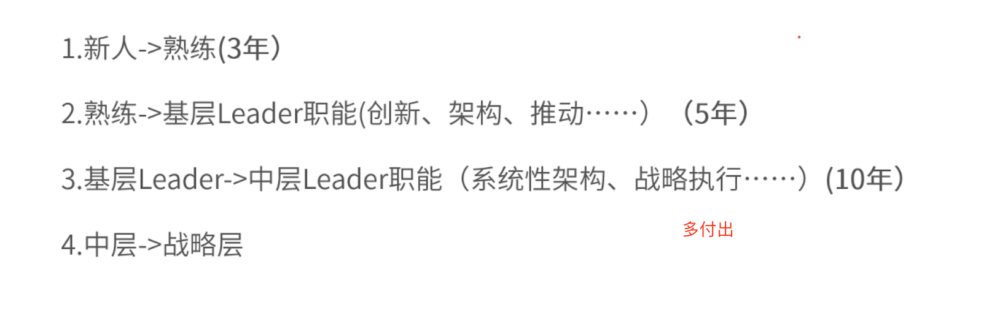

#### 工程师的能力模型

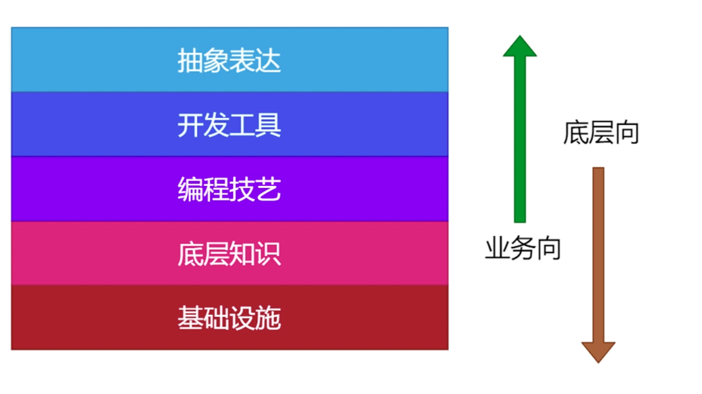

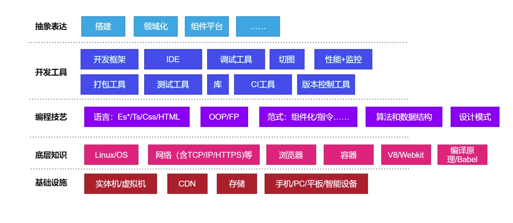

IDE vim

调试工具 whistle

切图 sketch

探索式学习（✔️）

填鸭式学习（×）

测试工具 jest mocha

jekeins

Git

CI/CD

## 网络面试题

#### TCP/IP协议群做了哪些事情？

1. 报文拆分
2. 增加协议头
3. 数据传输
4. 路由和寻址
5. 数据重组

#### TCP协议为什么是3次握手4次挥手？

TCP 为了保证 稳定性 可靠性 ACK

三次：合并 减少 包体积

四次

TCP 双工

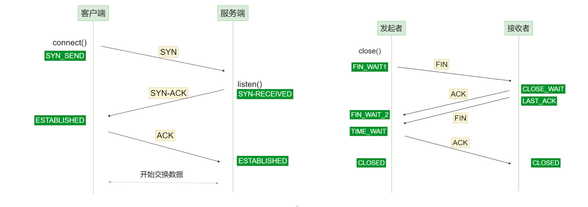

#### 如果网络延迟是30ms，那么Ping一个网站需要多少ms?如果请求一个HTTPS协议的网站， TTFB至少ms?

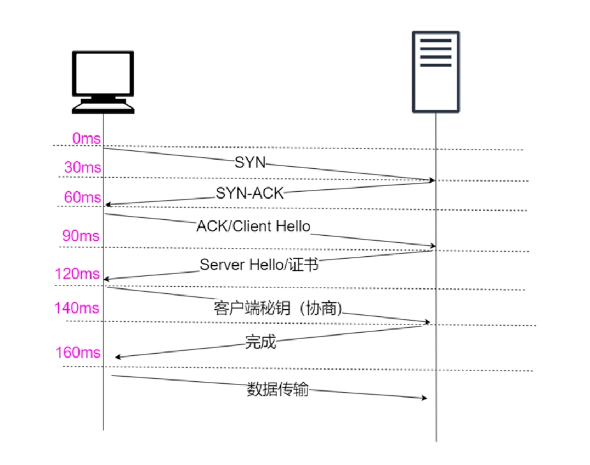

Ping：利用UDP，不保证可靠性 60ms

HTTPS：三次握手，回传证书，客户端服务端协商密钥，。。。 见上图

#### CDN更换图片？

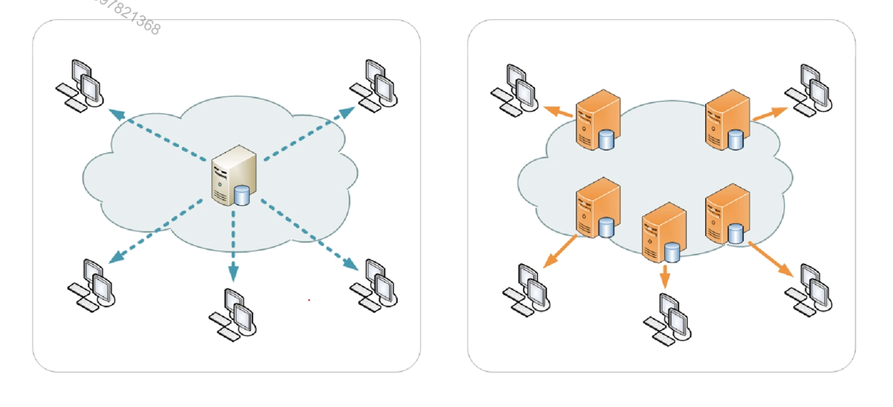

利用打包工具 a -- a2

#### 一次DNS查询最快和最慢差距有多大？

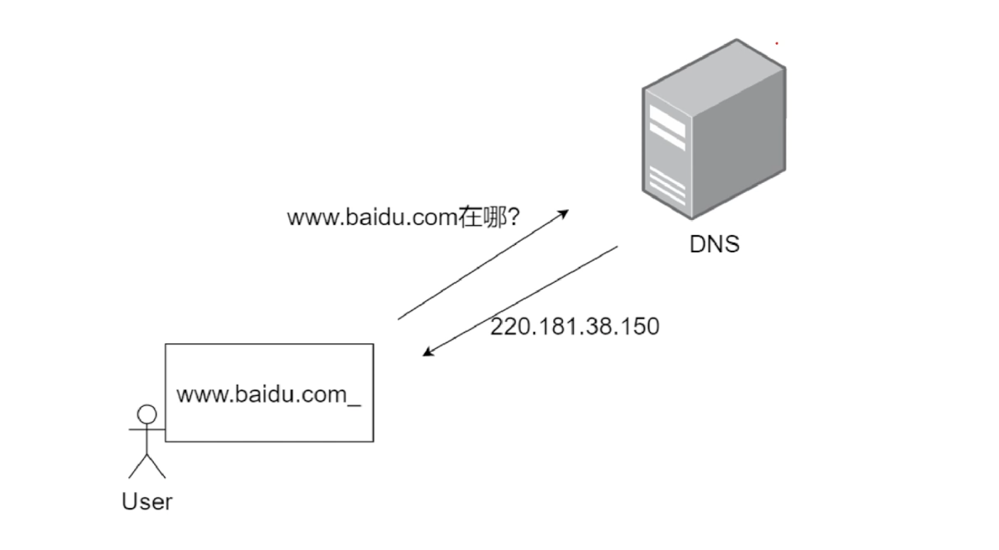

浏览器缓存 200-300cpu 纳秒级别

操作系统缓存

本地路由器缓存 ms

域名商

Root跟路由器（全世界大概只有十三台）分布式结构

root

+ .com
  + Authority
  + ...
+ .cn
  + Authority
  + ...
+ ...

#### HTTP长连接什么时候断开？

keep-alive

客户端 与 服务端 是用TCP， 频繁断开？不太合适，一直不断开，也不太合适。

不断开，server端多监听一个socket文件，（红黑树）

B 给 S 一个 html 文件，每隔5秒 看是否请求

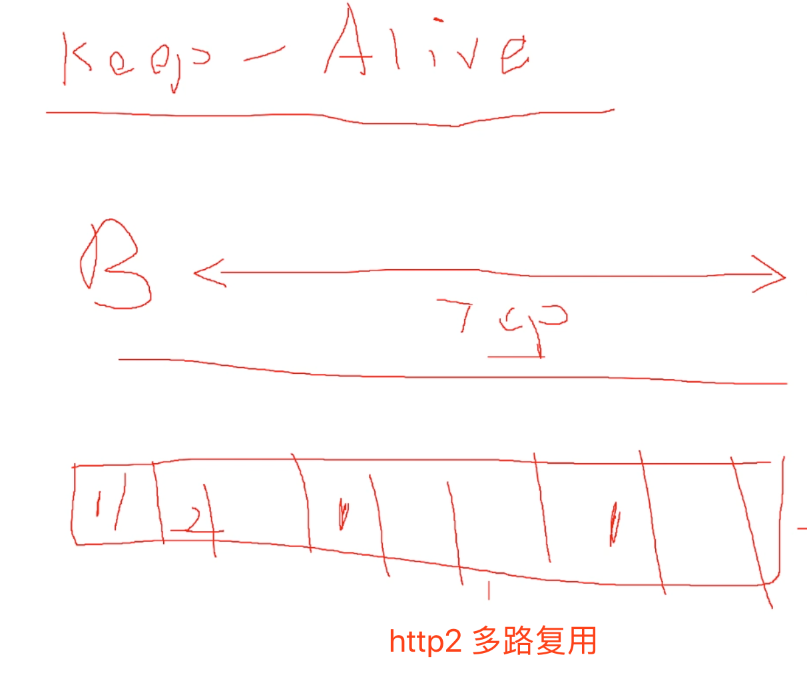

#### Socket是怎么回事？

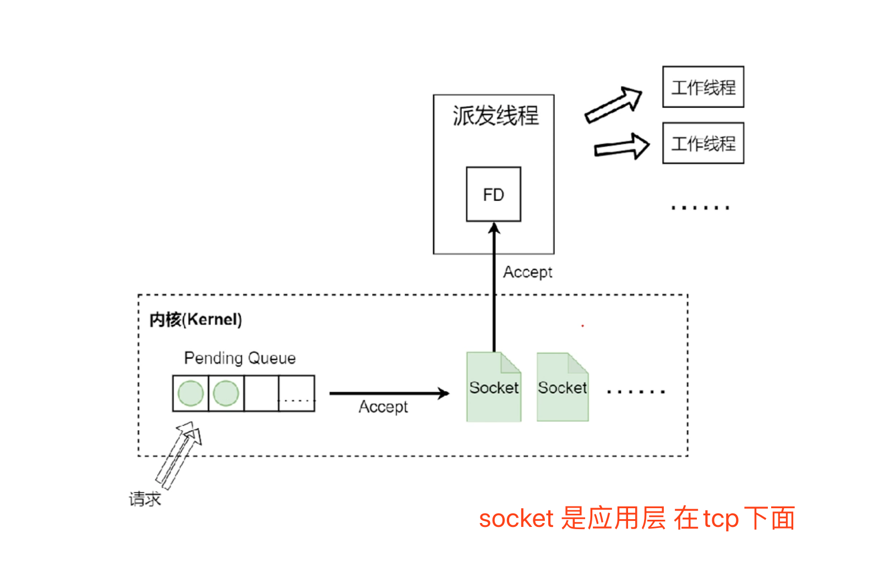

#### 请简述什么是Restful?

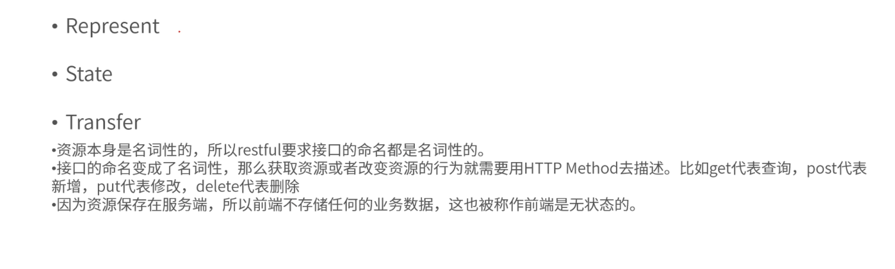

#### 强制缓存和协商缓存的区别？

Cache-Control  配置缓存类型

Etag比较

用途不一样

强制缓存：资源文件长期不变，jquery1.4.2

协商缓存：容易变的 资源 html

#### 正向代理和反向代理有什么区别？

正向代理：vpn  带着目标地址

反向代理：

#### 什么是 https 中间人攻击？

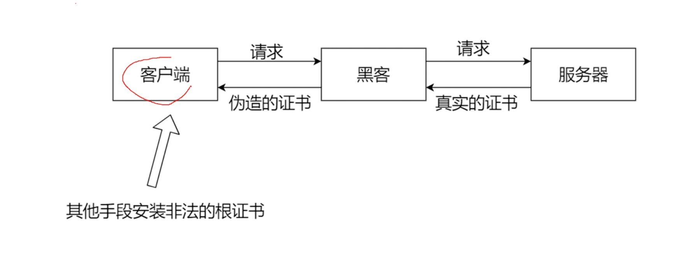

whistle

charles

#### Base64上传和blob上传有那个更好？

base64  3个 byte 转为 4个 byte  (ascii  0)

Blob 字符串传输  直接利用http协议 2进制传输 速度更快、节省3/4 流量

#### 解决跨域的手段？

+ 代理

+ Jsonp

+ CORS 

  + OPTIONS 

+ Iframe 页面通信:  postMessage

  

  Websocket  跨步跨域？

#### 请简述 amd/cmd/commonjs和es6 module 的主要区别？

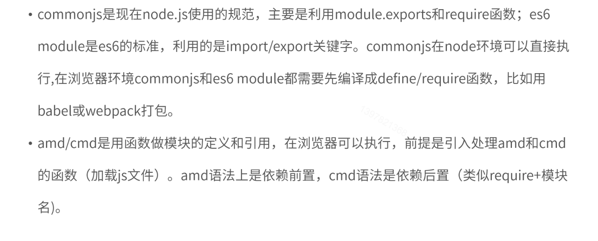

#### 移动端通常你关注哪些前端指标？

+ FCP
+ TTI
+ 跳出率
+ CPU占用
+ 白屏

#### 移动端网络性能优化策略

+ http缓存
+ CDN
+ 预加载webview
+ Server  push
+ 离线包
+ 压缩 gzip
+ service worker

#### 其他问题

+ 前端工程师算法要学到什么程度？往架构师方向

  + 理论、动态规划
  + 基础、递归
  + 深度优先搜索、广度优先搜索
  + 基础数据结构，队列、栈、链表、树

  easy: 15min

  middle：30min

+ 天天做页面没有成长怎么办？

