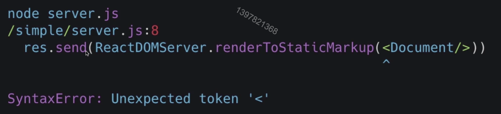
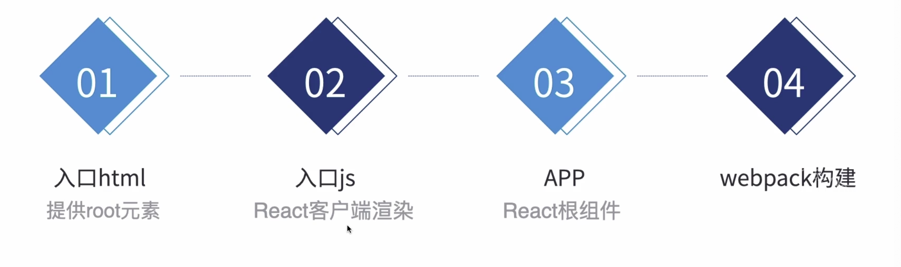
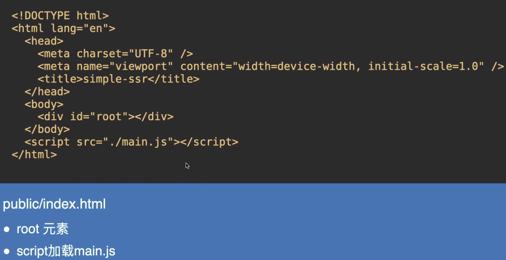
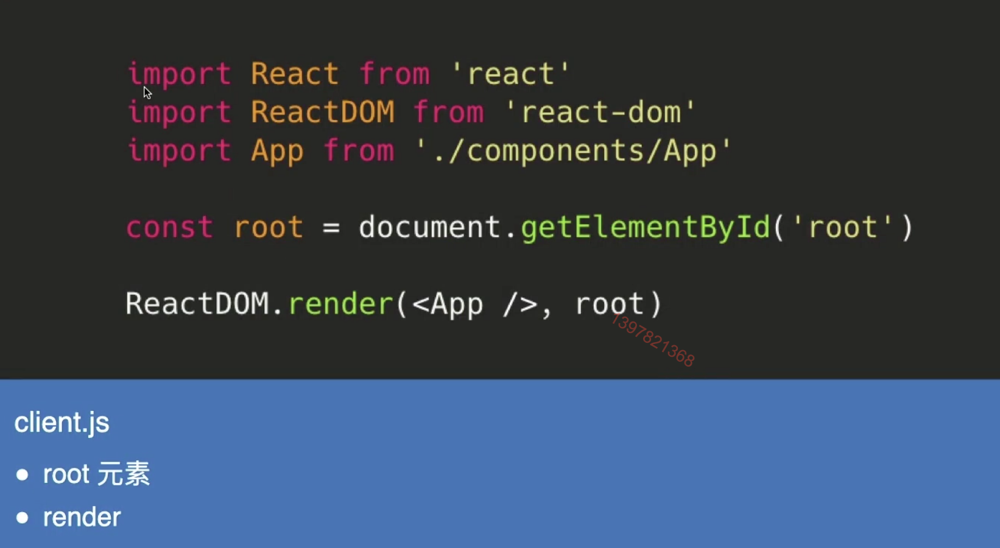
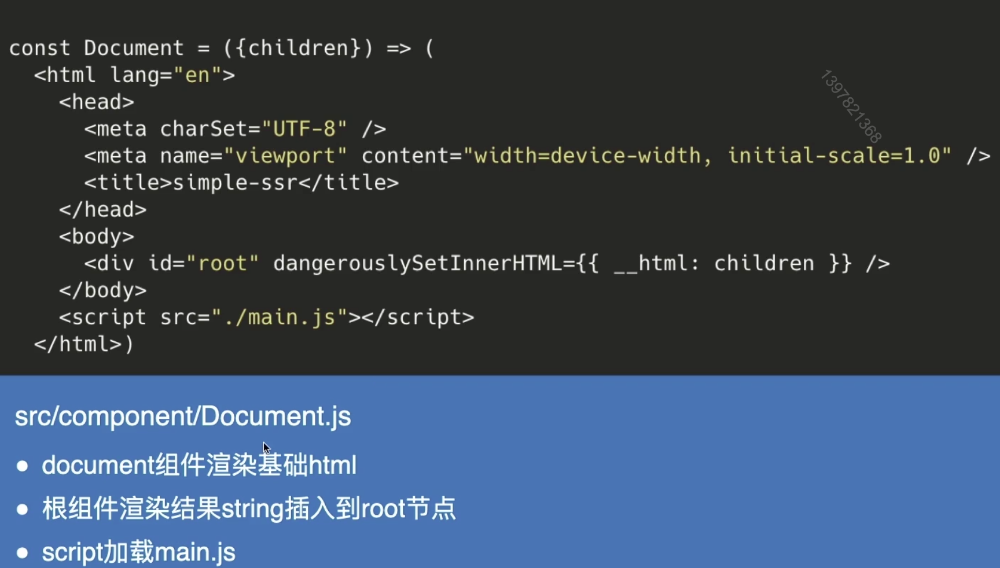
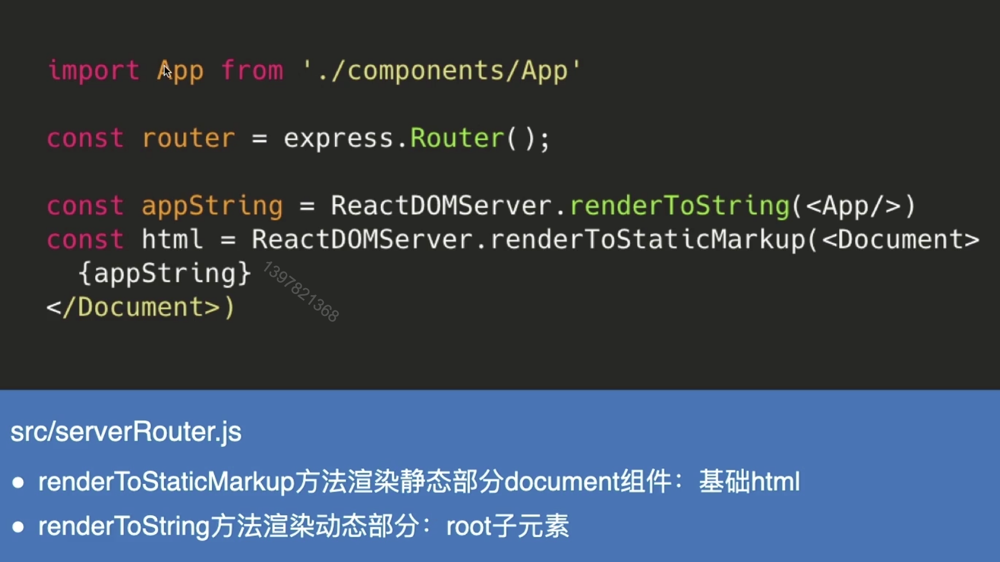
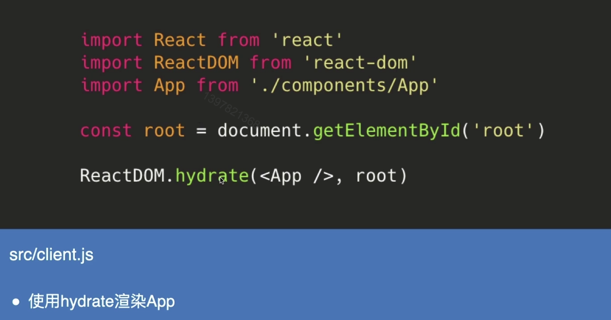
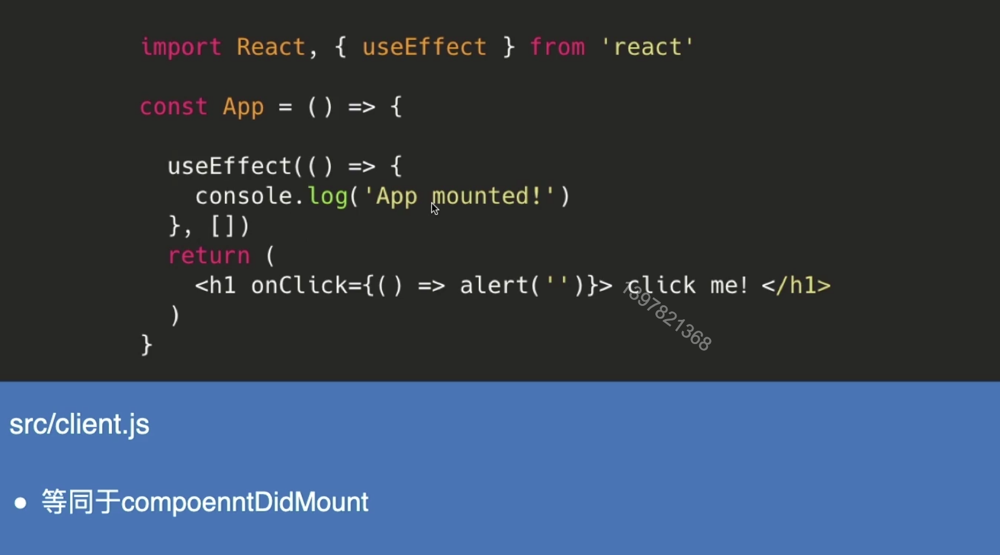

# 实现一个简单的同构


### Content

+ 使用express启动一个Node服务器
+ 在服务端使用React组件和API渲染
+ 实现Node响应客户端渲染页面
+ 实现SSR同构渲染


### Main Target

1. 掌握React服务端组件编写 & 渲染
2. 理解SSR的事件绑定
3. 能够独立完成React SSR demo
4. 熟悉服务端和客户端开发差异


##  01. 使用express启动一个Node服务器

 

### 安装express

+ 创建文件夹simple
+ 在simple路径下执行 npm init 初始化项目
+ 执行 npm install express --save 安装 express


### 启动Node服务器

+ 创建server.js文件
+ 执行 node server.js 
+ 在浏览器中输入 http://localhost:3000/

```js
// server.js
const express = require('express')
const app = express()

app.get('/', (req, res) => {
    res.send('Hello World')
})

app.listen(3000, () => {
    console.log('Example app is listening on port 3000!')
})
```


## 02. 在服务端使用React组件和API渲染

### 安装React

npm i react react-dom -S


### 服务端渲染html页面


#### 在服务端编写 Document组件

Document

+ 新建document.js
+ 基本的html 结构

```js
// Document.js
import React from 'react';

const Document = () => {
    return (
        <html>
            <head>
                <title> simple-ssr </title>
            </head>
            <body>
                <h1>Hello SSR</h1>
            </body>
        </html>
    )
}
export default Document
```


#### 使用React 服务端渲染API

server.js

+ 引入 ReactDOMServer 和组件 Document
+ 修改服务器的响应为 ReactDOMServer.renderToStaticMarkup(<Document/>)

```js
// server.js
const express = require('express')
const app = express()

const ReactDOMServer = require('react-dom/server')
const Document = require('./Document')

const html = ReactDOMServer.renderToStaticMarkup(<Document/>)
app.get('/', (req, res) => {
    res.send(html)
})

app.listen(3000, () => {
    console.log('Example app is listening on port 3000!')
})
```


#### JSX语法报错




#### 解决Node jsx报错

步骤

+ 安装babel

  npm  i @babel/core @babel/register @babel/preset-env @babel/preset-react --save-dev

+ babel  有效范围

  当前引入babel的文件无效

+ 拆分router

  把express的router拆出独立文件，在router中执行 React 服务端渲染API


#### 在路由中使用React服务端渲染

appRouter.js

+ 引入 React ReactDOMServer 和组件 Document
+ 修改服务器的响应为 ReactDOMServer.renderToStaticMarkup(<Document/>)

```js
// appRouter.js
const express = require('express')
import React from 'react';
import ReactDOMServer from 'react-dom/server'
import Document from './Document'

const router = express.Router()
const html = ReactDOMServer.renderToString(<Document/>)

router.get('/', (req, res) => {
    res.send(html)
})

module.exports = router

// server.js
require('@babel/register')({
    presets: ['@babel/preset-env', '@babel/preset-react']
})

const express = require('express')
const appRouter = require('./appRouter')
const app = express()


app.use('/', appRouter)

app.listen(4000, () => {
    console.log('Example app is listening on port 4000!')
})
```


#### 为什么没有事件响应？

**原因**

+ 服务端没有： 没有事件绑定
+ 服务端返回字符串：字符串不能绑定事件
+ 服务端返回没有 script
+ 浏览器加载只有 html : 没有任何script 去加载执行js


#### 如何解决？


## 03. Node服务器响应客户端渲染页面


#### 客户端渲染页面

步骤：




#### 客户端html




#### 客户端入口js




#### Node服务器提供静态文件

server.js

app.use(express.static('build'))


## 04. 实现SSR同构渲染


#### 服务端渲染替代 static/index.html




#### 服务端渲染优化静态/动态内容




#### 客户端渲染优化为 hydrate




#### 测试useEffect 的执行时机




#### 小结

1. React服务端组件编写 & 渲染
2. Node 服务返回客户端渲染页面
3. 结合CSR 和 服务端渲染
4. 理解SSR的事件绑定


Github: https://github.com/ykttym/simple