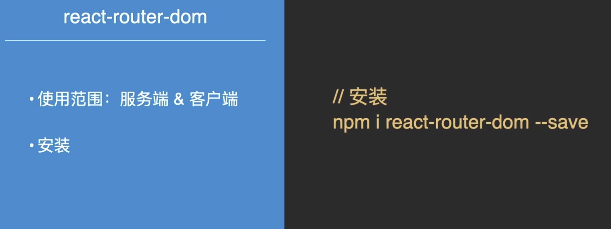
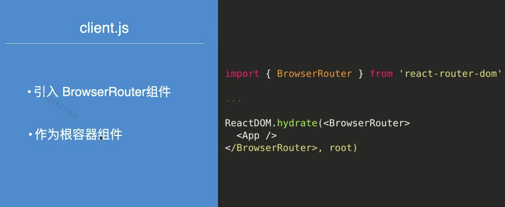
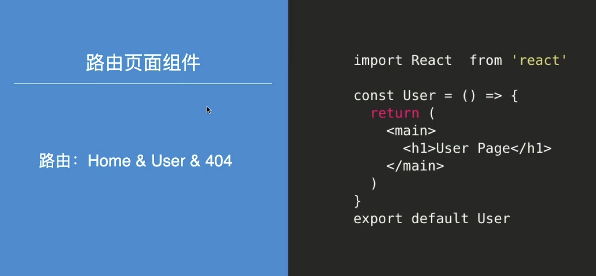
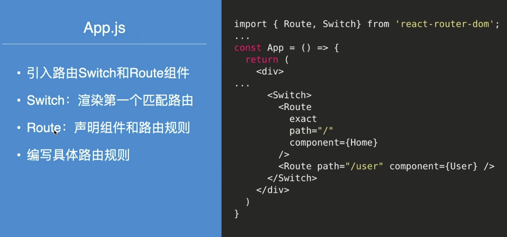
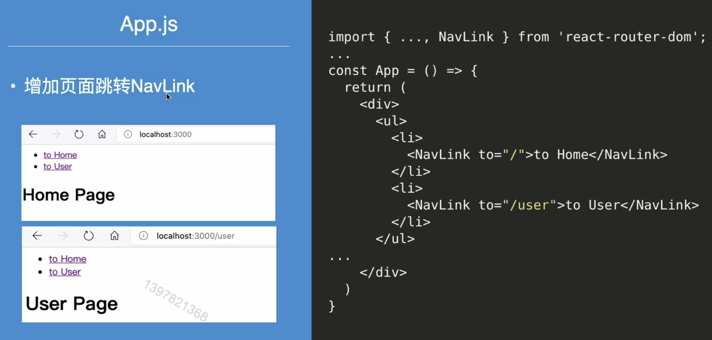
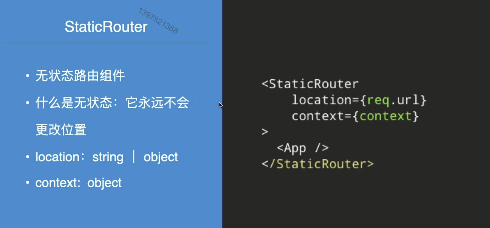
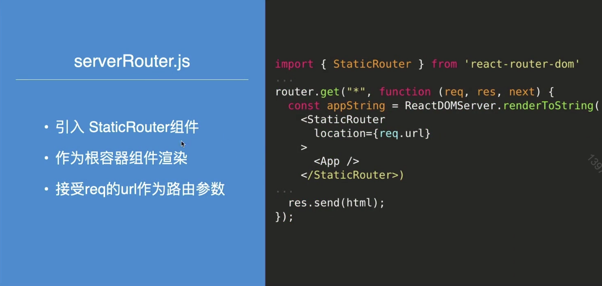

# 实现SPA同构渲染

实现一个同构demo

### Content

+ 实现客户端路由
+ 实现服务端路由

### Main Target

+ 掌握 react-router 基本的客户端路由实现
+ 理解无状态路由
+ 利用react-router 实现服务端路由

## 01. 客户端路由

客户端路由

 

## 02. 服务端路由

 

路由同构

#### 小结

+ 利用react-router-dom实现路由同构
+ 客户端路由
+ 服务端路由

