# 何时异步请求数据


### Content

+ 客户端请求数据的时机和实现
+ 服务端何时请求数据？
+ 实现服务端请求数据


### Main Target

+ 掌握客户端发送请求的时机
+ 掌握服务端发送请求的时机
+ 理解数据请求方法的挂在位置的设计


## 01. 掌握客户端发送请求的时机


#### 客户端请求数据

推荐：

+ 在 DidMount或者 useEffect 中 发送请求

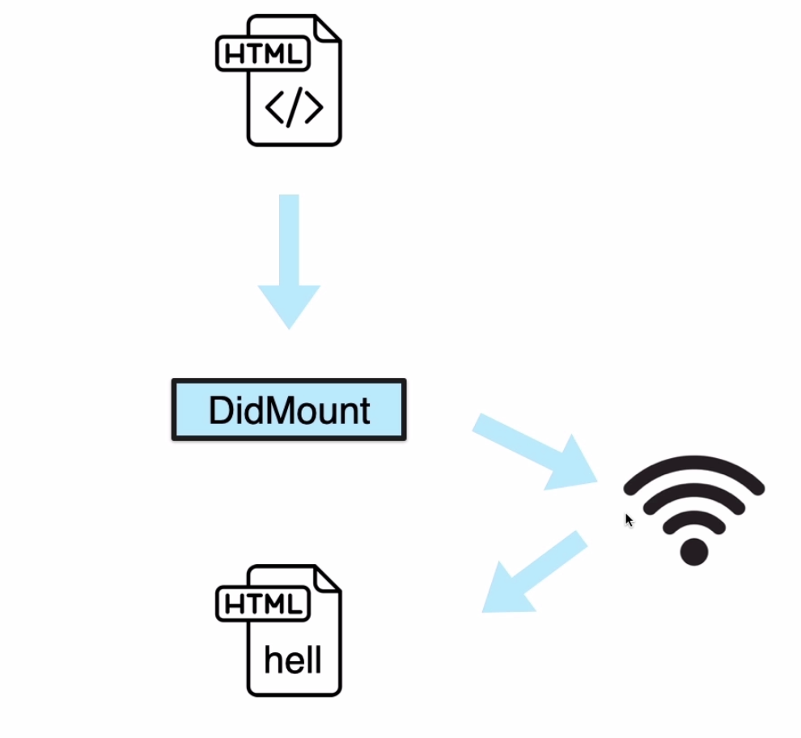

不推荐：

+ componentWillMount
+ componentWillReceiveProps
+ componentWillUpdate

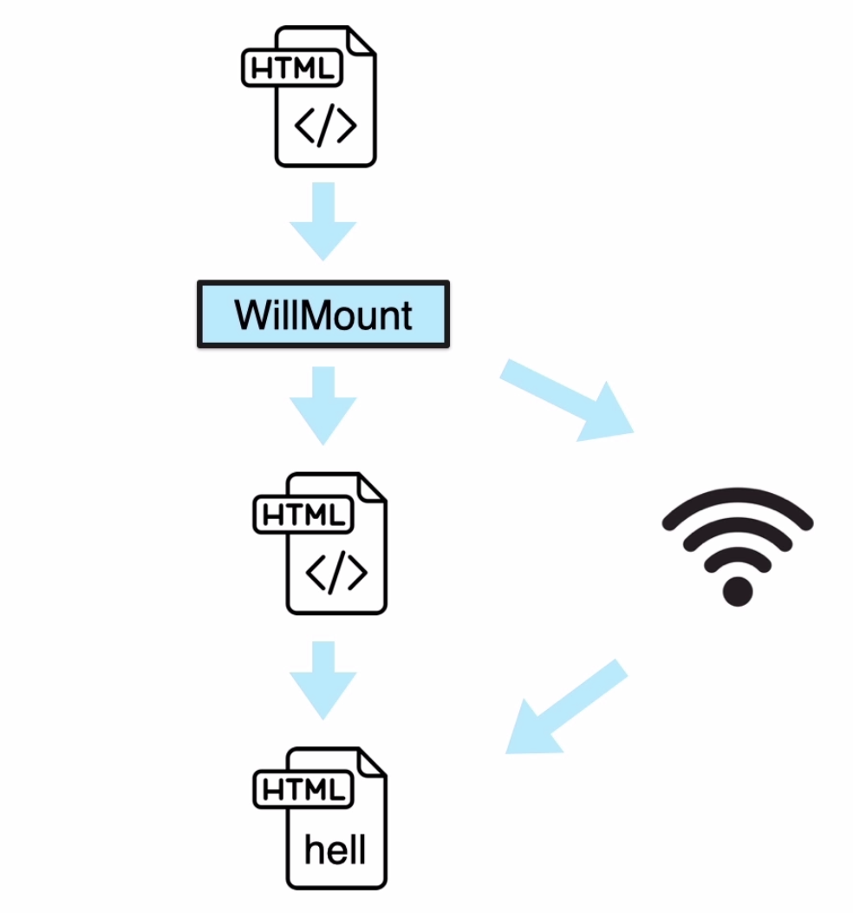


#### 过期警告

+ componentWillMount
+ componentWillReceiveProps
+ componentWillUpdate
+ 问题：可能多次执行

#### 客户端请求数据

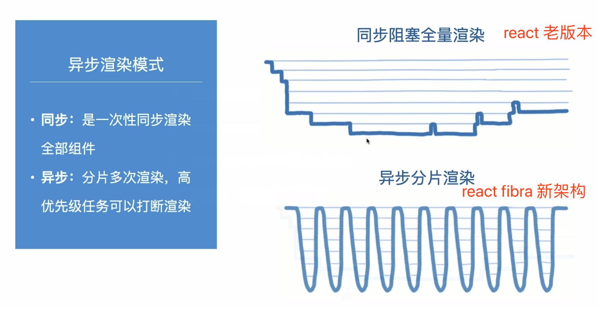

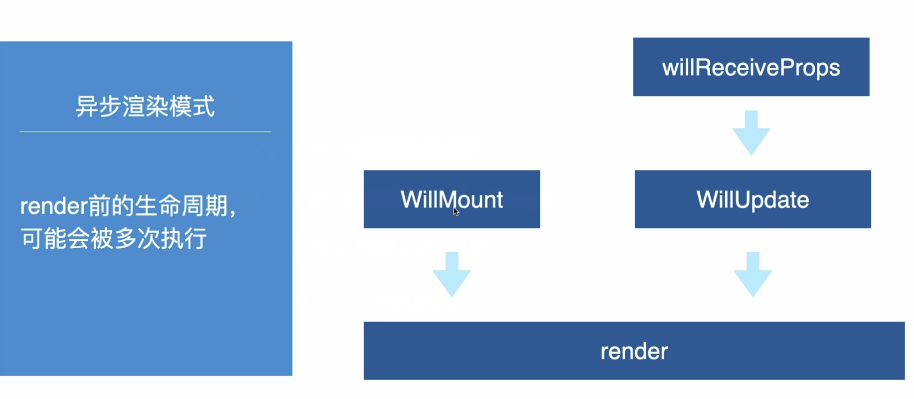


## 02. 服务端请求时机和实现

#### 服务端应该在 DIdMount中请求数据吗？

+ DIidMount 什么时候执行？
+ 在客户端首次渲染之后
+ 服务端不会执行


#### 服务端应该在什么时候请求？

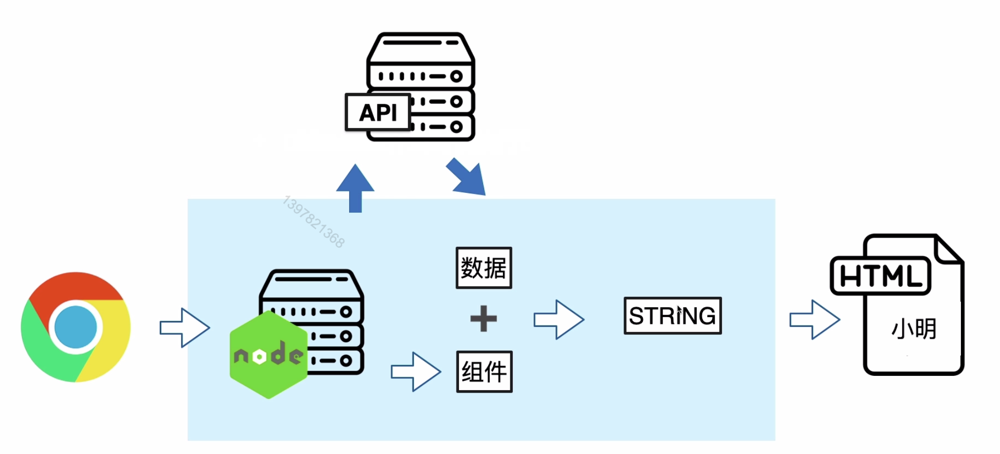

 

### axios 发送请求

**使用axios发送请求**

支持：

+ 服务端 & 客户端

**安装**

```shell
npm i axios -S
```

```js
// core/api.js
// 请求管理对象
import axios from 'axios'
```


请求管理对象：

集中处理所有的请求

```js
// core/api.js
// 请求管理对象
import axios from 'axios'
```


#### axios 发送请求

axios

基本请求方法

+ get
+ post
+ ...

```js
axios.get('/user', {
  params: {
    ID: 12345
  }
})
.then(function (response) {
  console.log(response)
})
```

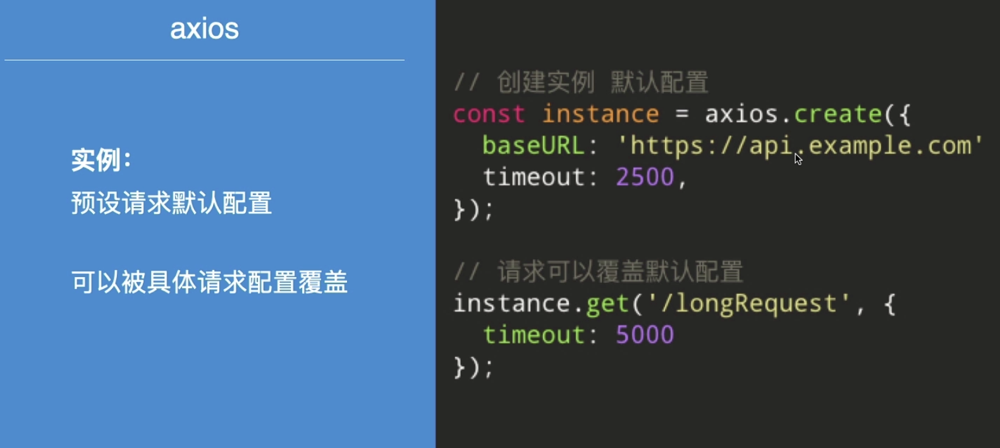

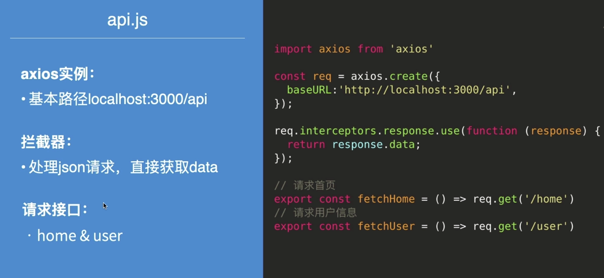

```js
// core/api.js
import axios from 'axios'

// 创建一个实例
const req = axios.create({
    baseURL: 'http://localhost:3000/api'
})

// 加一下拦截器
req.interceptors.response.use((response) => {
    return response.data
})

// 请求首页
export const fetchHome = () => req.get('/home')

export const fetchUser = () => req.get('/user')

```


#### axios发送请求

+ 客户端发送请求

```js
// Home.js
import React, {useEffect} from 'react';
import {fetchHome} from '../core/api'

const Home = () => {
    // 注意，函数组件没有 DidMount，这里我们使用 useEffect
    useEffect(() => {
        fetchHome().then(data => console.log('HomeData:', data))
    }, []);
    return ( 
        <main>
            <h1>
                Home Page
            </h1>
        </main>
     );
}
 
export default Home;
```


+ 服务端发送请求
  + 在服务端fetchHome
  + 先不区分路由
  + 请求的数据如何传递给组件？

#### 服务端组件渲染前发送请求

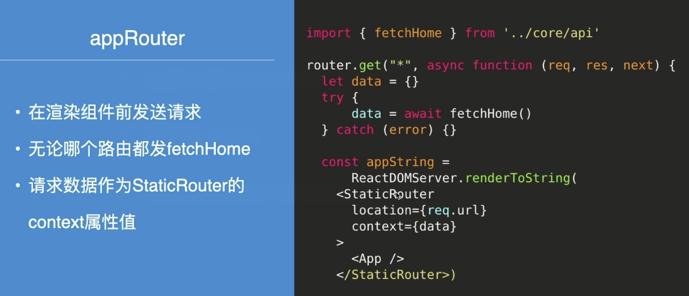

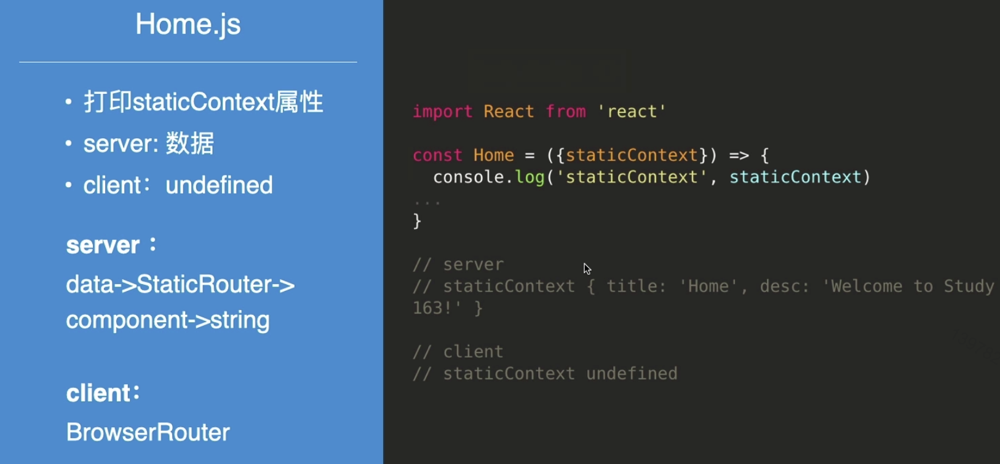

**使用了 async / await 语法**

需要安装对应的插件

```shell
npm i @babel/plugin-transform-runtime -S
```

```js
//.babelrc.js 文件中添加此插件
"plugins": [
  "@babel/plugin-transform-runtime"
]
```


#### 服务端按照路由发送请求

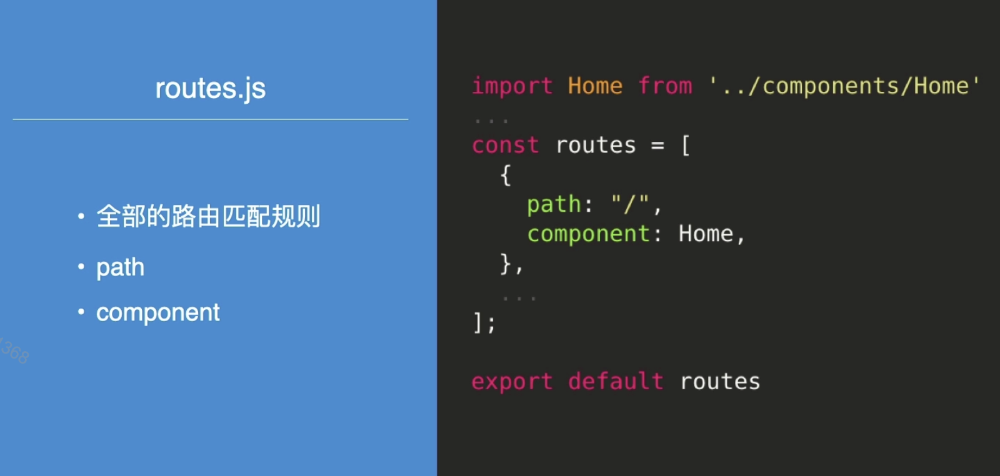

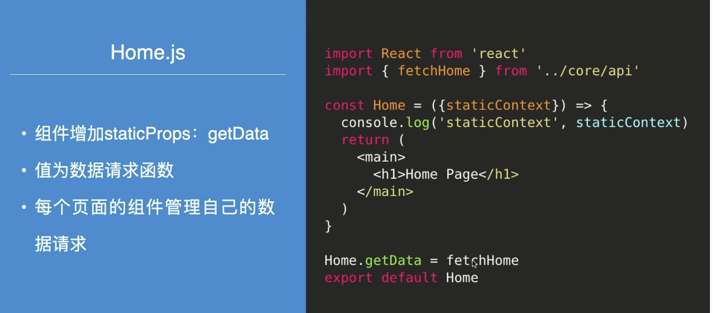

 

#### 客户端路由

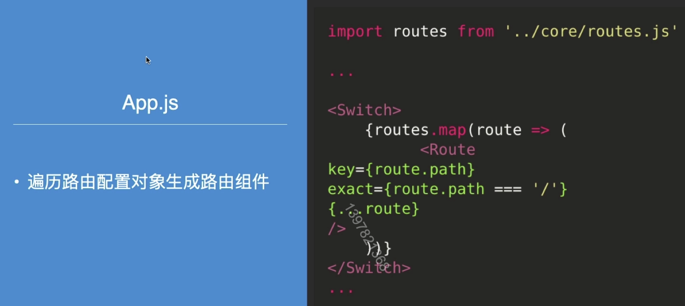


#### 服务端按照路由发送请求

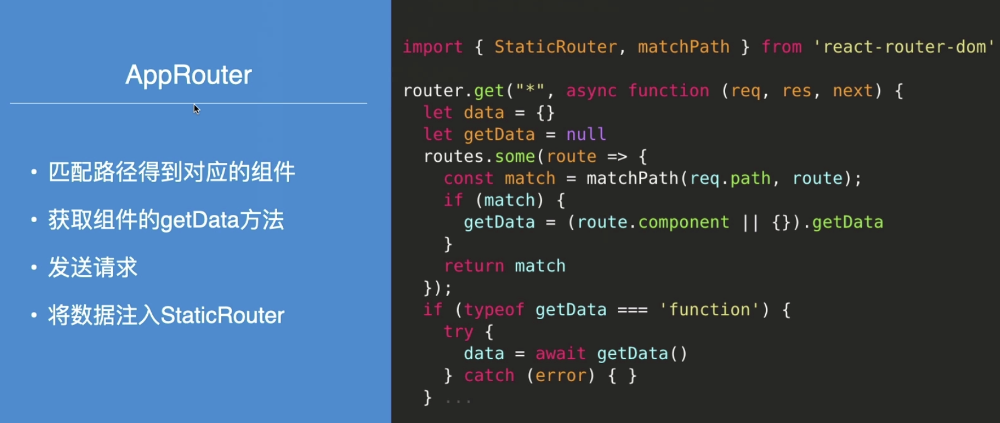


### 最后小结

+ 掌握客户端请求的时机
+ 简单理解异步渲染
+ 在服务端组件渲染前发送请求
+ 数据请求方法与路由组件绑定在一起

