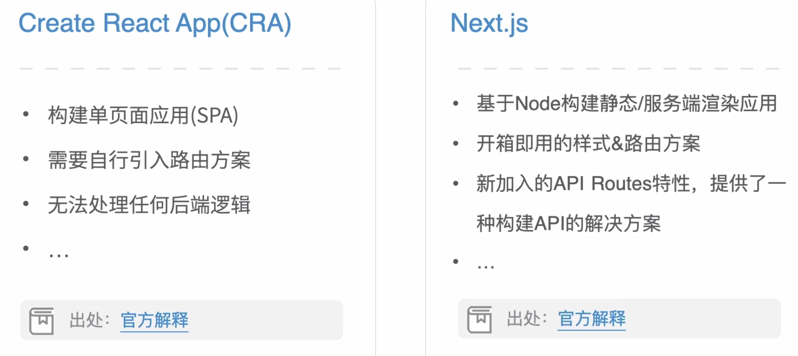
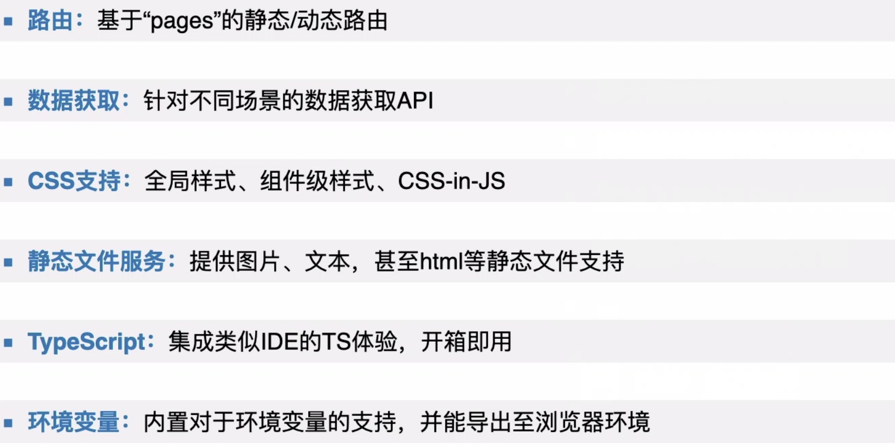
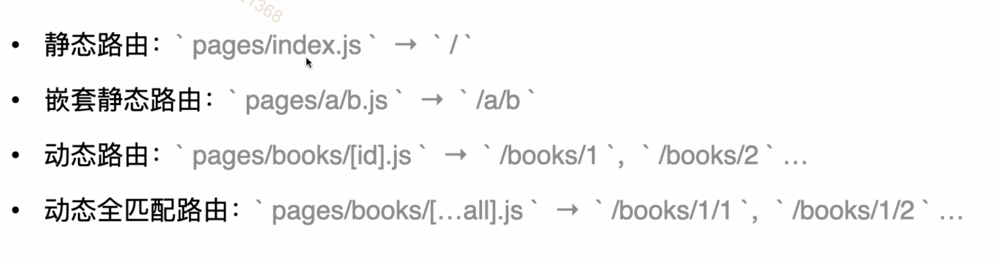
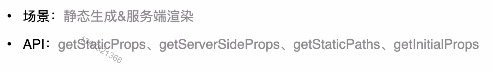
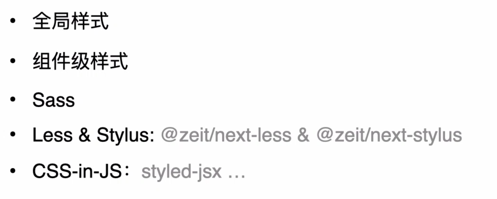
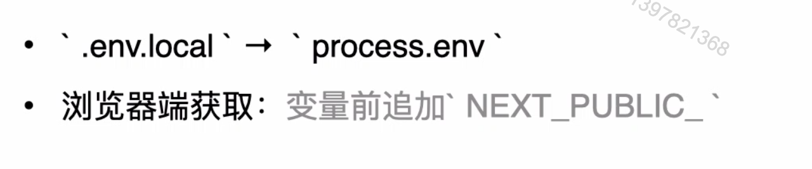

# Next.js介绍

### Content

+ Next.js是什么
+ Next.js的功能与特性
+ Next.js与周边生态

### Main target

+ 了解Next.js框架基本概念
+ 了解Next.js涵盖的主要功能特性
+ 了解Next.js周边生态

## 01. Next.js 是什么

#### **使用React 构建完整 Web 应用**

+ css方案、路由方案、数据获取方案...

+ 使用打包工具（如webpack、rollup等等）将代码进行打包

+ 使用诸如Babel之类的编译器进行代码转换

+ 生产环境代码优化

+ 静态预先渲染、服务器端渲染、客户端渲染

+ ###### ……

#### Next.js是什么

**Next.js  vs Create React App**

+ 有了cra，为什么又出现了 Next.js
+ cra 与 next 有何异同？

##### 相同点

+ 用于快速构建React应用程序
+ 体积轻薄
+ 自动的代码拆分
+ 开箱即用，同时支持自定义
+ 支持所有现代浏览器环境
+ 良好的开发体验，广泛用于生产

##### 区别

 

##  02.Next.js的功能与特性

#### 总览（重要的6点）

#### 路由

#### 数据获取

#### CSS支持

#### 静态文件服务

+ 基于`/public` 此路径下的静态文件，通过 `/` 路径访问

#### TypeScript

#### 环境变量

## 03.Next.js与周边生态

**状态管理** - 与redux、Mobx等高效请求

**数据请求** - 与GraphQL等工具配合使用

**多端开发** - 与Electron等框架的完美搭配                     

**静态站点** - 与 Agility CMS、Wordpress 等静态站框架协同助力

#### 最后小结

+ Next.js是什么
+ Next.js 有哪些特性
+ Next.js 与周边生态的关系

