# Next.js 路由


### Target

+ 了解Next.js 提供的两种预渲染形式
+ 掌握基于文件系统的静态/动态路由
+ 掌握next/link和next/router的使用
+ 掌握Shallow Routing


## 01. 预渲染

#### 思考：什么是预渲染？


#### Nextjs提供

**静态生成 & 服务端渲染**


##### 静态生成（static Generation）

+ 页面生成时机：构建时（build time）

+ 优势：CDN缓存

+ 数据

  + 不包含数据
  + 包含数据（数据固定不变）（getStaticPaths + getStaticProps）

+ 场景：

  + 营销页面
  + 博客文章
  + 帮助和文档

  

##### 服务端渲染（Server-side Rendering）

+ 页面生成时机：请求时（request time）
+ 优势：保持数据更新（每次访问都是最新的数据）
+ 数据：getServerSideProps
+ 场景：因请求不同而数据不同的页面


## 02. 静态路由和动态路由

> Nextjs 路由体系：基于文件系统（pages）

###  静态路由

简单一点的静态路由

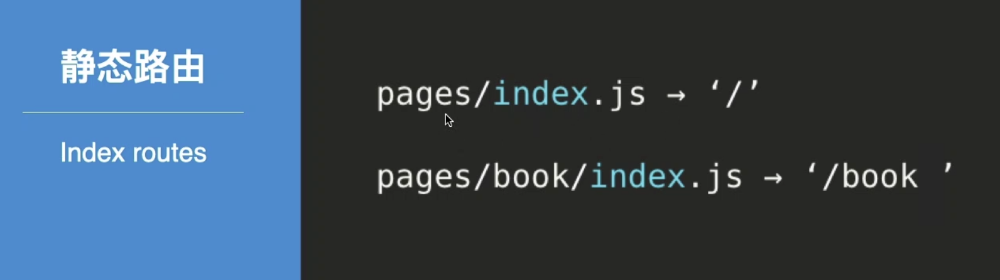

复杂一点的静态路由

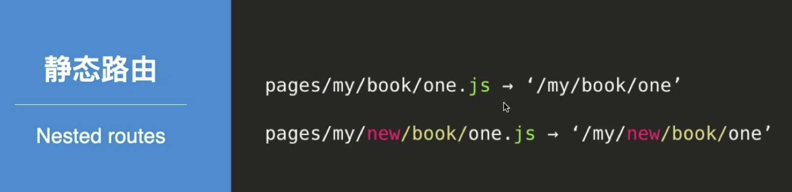


思考：无法预先明确定义的路由怎么办？


#### 动态路由

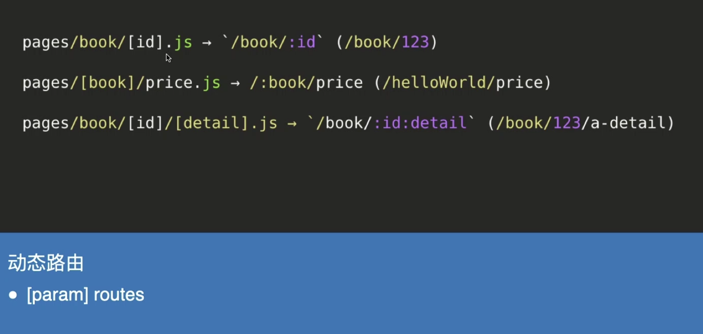

 全匹配路由

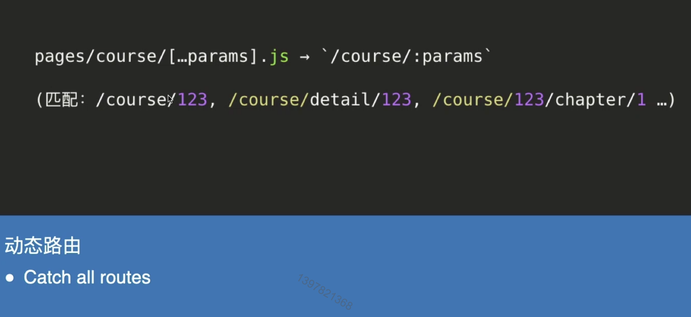

**思考：路由匹配优先级？**

#### 路由匹配优先级

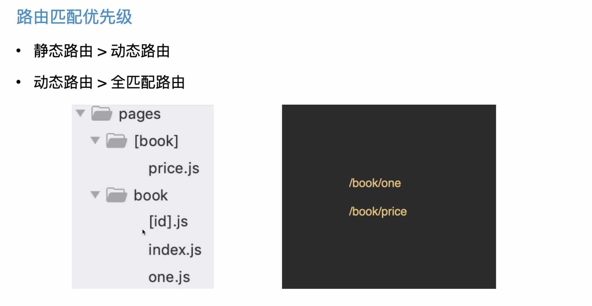


## 03. next/link和next/router的使用

#### 路由跳转

方式一：自定义

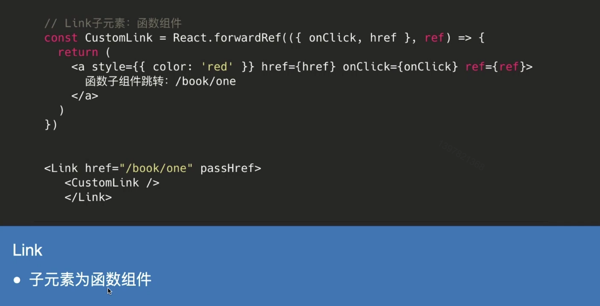

  

方式二：url 跳转


方式三：replace 替换

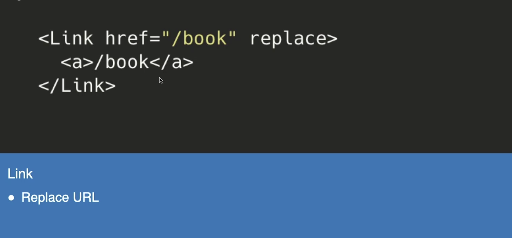

方式四：

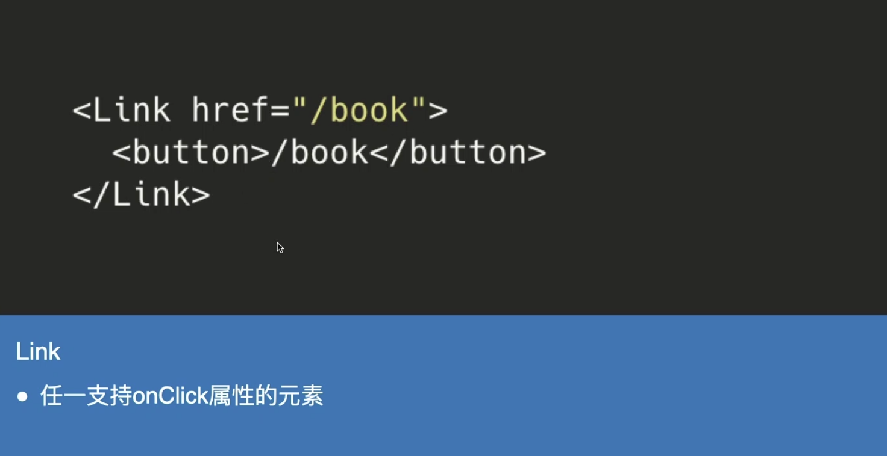

 **思考**：Link组件和 普通<a>标签的使用场景？

next pages 中的路由组件用 Link

外部链接用 <a> 标签


#### 路由跳转 - next/router

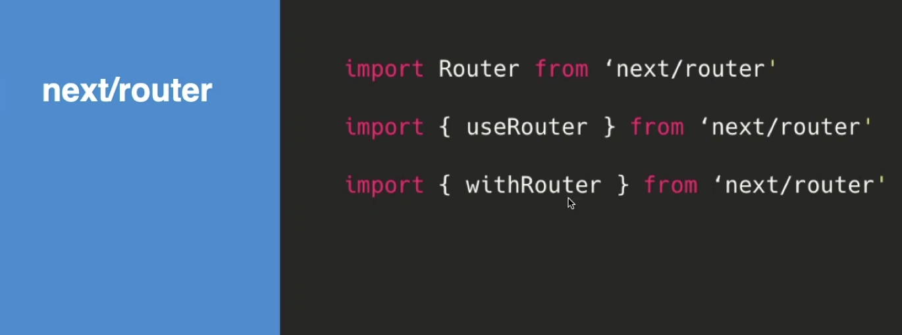


### Router API

+ push
+ replace
+ back
+ reload
+ prefetch
+ beforePopState
+ events
  + routeChangeStart
  + routeChangeComplete
  + routeChangeError
  + ...


#### Router API - push

+ url：导航到的url

+ as：url的可选装饰器，一般用于动态路由（默认值为url）

+ options：可选配置

  + shallow：（同Link组件的shallow属性）

  ```js
  import Router from 'next/router'
  Router.push(url, as, options)
  ```


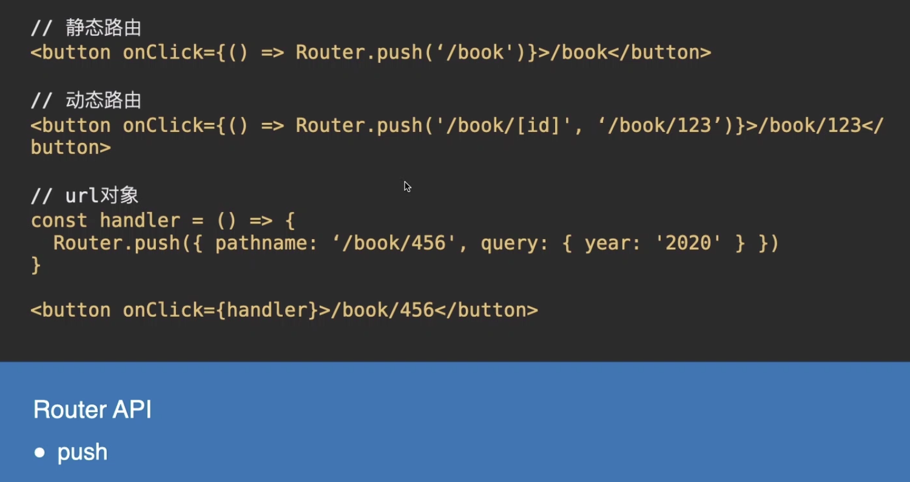 


#### Router API - other

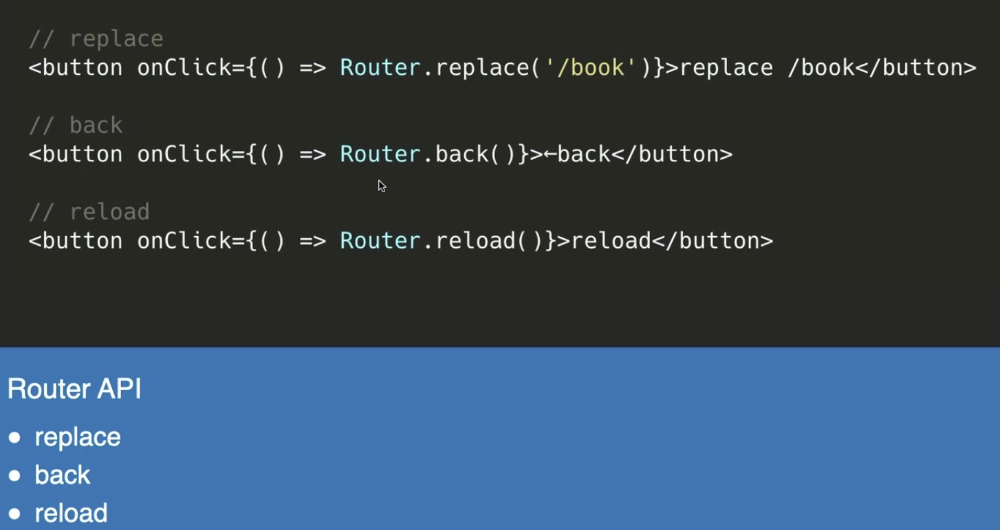


#### Router API - prefetch

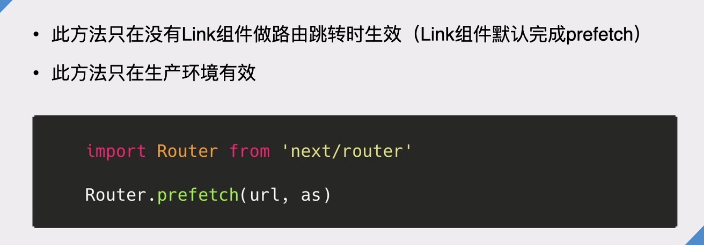

思考：说了这么多，Router对象似乎和Link组件没有什么区别？


#### Router API - beforePopState

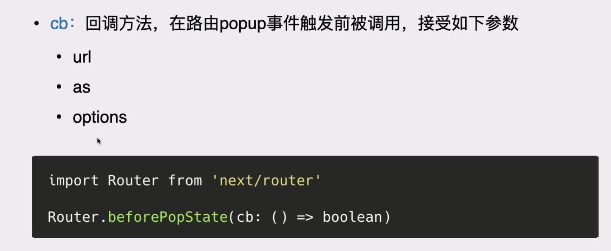

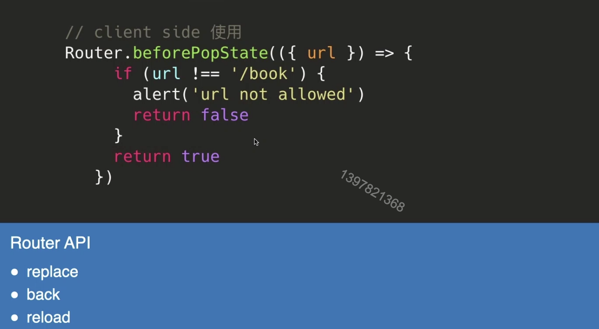


#### Router API - events

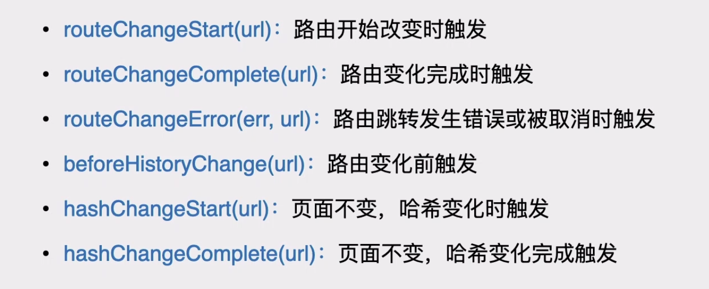

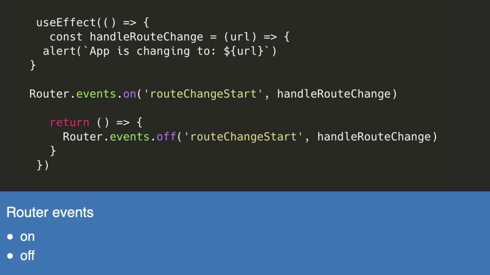


##### Router events 注意事项

+ events 需要在组件挂载完才能注册（useEffect or didMount）
+ Events 的 url 参数为实际浏览器地址栏的 url


#### useRouter & withRouter

除了 Router 对象，还记得 next/router的另外两个非默认导出吗？

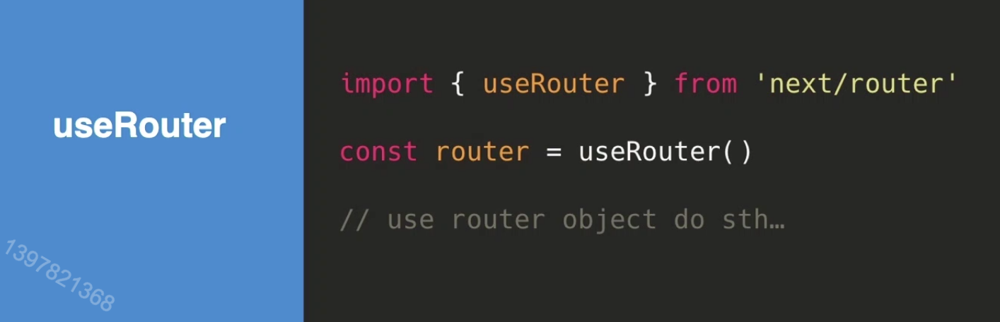


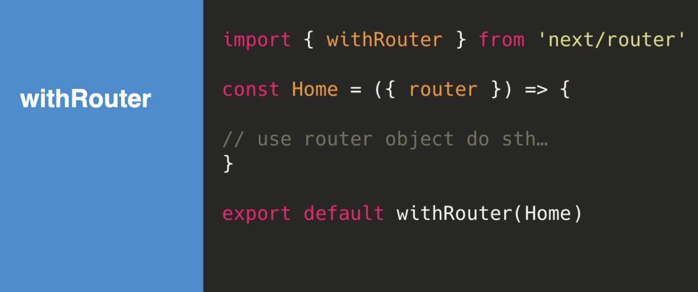


Router API - events

+ pathname：当前路由路径
+ query：当前路由的查询字符串解析成的对象
+ asPath：浏览器地址栏的实际url
+ Router API 支持的所有方法


## 04. Shallow Routing

#### 路由跳转

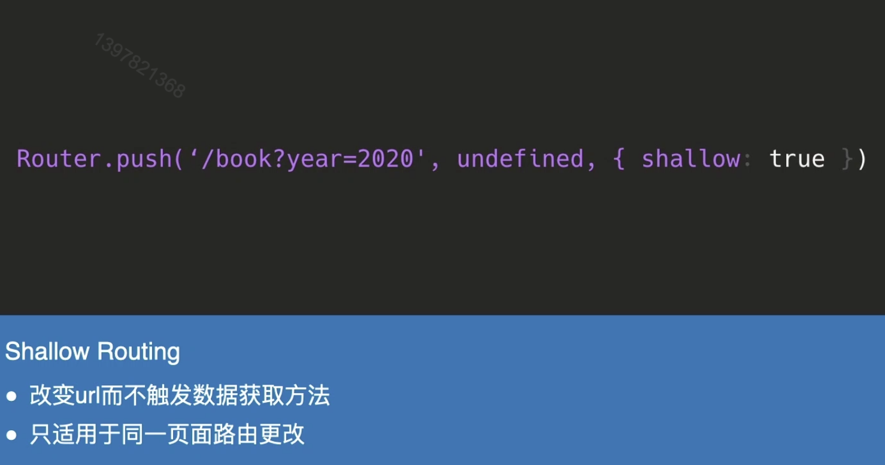


### 最后小结

+ next.js的预渲染生成
  + 静态生成
  + 服务端渲染
+ next.js路由跳转
  + 静态路由
  + 动态路由
+ next.js路由跳转
  + Router
  + useRouter
  + withRouter
+ Shallow Routing

