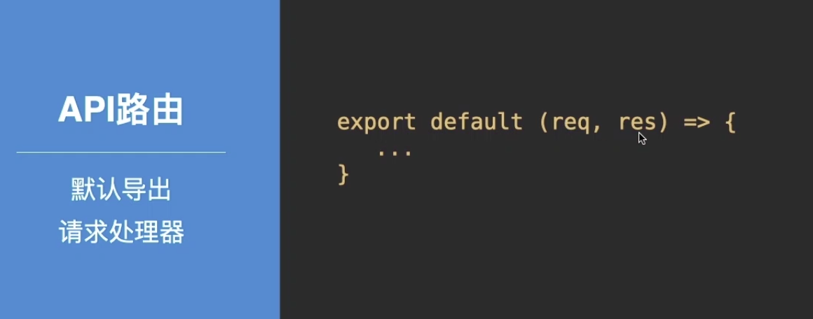
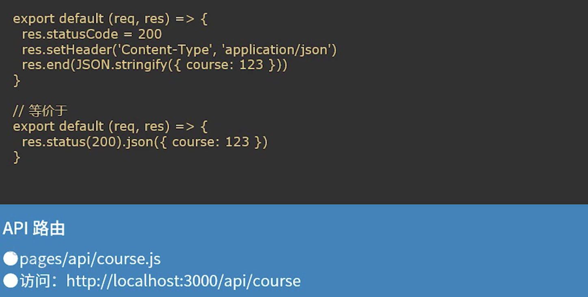
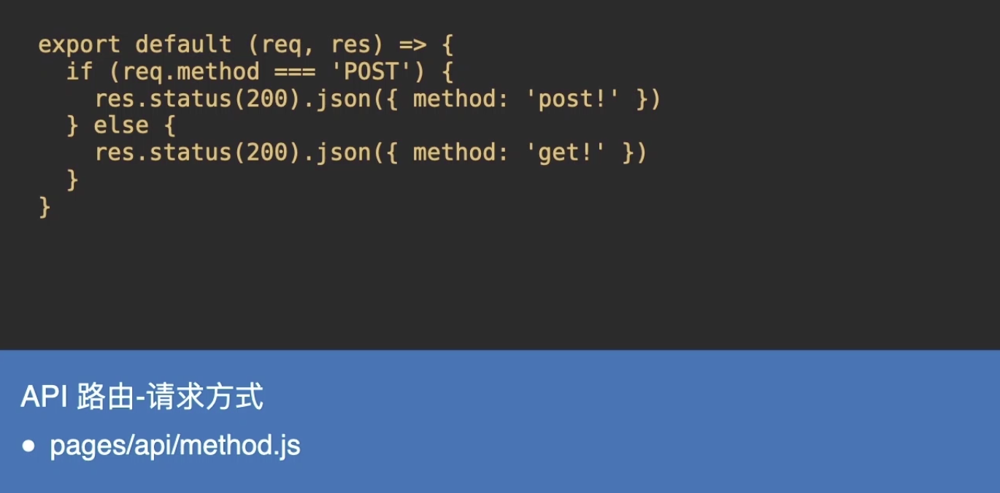
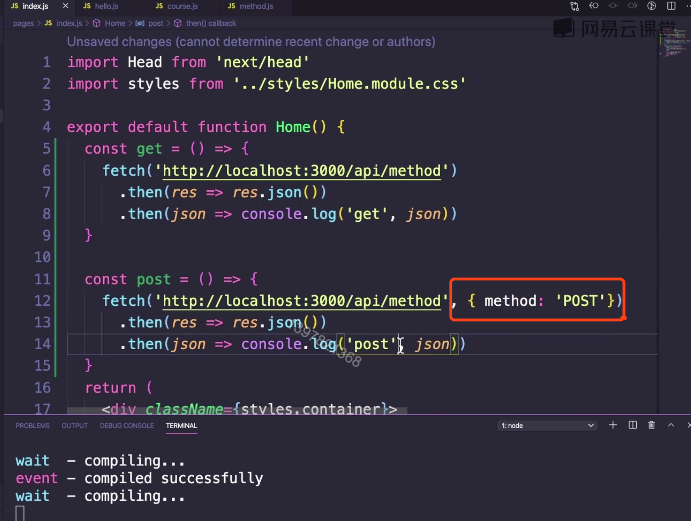
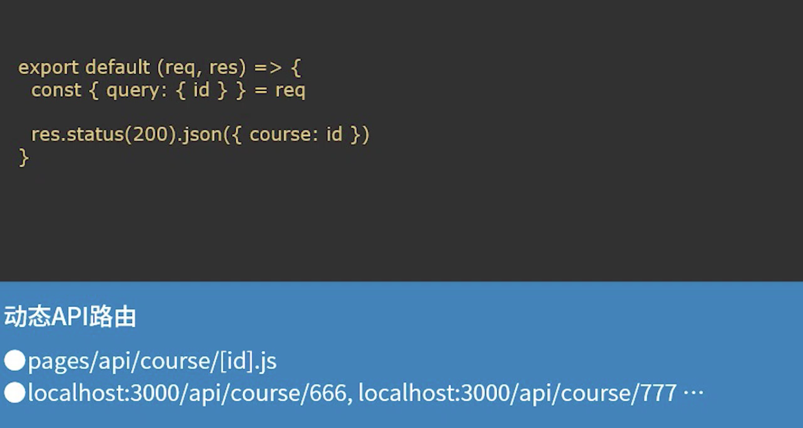
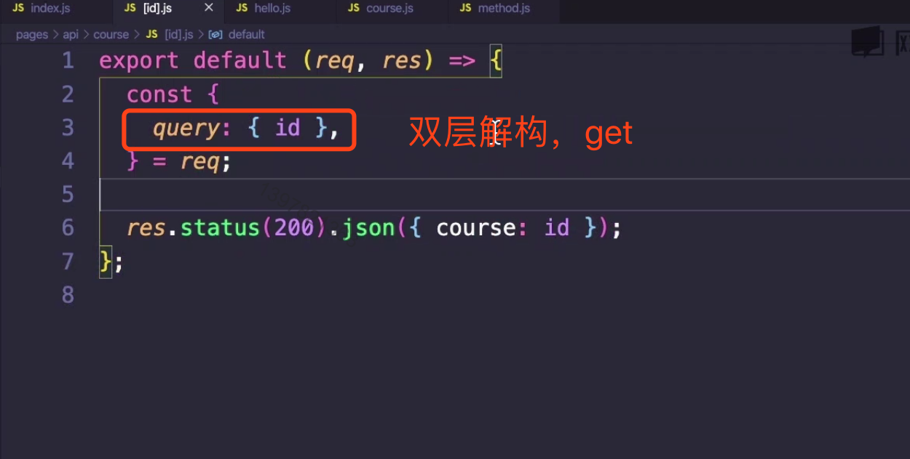
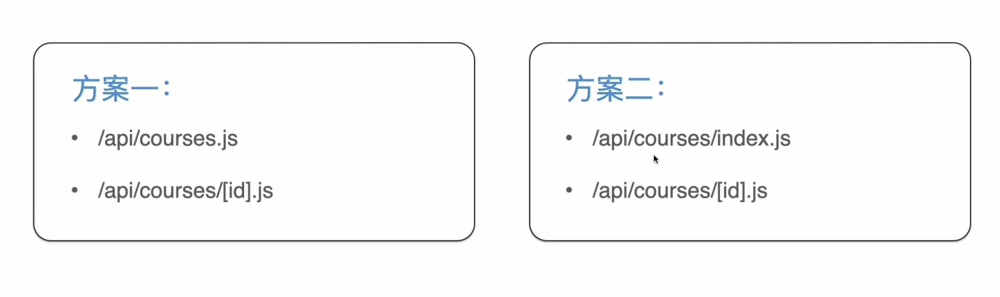
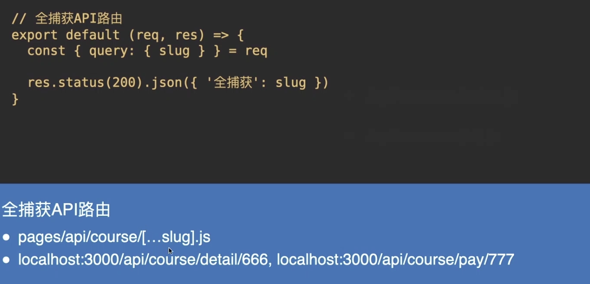

# Next.js API 路由

### Content

+ API路由的基本概念
+ 动态API路由
+ 其他使用细节

### Main Target

+ 掌握API路由的概念以及基本使用方法
+ 掌握动态API路由的使用

## 01. 基本概念

### 什么是API路由？

> next 9 之后出来的新的概念

使用Next.js 构建自己的API提供的一种简单的解决方案

#### 问题：如何区分API路由与页面路由？

答案：pages/api 目录下得任何文件都将作为API 路由映射到 `/api/*`

#### 如何区分 GET & POST 请求？

## 02. 动态API路由

 

> 与动态页面路由遵循相同的文件命名规则
>
> Pages/api/post/[xxx].js

#### 动态API 路由

 

#### 动态API路由 - 常见场景

+ GET api/course/  - 获取课程列表(静态)
+ GET api/course/123 - 获取id 为 123 的课程（**动态**）

##### 注意：仅使用  `/api/course/[id].js`是无效的

#### 全捕获API路由 - ...

#### API路由优先级

+ 静态API路由优先于动态API路由
+ 动态API路由优先于捕获所有API的路由

## 03. API 的其他使用细节

#### Request & response

| req         | res                          |
| ----------- | ---------------------------- |
| req.cookies | res.status(code)             |
| Req.query   | res.join(json)               |
| Req.body    | res.send(body)               |
|             | res.redirect([status,] path) |

#### 其他

+ 每个API路由都可以导出一个用以更改默认配置的对象
+ 通过丰富的中间件增强API功能

#### 最后小结

+ API路由的基本概念

+ 动态API路由

+ API路由的使用细节

  