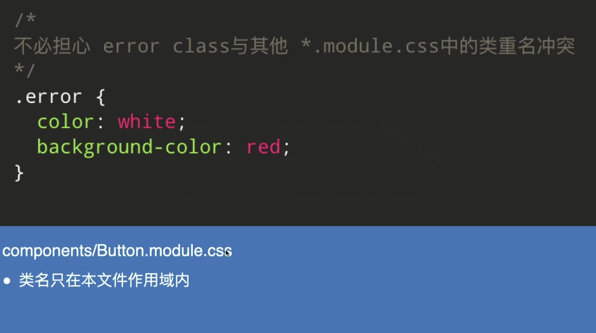
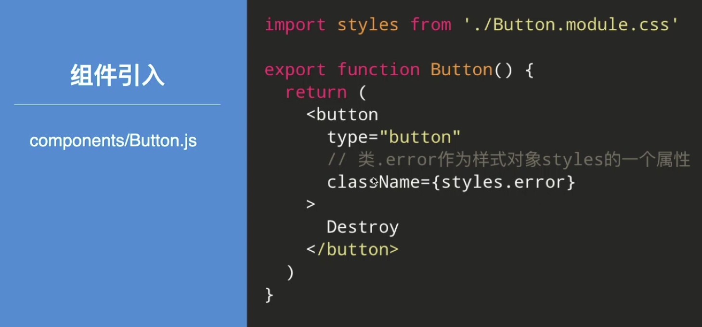
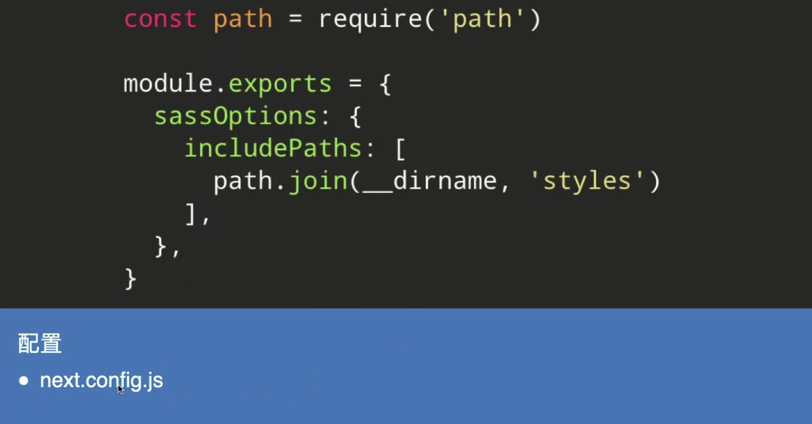
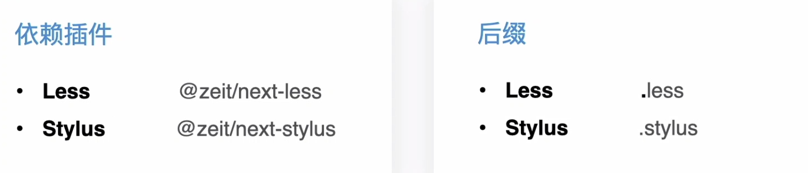
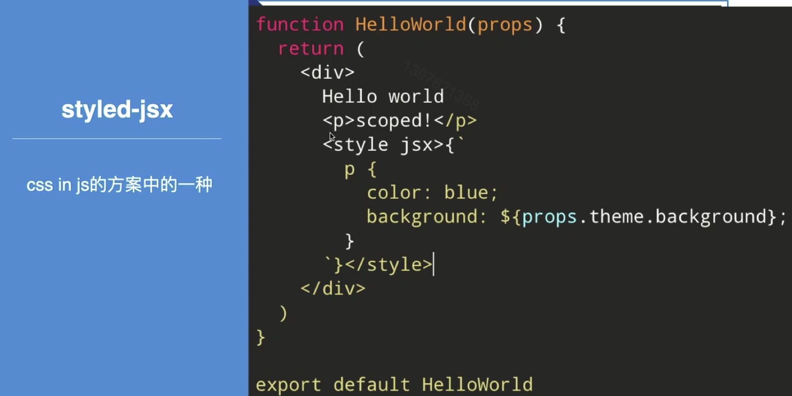
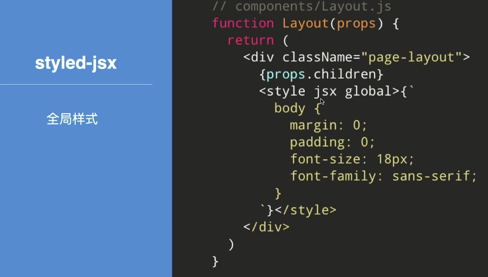
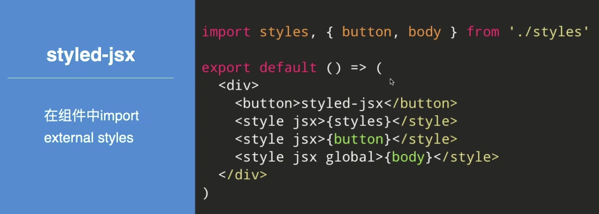
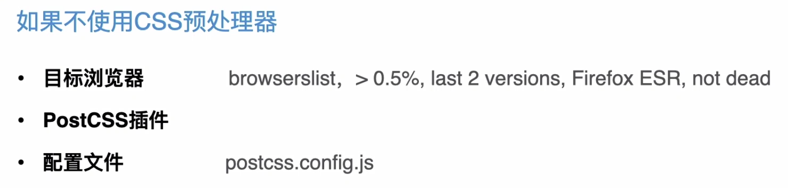

# Next.js下的css支持


#### Content

+ 全局样式
+ 组件级样式
+ Sass、Less & Stylus
+ Css-in-JS


### Target

+ 掌握Next.js 下的css 开发


### 全局样式

#### global css

+ 作用域  -  全局作用域，整个HTML文档
+ 引入位置  -  pages/_app.js
+ 文件后缀  -  *.cssm eg. style.css
+ 库CSS  -  支持来自node_modules的css文件


### 组件级样式

##### CSS Module

+ 作用域  -  局部作用域
+ 引入位置  -  任何位置
+ 文件后缀  -  [name].module.css






### CSS预处理器

##### Sass

+ 引入位置 - 任何位置
+ 全局作用域 - *.scss，`*.sass`
+ 局部作用域 - `*.module.scss, *.module.sass`

##### Sass安装

```shell
npm i sass
# or yarn 
yarn add sass
```

注意：node-sass可能出现安装问题




### Less & Stylus




#### Css-in-js









### PostCSS




#### 最后小结

+ 全局样式
+ CSS Module
+ CSS预处理器
+ styled-jsx

