# 根组件&Document组件

### Content

+ Next.js根组件
+ Next.js 文档页面组件
+ Next.js 自定义服务器入口文件

#### 回顾

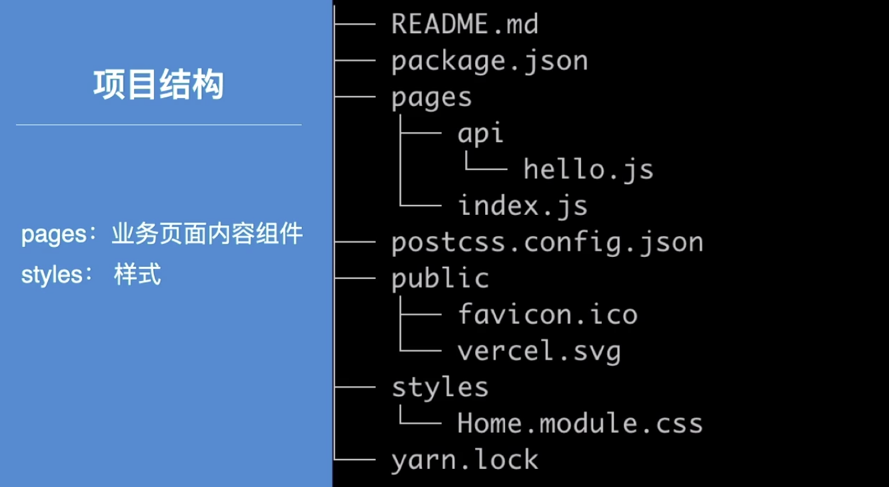

#### Home 页面组件

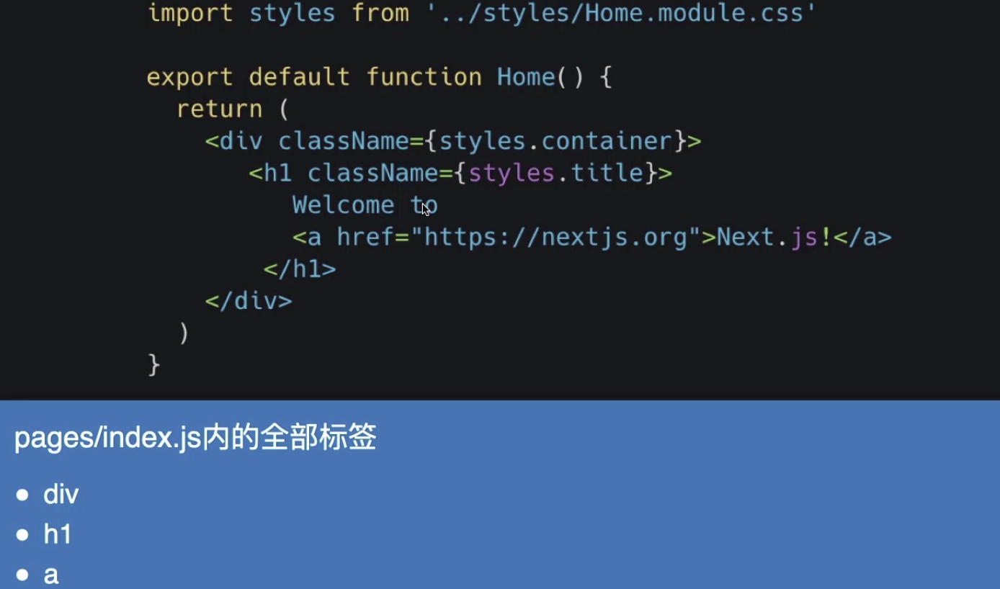

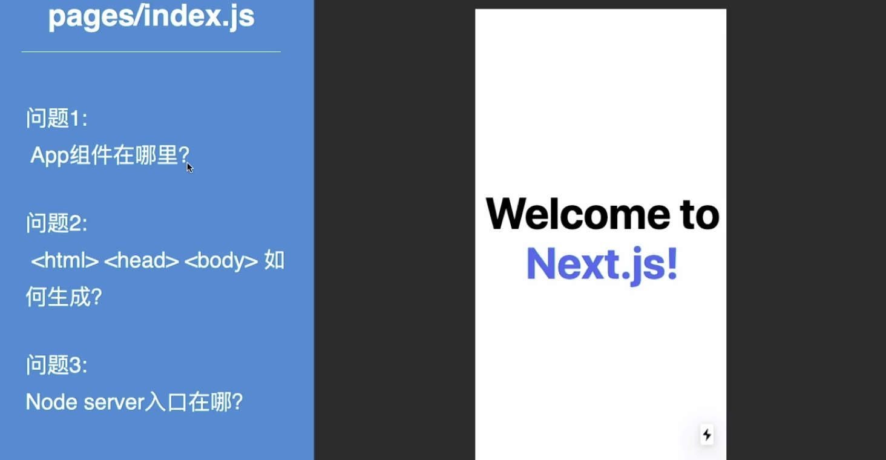

## 01. App根组件

#### 自定义App组件

+ **保持布局**    页面路由切换的时候保持某些布局： **Layout**
+ **保持状态**    页面路由切换的时候保持某些数据状态
+ **错误捕捉**    使用componentDidCatch 进行自定义错误处理
+ **全局CSS**

#### 如何自定义

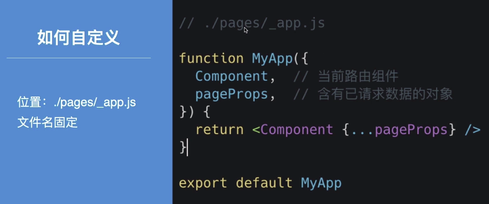

#### 全局CSS

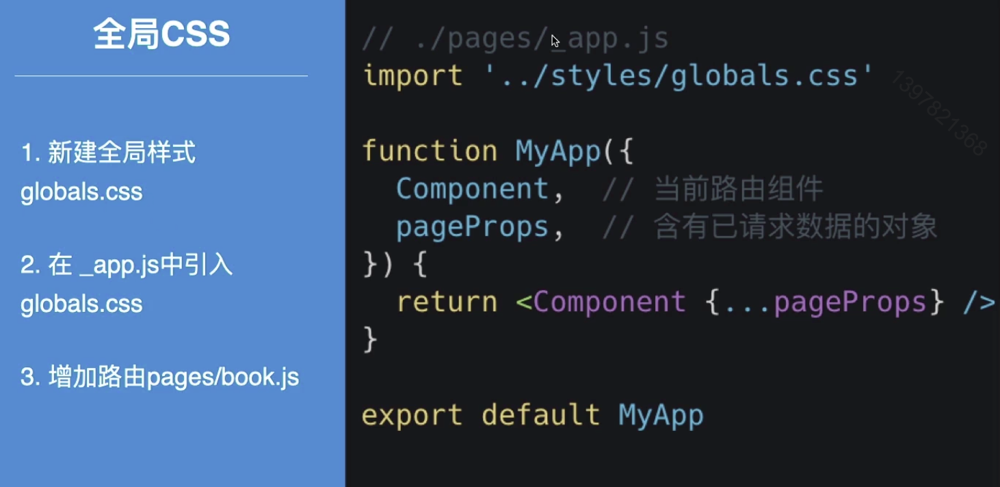

#### 共享Layout

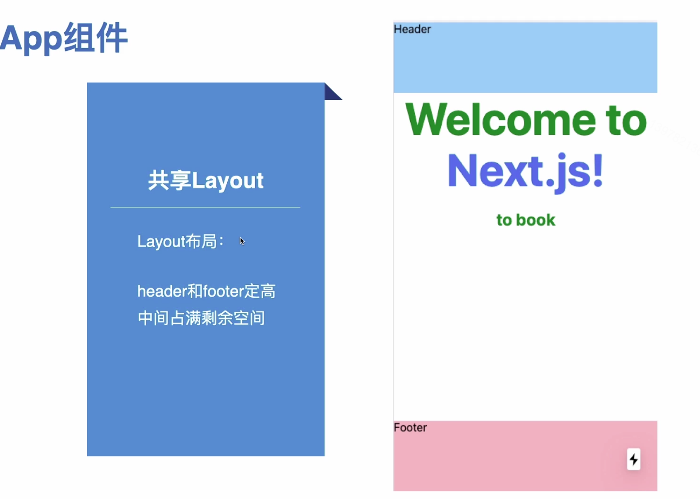

#### 保持/共享状态

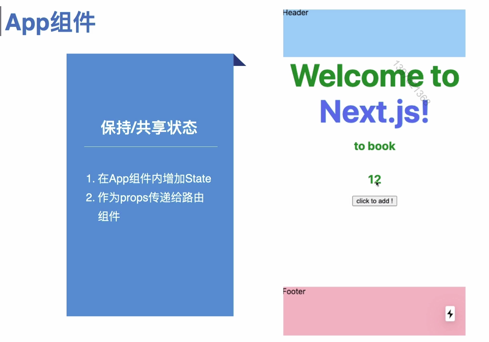

#### 全局错误捕捉

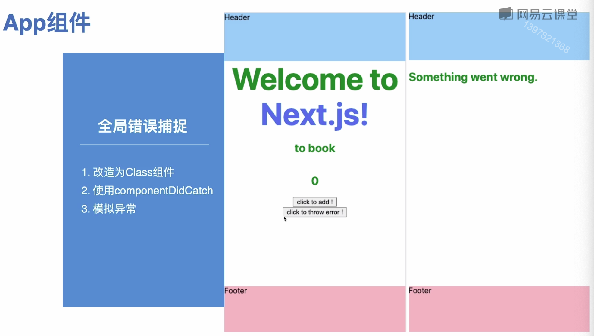

 

## 02.Document组件

#### 自定义Document组件

+ 顶层标签    html,head.body
+ 文档的头部    meta title……
+ 注入的脚本    script

#### 如何自定义

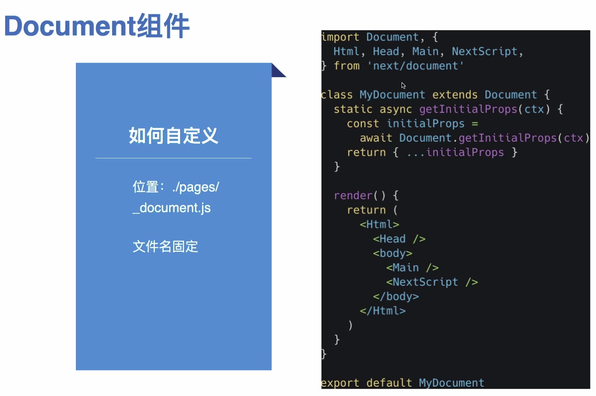

## 03. 自定义server

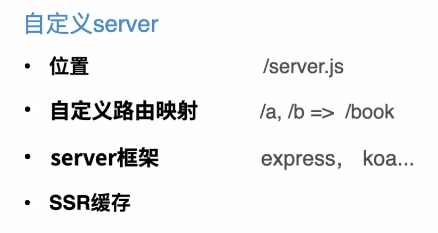

#### 简单 Node Server

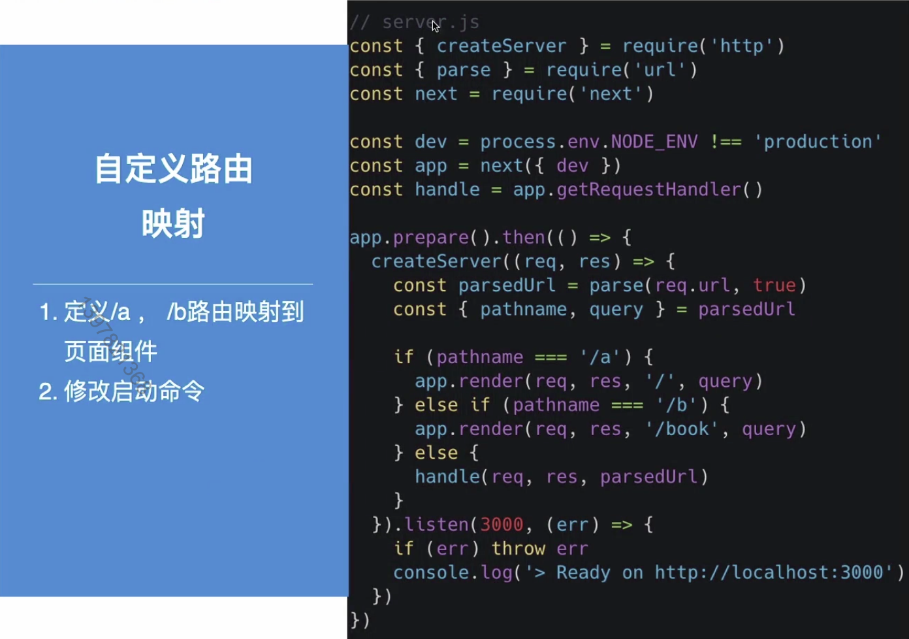

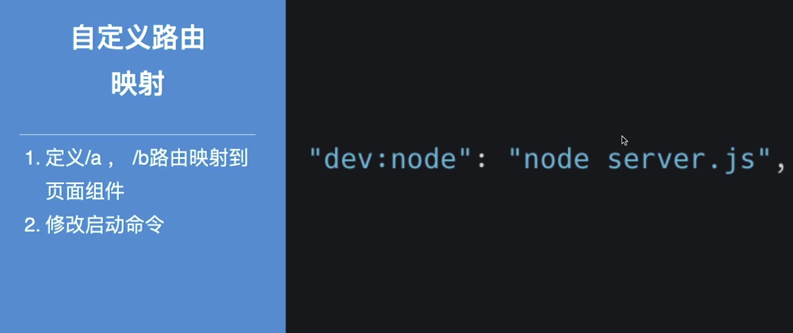

####  express server

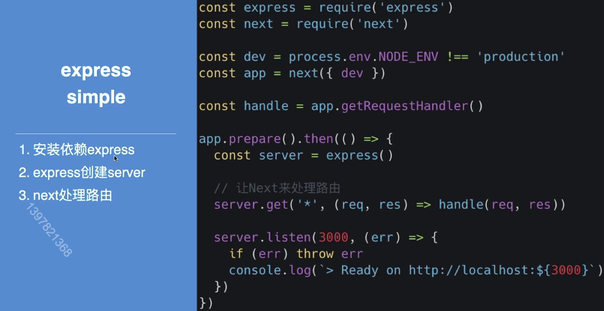

#### SSR 缓存

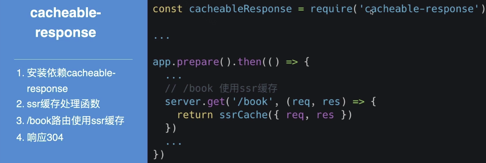

#### 最后小结

+ 自定义App组件
+ 自定义Document 组件
+ 自定义 server.js

