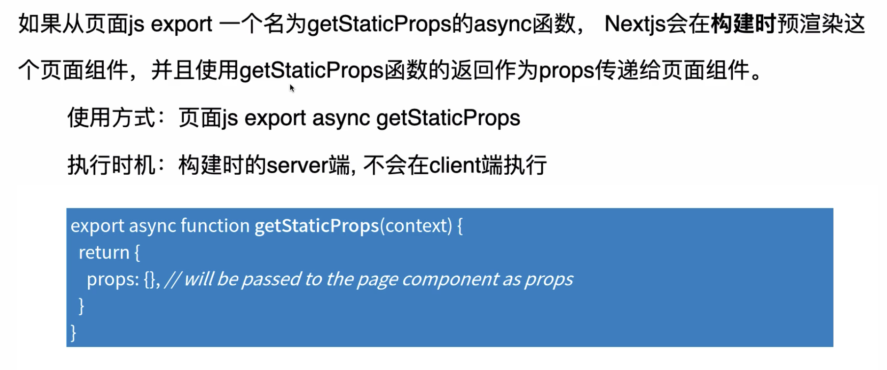
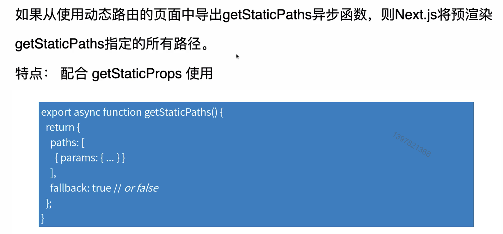
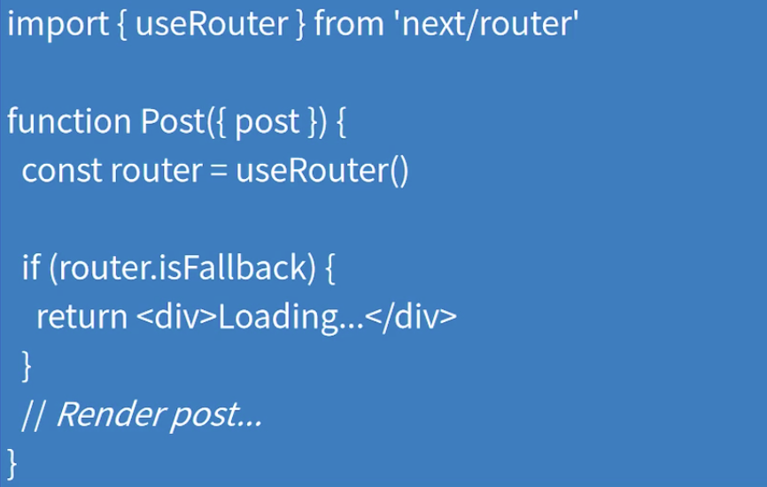
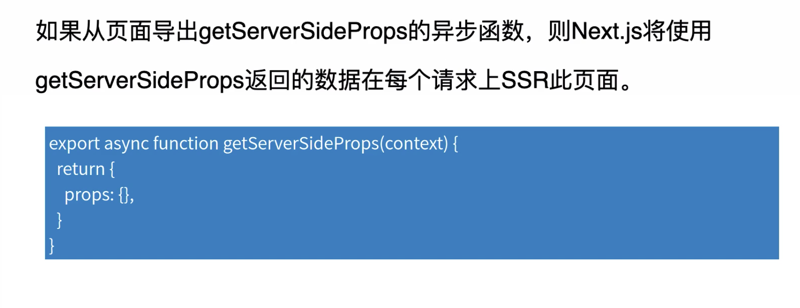
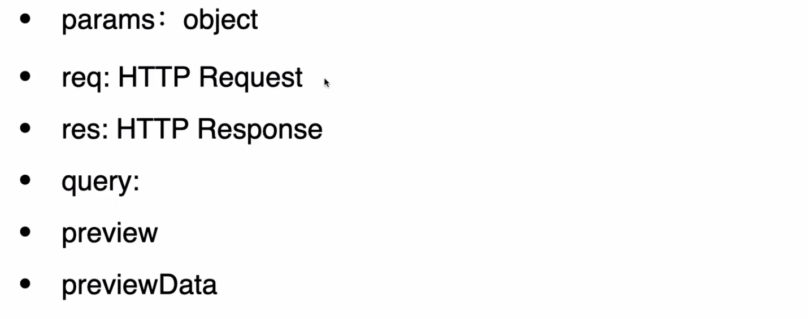

# 数据获取

### Content

+ 静态生成 getStaticProps
+ 静态生成 getStaticPaths
+ 服务端渲染 getServerSideProps

> Next9.5.2

## 01. getStaticProps

#### getStaticProps 介绍

#### context参数

> context参数是一个包含以下键的对象：

+ params: object
+ preview: boolean
+ previewData: object

#### context.params

说明：包含使用动态路由的页面的路由参数

例如：如果页面名称为[id].js，则参数将类似于{id: 1}

使用场景：与 getStaticPaths 配合使用

#### preview 和 previewData

preview：如果页面处于预览模式，则为true，否则为false

previewData：预览模式的预览数据

#### 预览模式

getStaticProps 特性：**构建时**预渲染这个页面组件

想象一个场景：静态博客的未发布“草稿”阶段，只能给作者呈现“草稿”内容，读者还是原本的blog

解决方案：预览模式，希望Next.js 在这种情况下绕过静态生成

#### 使用场景

+ 呈现页面所需的数据可在构建时获得
+ 数据来自无头 CMS（Headles CMS）
+ 数据是公用的可以缓存的（不是特定于用户的）
+ 该页面必须预渲染（SEO）&  快速响应。html & json => CDN

#### 增量静态再生成

> Next.js 9.5版本的新特性：增量静态再生成

功能：增量静态再生可以在用户请求时在服务端重新渲染现有页面来更新现有页面。如何使用：配置 revalidate参数，触发时机：页面缓存超过revalidate 时间 & 用户请求

+ 页面响应速度不会因为请求量变化而剧烈波动
+ 页面永远不会挂掉
+ 低数据库负载，低后端负载

### getStaticProps总结

##### 重点

1. 只在构建时执行
2. 只在服务端执行，不在客户端执行
3. 不仅静态生成HTML，还生成JSON
4. 只在页面组件中使用
5. next dev 的时候每次请求都会执行

## 02. getStaticPaths

### getStaticPaths 介绍

#### paths

功能：确定要预渲染的路径

#### fallback

false：paths 不包含的页面一律响应 404

true: 

1. 首次访问 返回 fallback page 给客户端
2. 同时，服务端静态商城该页面 html 和json
3. json 生成后响应给浏览器，渲染实际页面内容
4. Next把当前path加入到预渲染列表，当用户再次请求该页面，直接返回html

#### Fallback page

我们可以通过router来检测是否是处于fallback page 渲染的模式

如果是fallback ，则可以渲染默认数据 or 加载页面

## 03. getServerSideProps

#### context 参数

#### 使用场景

+ 仅当需要预渲染必须在请求时获取其数据的页面时，才应使用getServerSideProps
+ TTFB（Time to First Byte）的实践将比 getStaticProps 慢

#### 技术细节

+ 在服务端收到请求时候执行（每次）

+ 客户端路由跳转的时候回发送数据请求给服务端，服务端执行getServerSideProps 得到数据并以json格式返回
+ 只能在 page组件中使用

### 最后小结

+ 静态生成getStaticProps
+ 静态生成getStaticPaths
+ 服务端渲染：getServerSideProps