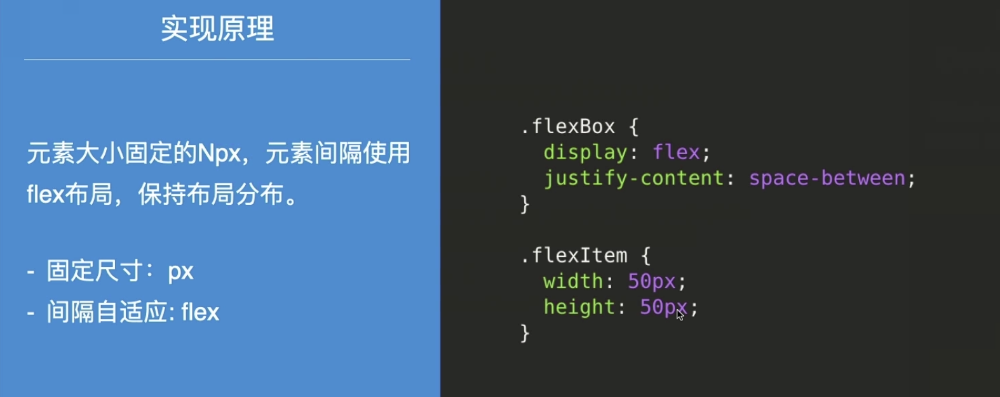
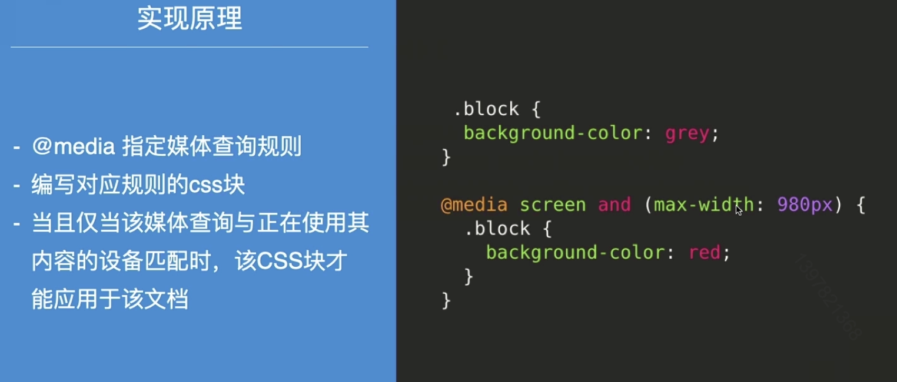
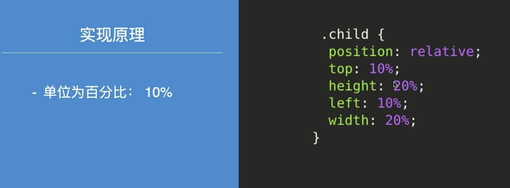
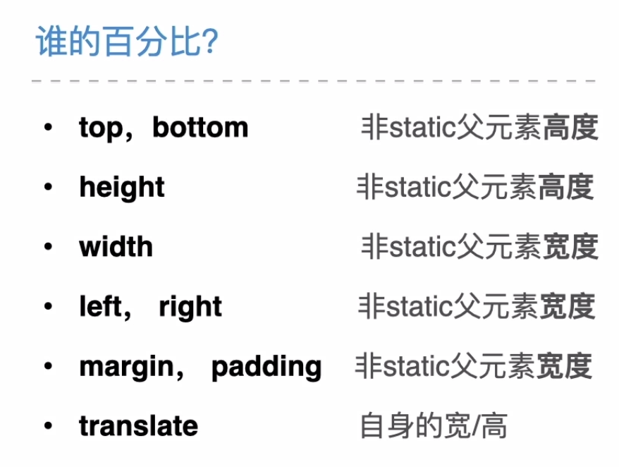
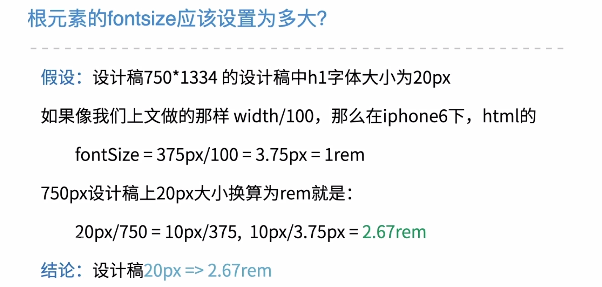
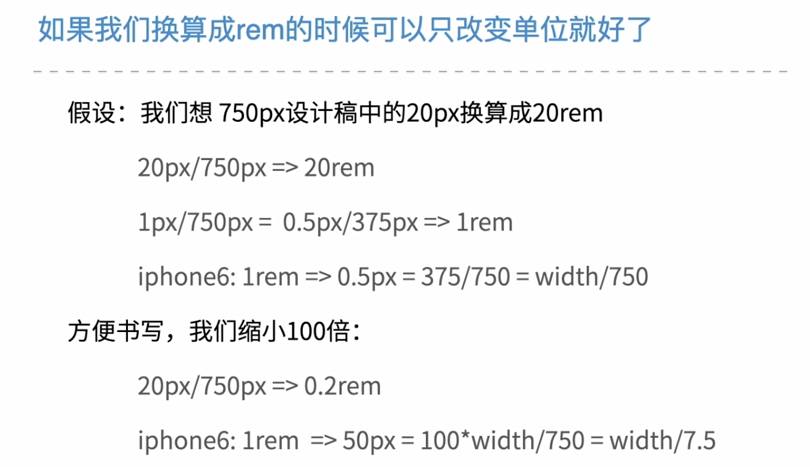
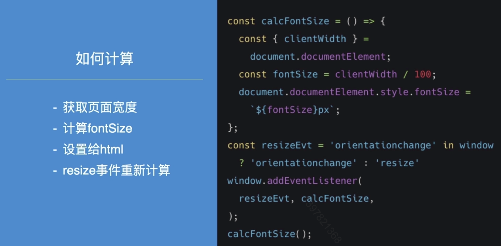
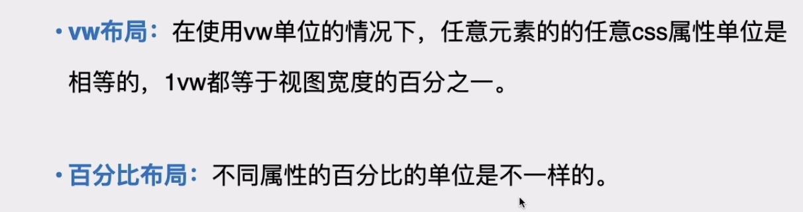
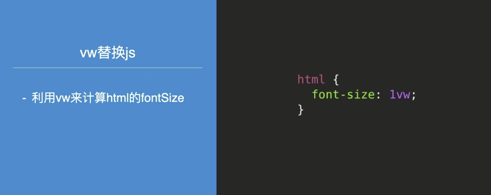
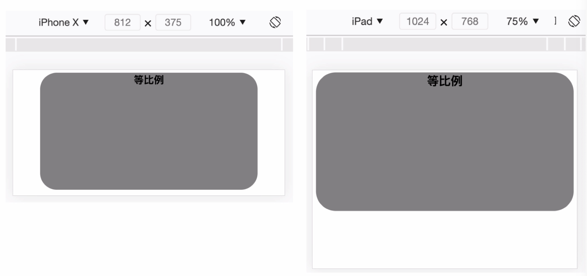

# rem-响应式布局

### Main target

+ 理解什么是响应式布局
+ 了解常见的响应式布局方案
+ 掌握REM响应式布局的实现原理

## 01. 响应式布局

#### 多端适配问题

+ PC端不同尺寸屏幕
+ 移动端不同尺寸屏幕

#### 多端适配解决方案

+ 自适应布局：AWD（Adaptive Web Design）
+ 响应式布局：RWD（Responsive Web Design）

#### 自适应布局

根据请求用户的设备不同(useragent)，来判断当前访问的设备是PC/Mobile，服务端返回针对对应设备类型实现的页面

#### 自适应布局的特点和问题

+ 需要开发多套不同布局的页面：开发量成倍增加
+ 服务端需要正确判断访问设备类型：ua判断不精准

#### 自适应布局适合场景

+ 适合    差异巨大的终端可以采用多页面方案
+ 不适合    尺寸差异相近的手机，从成本考虑只能使用同一个布局

#### 响应式布局定义

响应式布局指的是服务端始终只返回同一页面，该页面在不同屏幕尺寸下，在客户端动态实现不同的布局

#### 响应式布局特点

+ 只需要一个页面
+ 在客户端根据屏幕大小来显示合适的页面样式
+ 页面缩放控制/布局调整

#### 响应式布局优点

+ 一个页面适配多种屏幕大小：成本更低
+ 灵活适配多种屏幕大小：不需要针对每一种做开发

## 02. 场景的响应式布局方案

+ flex布局
+ 媒体查询布局
+ 百分比布局
+ rem响应式布局

### 1. flex布局

元素固定大小，间距动态变化

##### 实现原理

#### flex 布局问题

大尺寸屏幕下，元素显得很小，间距很大很空

### 2. 媒体查询布局

通过媒体查询规则，给不同尺寸的设备设定应用不同的css样式

##### 实现原理

#### 媒体查询的问题

兼容各种设备工作量大，兼容的屏幕尺寸越多，代码量越大

### 3.百分比布局

根据浏览器的宽度和高度，使用百分比来计算组件的宽和高。浏览器的大小变化，原色的大小和间距也随之变化

##### 实现原理

#### 谁的百分比？

#### 百分比布局存在问题

**缩放并没有完全等比例**

#### 百分比布局的缺点

+ 计算困难：设计稿 px => 百分比，20/750 = 2.667%
+ 各个属性的百分比单位不统一
+ 字体无法用百分比实现缩放效果

### 4.rem 响应式布局

## 03.REM响应式布局

> 页面所有元素和间距都保持相同比例缩放，来适配不同尺寸的屏幕

#### REM单位是什么

##### rem单位的意思是“根元素的字体大小”

+ 如果 html 的 font-size = 16px
+ 那么 1rem = 16px
+ 10rem = 160px

#### REM响应式布局原理

+ 页面的所有css样式统一单位 rem，即根元素 html的 fontSize大小
+ 根据屏幕尺寸不同来改变根元素html 的 fontSize，那么当 rem单位的大小变化的时候，元素的代销也会成比例缩放，这样就能适配不同大小的屏幕。

#### 根元素的 fontSize 应该设置为多大呢？

#### 如果我们换算成rem的时候可以只只改变单位就好了

#### 设置html 的 fontSize的时机

在所有 css 加载前

**思考**：在页面css加载后再设置 rem 会有什么效果？

#### REM布局代码实现

##### PostCSS工具

px2rem 或者 px2rem-loader 等实现自动换算 px 和rem

#### REM布局的缺点

+ 横屏下，页面放大过大
+ 横屏下，fixed元素会堆积在屏幕上

### VW，VH布局

##### css3新增的css单位

+ vw  -  视窗宽度的1%
+ vh  -  视窗高度的1%

#### 与百分比的区别

#### 使用vm改进REM方案

 

### 最后小结

+ 响应式布局
+ 场景的响应式布局方案
+ REM响应式布局的原理和实现

#### 作业

如何实现横屏下单屏满屏页面的自适应布局？

+ 页面没有任何滚动
+ 页面内容全部展示

**作业效果**

