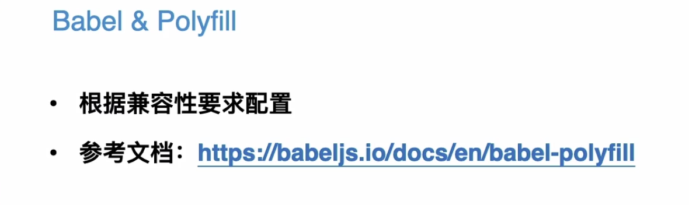

# 实战有道精品课 - 需求分析

### Content

+ 项目背景
+ 项目目标
+ 技术选型
+ 项目搭建

## 01. 项目背景

## 02. 项目目标

## 03. 技术选型

#### 技术需求

+ 项目搭建成本
+ 新人上手难度
+ 框架更新能力
+ 框架稳定性
+ 框架的使用广发程度和生态

#### 技术选型

+ 技术栈（√）：团队统一 React
+ CRA（×）：首页白屏问题
+ Next.js（√）：提供首屏SSR，学习成本相对较低

#### 服务端渲染方案

+ **预渲染 vs SSR**
+ 动态数据都使用 SSR, 静态数据可以使用预渲染

## 04.项目搭建

#### 本地开发环境

+ Node > 10
+ 全局安装 `yarn`

#### 创建Next.js 项目

#### 项目结构的补充

给自己的项目增加这些文件，更友好的开发

+ README.md
+ package.json
+ CHANGELOG.md

git commit 规范注意一下

#### 项目配置

jsconfig.json

+ 类似于tsconfig
+ 位置：根目录
+ 功能：配置 alias

#### 兼容性

+ 系统版本（IOS/Android）
+ browserslist版本设置

#### 项目配置

##### Babel & Polyfill

##### CSS & PostCSS

+ 根据兼容性要求配置
+ global css reset
+ stylelint

##### Eslint & prettier

+ 使用公共的eslint插件和自定义规则
+ 使用 prettier 格式化代码

##### precommit 校验

+ husky
+ lint-staged
+ 校验内容：eslint & stylelint

#### 最后小结

+ 理解项目背景
+ 明确项目需求
+ 根据业务需求和技术需求做技术选型
+ 搭建项目

