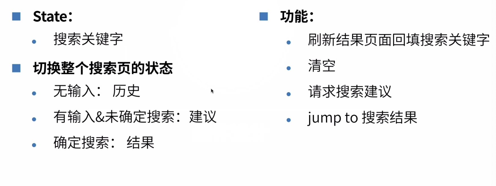

# 拆分页面和设计

### Content

+ 首页拆分和设计
+ 搜索页拆分和设计
+ 组件的设计

## 01. 首页

### 模块分区

+ 顶部搜索栏
+ 轮播
+ 分类页面入口
+ 公开课程分区
+ 推荐课列表

#### 顶部搜索栏

+ **布局**：顶部固定，左自适应，右固定

#### 轮播

+ **样式**：slide和dot 相对固定位置
+ **布局**：在搜索栏和分类入口的下层

#### 分类页面入口

+ **布局**：在轮播上层，水平居中，垂直位置相对固定
+ **样式**：定高定宽，每张 slide 两行

### 头部组件

+ 搜索栏
+ 轮播
+ 分类入口（轮播）
+ **思考**：轮播和分类入口能不能只一个组件复用？

#### 公开课分区

+ 模块标题【通用组件】
+ 公开课内容区
  + 推荐公开课
  + 公开课card

#### 推荐课列表

+ 模块标题 【通用组件】
+ 课程卡片

## 02. 搜索页

#### 搜索页设计

+ 请求：
  + 请求结果
  + 请求建议
+ 状态 & 数据
  + 页面状态：初始值 !== 建议
  + 建议数据
  + 结果数据
+ 刷新结果页面保持状态

#### 公共组件

+ 模块标题（首页内）
+ 课程卡片（首页&搜索页）

## 03. 组件设计

### 搜索框

#### 课程卡片设计

+ 数据：标题，老师，价格……
+ 样式 & 切图
+ 功能 & 逻辑：倒计时，价格的展示

#### 最后小结

+ 首页和搜索页的页面设计
+ 组件设计

